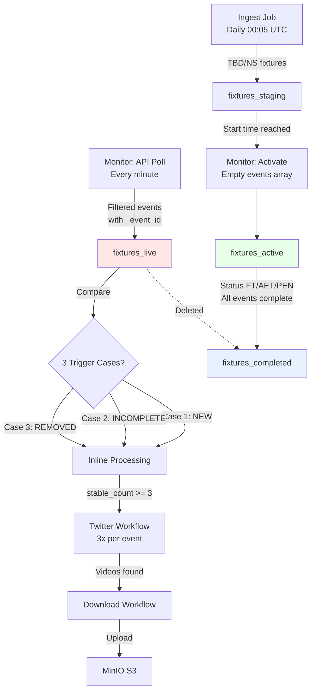
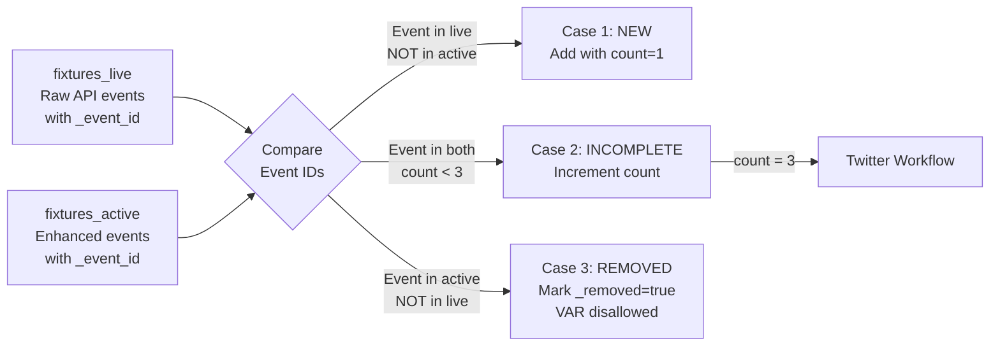
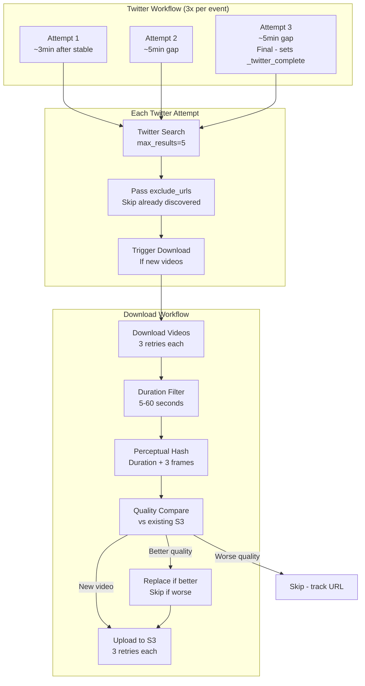
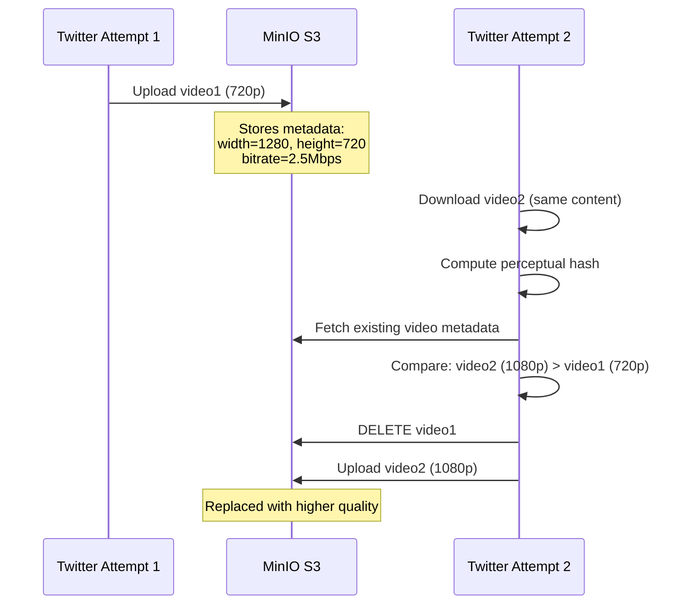

# Found Footy - Architecture Guide

**Temporal.io orchestration with 4-collection MongoDB architecture**

## 🎯 Core Concept

**4-Collection Design with fixtures_live for Safe Comparison**

Raw API data is stored in `fixtures_live` (temporary, overwritten each poll) for comparison, while `fixtures_active` contains enhanced events that are **never overwritten** - only updated in-place.

**Why 4 Collections?**
- **fixtures_staging**: Waiting to activate
- **fixtures_live**: Raw API data (temporary, for comparison only)
- **fixtures_active**: Enhanced events (never replaced, only updated)
- **fixtures_completed**: Archive

This prevents data loss - we can compare fresh API data against enhanced data without destroying enhancements.

---

## 📊 Data Flow



### Comparison Logic (3 Trigger Cases)



---

## 🎬 Video Pipeline

### Twitter → Download → S3 Flow



### Perceptual Hash Deduplication

**Problem**: Same video at different resolutions/bitrates = different file hashes but same content

**Solution**: Duration-based perceptual hash
- Extract video duration (0.5s tolerance)
- Extract 3 frames at 1s, 2s, 3s
- Compute dHash (64-bit difference hash) for each frame
- Combine: `{duration:.1f}_{hash1}_{hash2}_{hash3}`

```python
def compute_perceptual_hash(file_path):
    # Get duration
    duration = get_duration_ffprobe(file_path)
    
    # Extract frames at fixed positions
    frames = extract_frames_ffmpeg(file_path, [1.0, 2.0, 3.0])
    
    # Compute dHash for each frame
    hashes = []
    for frame in frames:
        img = Image.open(frame).convert('L').resize((9, 8))
        diff = np.array(img)[:, 1:] > np.array(img)[:, :-1]
        hash_val = ''.join(str(int(b)) for b in diff.flatten())
        hashes.append(format(int(hash_val, 2), '016x'))
    
    return f"{duration:.1f}_{'_'.join(hashes)}"
```

**Quality Comparison** (when hashes match):
```python
def quality_score(video):
    return (video["width"] * video["height"], video["bitrate"], video["file_size"])

# Higher tuple = better quality (lexicographic comparison)
if quality_score(new) > quality_score(existing):
    replace_video()  # Delete old, upload new
```

### Duration Filtering

Videos outside the 5-60 second range are filtered:
- **< 5s**: Usually just celebrations, not full goal replays
- **> 60s**: Usually compilations or full match highlights

Filtered videos still have their URLs tracked in `_discovered_videos` to prevent re-download attempts.

### Cross-Retry Quality Tracking



### URL Exclusion (New in v2)

Each Twitter search receives `exclude_urls` containing all previously discovered URLs:

```python
# In execute_twitter_search activity
response = requests.post(
    f"{session_url}/search",
    json={
        "search_query": "Salah Liverpool",
        "max_results": 5,
        "exclude_urls": existing_video_urls  # Skip these during scraping
    }
)
```

The Twitter service skips these URLs during scraping:
```python
# In session.py search_videos()
if tweet_url in exclude_set:
    print(f"⏭️ Skipping already-discovered URL: {tweet_url}")
    continue
```

This means 3 attempts × 5 videos = up to **15 unique videos per event**.

---

## 🗄️ Collection Schemas

### fixtures_staging

Fixtures waiting to start (status TBD, NS).

```json
{
  "_id": 5000,
  "fixture": {
    "id": 5000,
    "date": "2025-11-24T15:00:00Z",
    "status": {"short": "TBD"}
  },
  "teams": {
    "home": {"id": 40, "name": "Liverpool"},
    "away": {"id": 50, "name": "Man City"}
  },
  "league": {"id": 39, "name": "Premier League"}
}
```

### fixtures_live

**Temporary storage** for raw API data. Overwritten each poll. **Filtered to Goals only**.

```json
{
  "_id": 5000,
  "stored_at": "2025-11-24T15:25:00Z",
  "fixture": {...},
  "teams": {...},
  "events": [
    {
      "player": {"id": 234, "name": "D. Szoboszlai"},
      "team": {"id": 40, "name": "Liverpool"},
      "type": "Goal",
      "detail": "Normal Goal",
      "time": {"elapsed": 23},
      "_event_id": "5000_40_234_Goal_1"
    }
  ]
}
```

### fixtures_active

Enhanced fixtures with video tracking. Events array **grows incrementally**, **never replaced**.

```json
{
  "_id": 5000,
  "activated_at": "2025-11-24T15:00:00Z",
  "_last_activity": "2025-11-24T16:45:00Z",
  "fixture": {...},
  "teams": {...},
  "events": [
    {
      // ========== RAW API FIELDS ==========
      "player": {"id": 234, "name": "D. Szoboszlai"},
      "team": {"id": 40, "name": "Liverpool"},
      "type": "Goal",
      "time": {"elapsed": 23},
      
      // ========== ENHANCED FIELDS ==========
      "_event_id": "5000_40_234_Goal_1",
      "_stable_count": 3,
      "_monitor_count": 5,
      "_monitor_complete": true,
      "_twitter_count": 3,
      "_twitter_complete": true,
      "_first_seen": "2025-11-24T15:23:45Z",
      "_twitter_search": "Szoboszlai Liverpool",
      
      // ========== VIDEO TRACKING ==========
      "_discovered_videos": [
        {
          "video_page_url": "https://x.com/i/status/123",
          "tweet_url": "https://x.com/user/status/123",
          "tweet_text": "What a goal!",
          "discovered_at": "2025-11-24T15:30:00Z"
        }
      ],
      "_s3_videos": [
        {
          "s3_url": "http://minio:9000/footy/...",
          "s3_key": "5000/5000_40_234_Goal_1/abc123.mp4",
          "perceptual_hash": "15.2_abc_def_ghi",
          "width": 1920,
          "height": 1080,
          "bitrate": 5000000,
          "file_size": 15000000,
          "source_url": "https://x.com/i/status/123"
        }
      ]
    }
  ]
}
```

### fixtures_completed

Archive with all enhancements intact. fixtures_live entry deleted.

```json
{
  "_id": 5000,
  "completed_at": "2025-11-24T16:50:00Z",
  "_last_activity": "2025-11-24T16:45:00Z",
  "fixture": {...},
  "events": [...]
}
```

---

## 🔄 Workflow Details

### 1. IngestWorkflow (Daily 00:05 UTC)

**Purpose**: Fetch today's fixtures and route by status

| Activity | Purpose | Retries |
|----------|---------|---------|
| `fetch_todays_fixtures` | Call API-Football | 3x, 2.0x backoff from 1s |
| `categorize_and_store_fixtures` | Route by status | 3x, 2.0x backoff from 1s |

### 2. MonitorWorkflow (Every Minute)

**Purpose**: Activate fixtures, detect events, trigger Twitter workflows

| Activity | Purpose | Retries |
|----------|---------|---------|
| `activate_fixtures` | Move staging → active | 2x |
| `fetch_active_fixtures` | Batch fetch from API | 3x |
| `store_and_compare` | Filter events, store in live | 3x, 2.0x backoff |
| `process_fixture_events` | Set ops, increment counts | 3x |
| `sync_fixture_metadata` | Keep score/status fresh | - |
| `complete_fixture_if_ready` | Move to completed | 3x, 2.0x backoff |

**Key Behavior**:
- Twitter workflows are **non-blocking** (`parent_close_policy=ABANDON`)
- Monitor completes quickly, doesn't wait for downloads
- Each Twitter search is a separate child workflow

### 3. TwitterWorkflow (3x Per Event)

**Purpose**: Search Twitter for event videos, trigger download

| Activity | Purpose | Retries |
|----------|---------|---------|
| `get_twitter_search_data` | Get search query + existing URLs | 2x |
| `execute_twitter_search` | POST to Firefox with exclude_urls | 3x, 1.5x backoff from 10s |
| `save_discovered_videos` | Persist videos to MongoDB | 3x, 2.0x backoff |

**Search Parameters**:
- `max_results: 5` - Up to 5 videos per search
- `exclude_urls: [...]` - Skip already-discovered videos

**3 Attempts Per Event**:
- Attempt 1: Immediately when stable (count=3)
- Attempt 2: ~5 minutes later (via `twitter_retry_needed`)
- Attempt 3: ~5 minutes later (sets `_twitter_complete=true`)

### 4. DownloadWorkflow (Per Twitter Search)

**Purpose**: Download, filter, deduplicate, upload videos with quality comparison

| Activity | Purpose | Retries |
|----------|---------|---------|
| `fetch_event_data` | Get existing S3 metadata | 2x |
| `download_single_video` | Download ONE video | 3x, 2.0x backoff from 2s |
| `deduplicate_videos` | Perceptual hash comparison | 2x |
| `replace_s3_video` | Delete old video when replacing | 3x, 2.0x backoff from 2s |
| `upload_single_video` | Upload ONE video to S3 | 3x, 1.5x backoff from 2s |
| `save_processed_urls` | Track URLs for dedup | 3x, 2.0x backoff |
| `mark_download_complete` | Update MongoDB, cleanup | 3x, 2.0x backoff |

**Duration Filtering**: Videos < 5s or > 60s are skipped but tracked.

---

## 🔁 Retry Strategy Summary

All activities have exponential backoff for transient failures:

| Activity Type | Max Attempts | Initial Interval | Backoff Coefficient |
|--------------|--------------|------------------|---------------------|
| MongoDB reads | 2-3 | 1s | 2.0x |
| MongoDB writes | 3 | 1s | 2.0x |
| API-Football | 3 | 1s | 2.0x |
| Twitter search | 3 | 10s | 1.5x |
| Video download | 3 | 2s | 2.0x |
| S3 upload | 3 | 2s | 1.5x |
| S3 delete | 3 | 2s | 2.0x |

**Retry intervals example** (2s initial, 2.0x backoff):
- Attempt 1: immediate
- Attempt 2: wait 2s
- Attempt 3: wait 4s

---

## 📝 Event Enhancement Fields

| Field | Type | Purpose |
|-------|------|---------|
| `_event_id` | string | Unique: `{fixture}_{team}_{player}_{type}_{seq}` |
| `_stable_count` | int | Consecutive unchanged polls (0-3) |
| `_monitor_count` | int | Total times seen by monitor |
| `_monitor_complete` | bool | true when stable_count >= 3 |
| `_twitter_count` | int | Number of Twitter searches run (1-3) |
| `_twitter_complete` | bool | true after 3rd Twitter attempt |
| `_first_seen` | datetime | When event first appeared |
| `_twitter_search` | string | "{player_last_name} {team_name}" |
| `_removed` | bool | true if VAR disallowed |
| `_discovered_videos` | array | Video URLs from Twitter |
| `_s3_videos` | array | Uploaded videos with quality metadata |

---

## 🎯 Key Design Decisions

### Why fixtures_live?
Store raw API data temporarily for comparison without destroying enhancements.

### Why 3 Twitter attempts?
Early uploads often have lower quality. Later uploads may have 1080p versions.

### Why exclude_urls?
Without it, each search returns the same videos. With it, we find NEW videos each attempt.

### Why perceptual hashing?
Same video at different bitrates = different file hashes. Perceptual hash catches duplicates.

### Why quality comparison on S3?
Replace 720p with 1080p if same content found later.

### Why duration filtering?
< 5s = celebrations only. > 60s = compilations. 5-60s = goal clips.

### Why `$max` for `_last_activity`?
Ensures timestamp only moves forward, never backwards (handles out-of-order event processing).

### Why non-blocking child workflows?
Monitor must complete quickly to start next poll. Downloads can take 2+ minutes.

### Why per-video retry?
If 3/5 videos succeed, those are preserved. Partial success is better than total failure.

---

## 🚀 Testing

### Run a Test Fixture
```bash
docker exec found-footy-worker python /workspace/tests/workflows/test_pipeline.py --fixture-id 1469132
```

### Check Video Pipeline
```bash
docker compose -f docker-compose.dev.yml logs -f worker | grep -E "(Download|Upload|S3|quality|phash|filter)"
```

### Verify S3 Videos
```bash
docker exec found-footy-worker python -c "
from src.data.s3_store import FootyS3Store
s3 = FootyS3Store()
objs = s3.s3_client.list_objects_v2(Bucket='footy-videos', Prefix='')
for obj in objs.get('Contents', []):
    print(f\"{obj['Key']} ({obj['Size']/1024/1024:.2f} MB)\")
"
```

---

## 📊 Collection Lifecycle

```
fixtures_staging: Hours to days (until start time)
fixtures_live: ~1 minute (overwritten each poll)
fixtures_active: ~90 minutes (fixture duration)
fixtures_completed: Forever (archive)
```

---

## 🔍 Debugging Tips

### Check Workflow Status
```
Temporal UI: http://localhost:4100
```

### Check MongoDB
```
MongoDB Express: http://localhost:4101
```

### Common Issues

| Symptom | Cause | Fix |
|---------|-------|-----|
| Fixture stuck in active | Events missing `_twitter_complete` | Check worker logs for Twitter errors |
| Videos not uploading | S3 connection failed | Check MinIO is running |
| Duplicate videos | Perceptual hash mismatch | Check ffprobe is installed |
| Twitter search empty | Browser session expired | Re-login via VNC (port 4103) |
| Same videos found repeatedly | `exclude_urls` not being passed | Check TwitterWorkflow activity calls |
