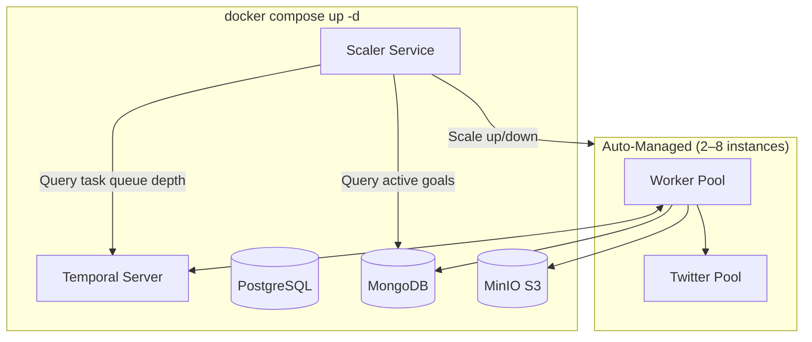
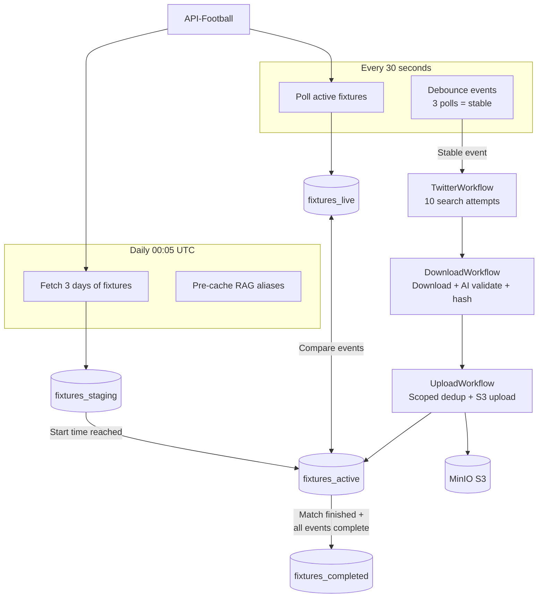
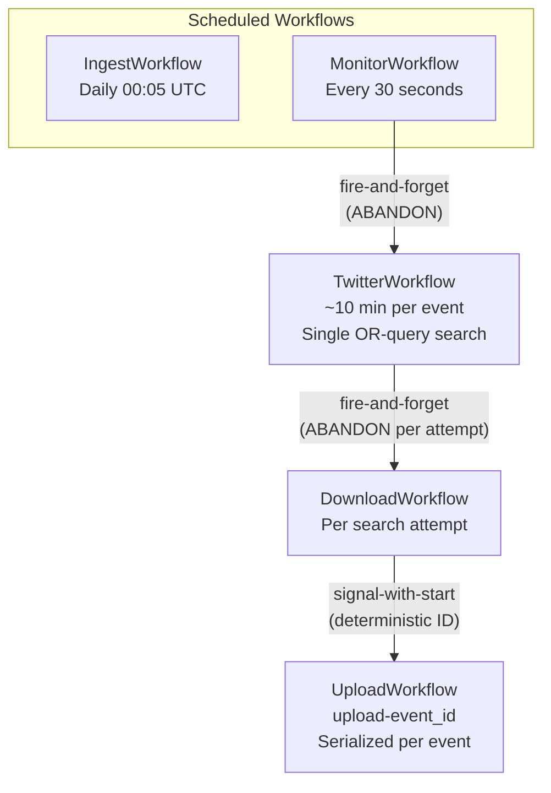
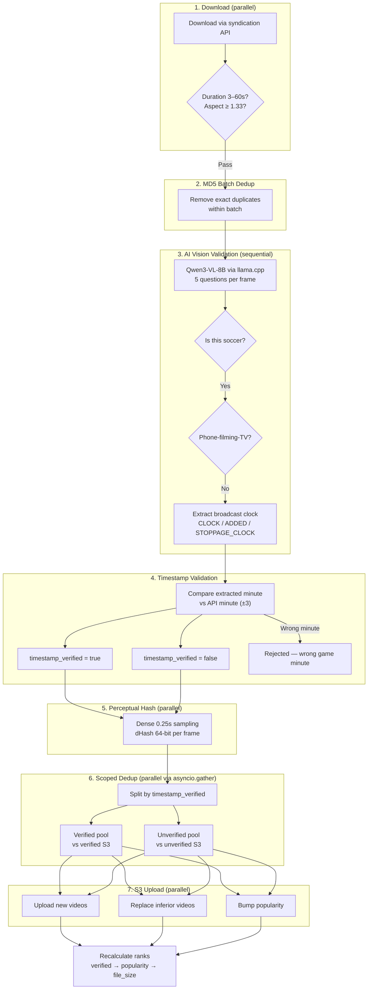

# Found Footy - Architecture Guide

**Temporal.io orchestration with 5-collection MongoDB architecture**

## Core Concept

**5-Collection Design with fixtures_live for Safe Comparison**

Raw API data is stored in `fixtures_live` (temporary, overwritten each poll) for comparison, while `fixtures_active` contains enhanced events that are **never overwritten** — only updated in-place.

| Collection | Purpose | Lifecycle |
|------------|---------|-----------|
| **fixtures_staging** | Upcoming matches (TBD, NS) | Hours to days |
| **fixtures_live** | Raw API data for comparison | ~1 minute (overwritten) |
| **fixtures_active** | Enhanced events with video tracking | ~90 minutes |
| **fixtures_completed** | Permanent archive | 14 days (retention) |
| **team_aliases** | Cached team aliases from RAG pipeline | Persistent |

This prevents data loss — we compare fresh API data against enhanced data without destroying enhancements.

---

## Auto-Scaling Worker Architecture

Workers and Twitter instances are **auto-scaled** by the Scaler Service. Python's GIL limits each process to one CPU core, so multiple worker replicas are needed for parallelism.



`docker compose up -d` starts infrastructure + scaler only. Workers and Twitter instances are started and scaled automatically via `profiles: ["managed"]`.

**Per-worker concurrency**: `max_concurrent_workflow_tasks=10`, `max_concurrent_activities=30`

| Config | Value | Description |
|--------|-------|-------------|
| MIN_INSTANCES | 2 | Minimum workers/Twitter instances |
| MAX_INSTANCES | 8 | Maximum workers/Twitter instances |
| SCALE_UP_THRESHOLD | 5 | Scale up when > 5 pending tasks/worker |
| SCALE_DOWN_THRESHOLD | 2 | Scale down when < 2 pending tasks/worker |
| CHECK_INTERVAL | 30s | How often to check metrics |
| SCALE_COOLDOWN | 60s | Minimum time between scaling actions |

**Why different metrics per service?**
- Workers scale on **Temporal queue depth** (pending tasks backlog)
- Twitter scales on **active goals** (goals with `_monitor_complete=true` but `_download_complete=false`)

**Concurrency guarantees** (all enforced by Temporal Server):

| Guarantee | Scope |
|-----------|-------|
| Workflow ID uniqueness — only one running per ID | Namespace |
| Task exclusivity — each task goes to ONE worker | Task queue |
| Signal ordering — FIFO within a workflow | Per workflow |
| Sticky queue — same workflow prefers same worker | Cache optimization |

---

## Data Flow



---

## Workflow Hierarchy



**Key architecture points:**
- **Monitor → Twitter**: Fire-and-forget with ABANDON parent close policy
- **Twitter → Download**: Fire-and-forget with ABANDON (while-loop checks `_download_workflows` count)
- **Download → Upload**: Signal-with-start with deterministic ID `upload-{event_id}`
- **Single OR-query per search**: `"(Salah OR Mohamed) (Liverpool OR LFC OR Reds)"` — one search per attempt, not per-alias
- **Multiple DownloadWorkflows → ONE UploadWorkflow** per event (FIFO queue via signals)

---

## Video Pipeline

### Download → Validate → Deduplicate → Upload



### AI Clock Extraction

The vision model (Qwen3-VL-8B via llama.cpp) answers 5 structured questions per video frame:

| Field | Example | Purpose |
|-------|---------|---------|
| SOCCER | yes/no | Is this a soccer match? |
| SCREEN | yes/no | Is someone filming a TV screen with a phone? |
| CLOCK | "45:23" | Main broadcast timer text |
| ADDED | "+4" | Added/stoppage time indicator |
| STOPPAGE_CLOCK | "02:36" | Separate sub-timer during stoppage |

**Smart 2–3 check strategy**: Frames extracted at 25% and 75% of video duration. If both agree on SOCCER/SCREEN → done (2 checks). Disagreement → 50% frame as tiebreaker (max 3 checks). Clock fields are extracted from both frames, parsed through field-specific parsers:

- `parse_clock_field()` — handles running clocks, period indicators (2H, ET), frozen clocks (HT/FT)
- `parse_added_field()` — parses "+N" indicators
- `parse_stoppage_clock_field()` — parses "MM:SS" sub-timers
- `compute_absolute_minute()` — combines clock + stoppage into absolute match minute

**Timestamp validation** (`validate_timestamp()`): Compares the extracted absolute minute against `api_elapsed + api_extra` with ±3 tolerance. Includes smart OCR correction for stoppage time (e.g., vision reads "02:36" instead of "92:36" — tries `api_elapsed + parsed_minute`).

### Verification-Scoped Deduplication

Videos are split by `timestamp_verified` before perceptual dedup. Each pool runs as an independent Temporal activity via `asyncio.gather()` — **true parallel execution** with zero shared state:

```
incoming videos ──split──┬── verified ──compare──► verified S3 pool    ─┐
                         │                                               ├─ merge results
                         └── unverified ─compare─► unverified S3 pool  ─┘
```

**Why scope dedup?** A verified goal clip and an unverified clip from a different match moment can have similar perceptual hashes (same broadcast, same camera angles). Without scoping, the verified clip could be replaced by the unverified one. In production, this correctly blocked a Goal 1 clip from replacing a Goal 2 clip (expected ~31', got 15' — same match, different moment).

**Failure handling**: If either pool fails, the entire batch is skipped (no videos uploaded as new). This prevents the duplicate video bug that originally motivated serialized uploads.

### Perceptual Hash Matching

- Sample frames every **0.25 seconds**, apply **histogram equalization**, compute **dHash** (64-bit)
- Format: `dense:0.25:<ts>=<hash>,<ts>=<hash>,...`
- **Offset-tolerant**: Tries all time offsets, requires **3 consecutive frames** at consistent offset
- **Frame match**: Hamming distance ≤10 bits (of 64)

**Quality comparison** (when hashes match):
- Durations within **15%** → same clip → prefer **larger file** (higher resolution)
- Durations differ **>15%** → different clips → prefer **longer duration**

### Video Ranking

Rank 1 = best video. Sort order (all descending):

1. **`timestamp_verified`** — verified always above unverified
2. **`popularity`** — how many times same content discovered
3. **`file_size`** — proxy for resolution quality

---

## Collection Schemas

### fixtures_active (primary)

```json
{
  "_id": 5000,
  "activated_at": "2025-11-24T15:00:00Z",
  "events": [
    {
      "player": {"id": 234, "name": "D. Szoboszlai"},
      "team": {"id": 40, "name": "Liverpool"},
      "type": "Goal", "detail": "Normal Goal",
      "time": {"elapsed": 23},

      "_event_id": "5000_40_234_Goal_1",
      "_monitor_workflows": ["monitor-T0:30", "monitor-T1:00", "monitor-T1:30"],
      "_monitor_complete": true,
      "_twitter_aliases": ["Liverpool", "LFC", "Reds"],
      "_download_workflows": ["download1-...", "..."],
      "_download_complete": true,

      "_s3_videos": [
        {
          "s3_url": "http://minio:9000/footy/...",
          "_s3_key": "5000/5000_40_234_Goal_1/abc123.mp4",
          "perceptual_hash": "dense:0.25:...",
          "width": 1920, "height": 1080,
          "file_size": 15000000, "duration": 45.2,
          "popularity": 3, "rank": 1,
          "timestamp_verified": true,
          "extracted_minute": 23,
          "timestamp_status": "verified"
        }
      ]
    }
  ]
}
```

### Event Enhancement Fields

| Field | Type | Set By | Purpose |
|-------|------|--------|---------|
| `_event_id` | string | Monitor | `{fixture}_{team}_{player}_{type}_{seq}` |
| `_monitor_workflows` | array | Monitor | Workflow IDs that saw this event (debounce) |
| `_monitor_complete` | bool | TwitterWorkflow | Set at VERY START of TwitterWorkflow |
| `_twitter_aliases` | array | TwitterWorkflow | Team search variations |
| `_download_workflows` | array | DownloadWorkflow | Workflow IDs for completed attempts |
| `_download_complete` | bool | UploadWorkflow | Set when `len(_download_workflows) >= 10` |
| `_first_seen` | datetime | Monitor | When event first appeared |
| `_removed` | bool | Monitor | Set when VAR disallows |
| `_discovered_videos` | array | TwitterWorkflow | Video URLs from searches |
| `_s3_videos` | array | UploadWorkflow | Uploaded videos with full metadata |

### Video Object Fields

| Field | Type | Description |
|-------|------|-------------|
| `s3_url` | string | Public URL |
| `_s3_key` | string | S3 object key |
| `perceptual_hash` | string | Dense sampling hash |
| `width`, `height` | int | Resolution |
| `file_size` | int | Bytes |
| `duration` | float | Seconds |
| `bitrate` | int | Bits per second |
| `aspect_ratio` | float | Width/height |
| `resolution_score` | int | Width × height |
| `popularity` | int | Duplicate discovery count |
| `rank` | int | 1 = best |
| `source_url` | string | Original tweet URL |
| `hash_version` | string | Hash algorithm version |
| `timestamp_verified` | bool | AI confirmed correct match minute |
| `extracted_minute` | int/null | AI-extracted minute from broadcast clock |
| `timestamp_status` | string | "verified", "unverified", or "rejected" |

---

## Workflow Activity Reference

### IngestWorkflow (Daily 00:05 UTC)

Fetches 3 days of fixtures, routes by status, pre-caches RAG aliases, cleans up old data (14-day retention).

| Activity | Timeout | Retries |
|----------|---------|---------|
| `fetch_todays_fixtures` | 30s | 3 (2.0× from 1s) |
| `fetch_fixtures_by_ids` | 30s | 3 (2.0× from 1s) |
| `categorize_and_store_fixtures` | 30s | 3 (2.0× from 1s) |
| `cleanup_old_fixtures` | 120s | 2 |

### MonitorWorkflow (Every 30 seconds)

Polls staging fixtures (interval-based, 15-min intervals for staging), activates fixtures, detects events, triggers Twitter when stable (3 polls).

| Activity | Timeout | Retries |
|----------|---------|---------|
| `fetch_staging_fixtures` | 60s | 3 |
| `process_staging_fixtures` | 30s | 3 |
| `activate_pending_fixtures` | 30s | 2 |
| `fetch_active_fixtures` | 60s | 3 |
| `store_and_compare` | 10s | 3 (2.0× from 1s) |
| `process_fixture_events` | 60s | 3 |
| `complete_fixture_if_ready` | 10s | 3 (2.0× from 1s) |
| `notify_frontend_refresh` | 5s | 1 |

### TwitterWorkflow (~10 min per event)

Resolves team aliases (cache or RAG), builds a single OR-query per attempt, searches Twitter up to 10 times with ~1-min durable timers.

| Activity | Timeout | Retries |
|----------|---------|---------|
| `get_cached_team_aliases` | 10s | 2 |
| `get_team_aliases` | 60s | 2 |
| `save_team_aliases` | 10s | 2 |
| `check_event_exists` | 30s | 3 |
| `get_twitter_search_data` | 30s | 3 |
| `execute_twitter_search` | 60s | 3 (1.5× from 10s) |
| `save_discovered_videos` | 30s | 3 (2.0× from 2s) |

### DownloadWorkflow (per search attempt)

Downloads, AI validates (soccer + timestamp), hashes, delegates to UploadWorkflow. **7 activities.**

| Activity | Timeout | Retries |
|----------|---------|---------|
| `register_download_workflow` | 30s | 5 |
| `check_event_exists` | 30s | 1 |
| `download_single_video` | 90s | 3 (2.0× from 2s) |
| `validate_video_is_soccer` | 90s | 4 (2.0× from 3s, heartbeat between AI calls) |
| `generate_video_hash` | heartbeat 60s | 2 (heartbeat every 5 frames) |
| `cleanup_download_temp` | 30s | 2 |
| `queue_videos_for_upload` | 60s | 3 |

**Pipeline**: register → download (parallel) → MD5 batch dedup → AI validation with clock extraction (sequential) → timestamp validation → hash generation (parallel) → signal UploadWorkflow

### UploadWorkflow (serialized per event)

S3 dedup (scoped by verification status) and upload. ID: `upload-{event_id}`. **12 activities.**

| Activity | Timeout | Retries |
|----------|---------|---------|
| `fetch_event_data` | 30s | 3 |
| `deduplicate_by_md5` | 30s | 2 |
| `deduplicate_videos` | heartbeat 120s, STC 1h | 3 |
| `upload_single_video` | 60s | 3 |
| `update_video_in_place` | 30s | 3 |
| `replace_s3_video` | 30s | 3 |
| `bump_video_popularity` | 15s | 2 |
| `save_video_objects` | 30s | 3 |
| `recalculate_video_ranks` | 30s | 2 |
| `cleanup_individual_files` | 30s | 2 |
| `cleanup_upload_temp` | 30s | 2 |
| `check_and_mark_download_complete` | 30s | 3 |

---

## Race Condition Prevention

| Problem | Solution | Guarantee |
|---------|----------|-----------|
| Two downloads upload same video | UploadWorkflow serialized per event | One upload at a time per event |
| Fixture completes during downloads | `_download_complete` only set at 10 workflows | All attempts must register first |
| Goal gets VAR'd mid-pipeline | Multi-layer `check_event_exists` | Workflows abort gracefully |
| Verified clip replaced by unverified | Scoped dedup — separate pools | Verified only compared to verified |

---

## Key Design Decisions

| Decision | Rationale |
|----------|-----------|
| Signal-with-start for Upload | Multiple downloads → ONE serialized upload per event. Namespace-scoped IDs avoid "already started" errors |
| BLOCKING downloads | `_download_workflows` array must track completed attempts reliably |
| Alias resolution inside Twitter | Eliminates double fire-and-forget chain that caused duplicate workflows |
| Workflow-ID arrays over counters | Idempotent (`$addToSet`), auditable, failure-resistant |
| Scoped dedup by verification | Prevents verified clips from being replaced by unverified similar content |
| Parallel scoped dedup | Verified and unverified pools have zero shared state — true `asyncio.gather` parallelism |
| 10 Twitter attempts × 1-min spacing | Goal videos appear over 5–15 minutes — captures early SD through late HD |
| Pre-caching aliases at ingest | By match time, aliases are cached. TwitterWorkflow just does fast lookup |
| Fail-closed AI validation | If AI unavailable, skip video. Never upload unvalidated content |
| Heartbeat-based timeouts | Proves activity is making progress — better than arbitrary execution timeouts |

---

## Infrastructure

### Port Allocation

| Service | Port | Purpose |
|---------|------|---------|
| Temporal UI | 3200 | Workflow monitoring |
| Mongo Express | 3201 | MongoDB GUI |
| MinIO Console | 3202 | S3 management |
| Twitter VNC | 3203 | Browser access (VNC instance only) |

### Environment Variables

```bash
API_FOOTBALL_KEY=...          # API-Football
MONGODB_URI=mongodb://...     # MongoDB connection
S3_ENDPOINT=http://minio:9000 # MinIO S3
TEMPORAL_ADDRESS=temporal:7233 # Temporal gRPC
TWITTER_SERVICE_URL=http://twitter:8888
LLAMA_URL=...                 # llama.cpp vision/LLM endpoint
```

---

## Debugging

```bash
# Start stack (scaler auto-manages workers + twitter)
docker compose up -d

# Worker logs
docker compose logs -f worker

# Check scaler decisions
docker compose logs -f scaler

# Run tests
docker exec <worker> rm -rf /app/tests && docker cp tests <worker>:/app/tests
docker exec <worker> python -m pytest tests/ --ignore=tests/test_rag_pipeline.py -v
```

| Symptom | Cause | Fix |
|---------|-------|-----|
| Fixture stuck in active | Events missing `_download_complete` | Check TwitterWorkflow in Temporal UI |
| Twitter search empty | Session expired | Re-login via VNC (port 3203) |
| Videos not uploading | S3 connection | Check MinIO is running |
| Low-rank verified video | Scoped dedup issue | Check dedup logs for pool split |
