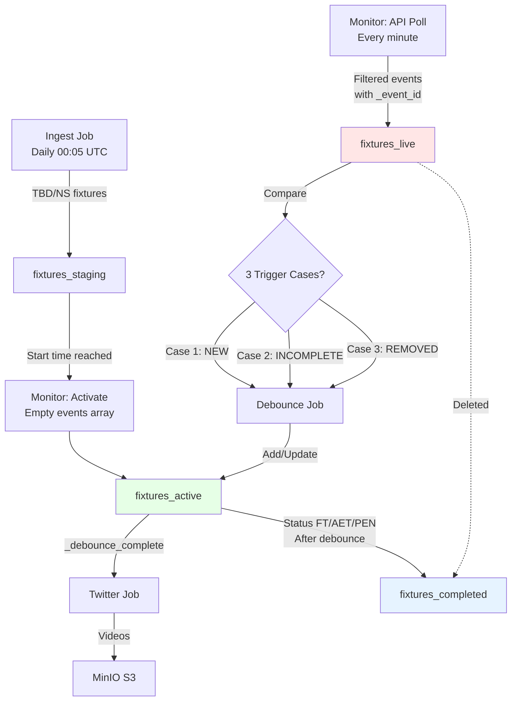
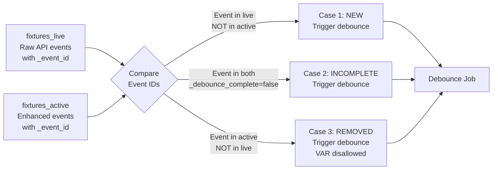
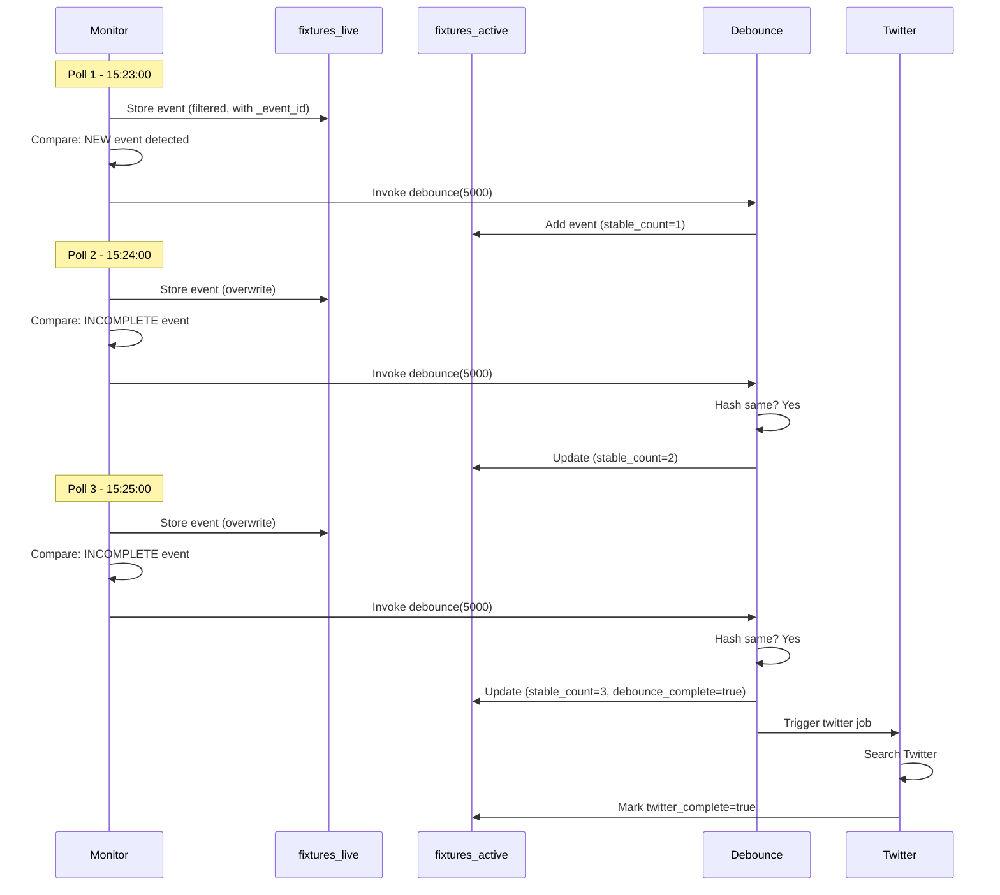

# Found Footy - 4-Collection In-Place Debounce Architecture

## 🎯 Core Concept

**4-Collection Design with fixtures_live for Safe Comparison**

Raw API data is stored in `fixtures_live` (temporary, overwritten each poll) for comparison, while `fixtures_active` contains enhanced events that are **never overwritten** - only updated in-place by debounce job.

**Why 4 Collections?**
- **fixtures_staging**: Waiting to activate
- **fixtures_live**: Raw API data (temporary, for comparison only)
- **fixtures_active**: Enhanced events (never replaced, only updated)
- **fixtures_completed**: Archive

This prevents data loss - we can compare fresh API data against enhanced data without destroying enhancements.

---

## 📊 Data Flow



### Comparison Logic (3 Trigger Cases)



---

## 🗄️ Collection Schemas

### fixtures_staging

Fixtures waiting to start (status TBD, NS).

```json
{
  "_id": 5000,
  "fixture": {
    "id": 5000,
    "date": "2025-11-24T15:00:00Z",
    "status": {"short": "TBD"}
  },
  "teams": {
    "home": {"id": 40, "name": "Liverpool"},
    "away": {"id": 50, "name": "Man City"}
  },
  "league": {"id": 39, "name": "Premier League"}
}
```

### fixtures_live

**Temporary storage** for raw API data. Overwritten each poll. **Filtered to Goals only**.

```json
{
  "_id": 5000,
  "stored_at": "2025-11-24T15:25:00Z",
  "fixture": {...},
  "teams": {...},
  "events": [
    {
      "player": {"id": 234, "name": "D. Szoboszlai"},
      "team": {"id": 40, "name": "Liverpool"},
      "type": "Goal",
      "detail": "Normal Goal",
      "time": {"elapsed": 23},
      "_event_id": "5000_234_23_Goal_Normal Goal"  // Generated by monitor
    }
  ]
}
```

**Key Points:**
- Only Goals stored (Normal Goal, Penalty, Own Goal)
- `_event_id` generated in monitor using `_generate_event_id()`
- Gets **overwritten** every poll cycle
- Used ONLY for comparison, not for enhancement

### fixtures_active

Enhanced fixtures. Events array **grows incrementally**, **never replaced**.

```json
{
  "_id": 5000,
  "activated_at": "2025-11-24T15:00:00Z",
  "fixture": {...},
  "teams": {...},
  "events": [
    {
      // ========== RAW API FIELDS ==========
      "player": {"id": 234, "name": "D. Szoboszlai"},
      "team": {"id": 40, "name": "Liverpool"},
      "assist": {"id": 456, "name": "M. Salah"},
      "type": "Goal",
      "detail": "Normal Goal",
      "time": {"elapsed": 23},
      
      // ========== ENHANCED FIELDS (added by debounce_job) ==========
      "_event_id": "5000_234_23_Goal_Normal Goal",
      "_stable_count": 3,
      "_debounce_complete": true,
      "_twitter_complete": false,
      "_first_seen": "2025-11-24T15:23:45Z",
      "_snapshots": [
        {"timestamp": "2025-11-24T15:23:45Z", "hash": "abc123"},
        {"timestamp": "2025-11-24T15:24:45Z", "hash": "abc123"},
        {"timestamp": "2025-11-24T15:25:45Z", "hash": "abc123"}
      ],
      "_score_before": {"home": 0, "away": 0},
      "_score_after": {"home": 1, "away": 0},
      "_scoring_team": "home",
      "_twitter_search": "Szoboszlai Liverpool"
    }
  ]
}
```

**Key Points:**
- Starts with **empty events array** when activated
- Events added by debounce job (Case 1: NEW)
- Events updated in-place (Case 2/3: INCOMPLETE/REMOVED)
- **Never replaced** - only $push and $set operations

### fixtures_completed

Archive with all enhancements intact. fixtures_live entry deleted.

```json
{
  "_id": 5000,
  "completed_at": "2025-11-24T16:50:00Z",
  "fixture": {...},
  "events": [...]  // All enhanced fields preserved
}
```

---

## 🔄 Job Details

### 1. Ingest Job (Daily 00:05 UTC)

**Purpose**: Fetch today's fixtures and route by status

**Process**:
```python
1. Fetch fixtures from API-Football for today
2. Filter to 50 tracked teams
3. Route by status:
   - TBD/NS → fixtures_staging
   - LIVE → fixtures_active (with empty events)
   - FT/AET/PEN → fixtures_completed
```

**Why empty events?** Monitor will populate events from fixtures_live comparison.

---

### 2. Monitor Job (Every Minute)

**Purpose**: Activate fixtures, compare live vs active, trigger debounce

**Process**:
```python
1. Activate fixtures (staging → active with EMPTY events array)

2. Batch fetch fresh API data for ALL active fixtures

3. For each fixture:
   a. Filter events (only Goals: Normal Goal, Penalty, Own Goal)
   b. Generate _event_id for each filtered event
   c. Store in fixtures_live (overwrite previous)

4. For each fixture:
   a. Compare fixtures_live vs fixtures_active
   b. Detect 3 trigger cases:
      - NEW: Event in live, not in active
      - INCOMPLETE: Event in both, _debounce_complete=false
      - REMOVED: Event in active, not in live (VAR)
   c. If needs_debounce: directly invoke debounce_job(fixture_id)

5. After debounce:
   a. Check if status is FT/AET/PEN
   b. Move to fixtures_completed (also deletes fixtures_live)
```

**Key Methods:**
- `store_live_fixture()`: Filters events, generates _event_id
- `compare_live_vs_active()`: Returns needs_debounce + counts
- `debounce_fixture_events_op()`: Directly invoked per fixture

**Event ID Format:**
```python
f"{fixture_id}_{player_id}_{elapsed}_{type}_{detail}"
# Example: "5000_234_23_Goal_Normal Goal"
```

---

### 3. Debounce Job (Per Fixture)

**Purpose**: Process events using clean iteration pattern

**Process (Clean Iteration Pattern)**:
```python
1. Get live_events and active_events

2. Build dict of live events by _event_id:
   live_events_dict = {e["_event_id"]: e for e in live_events}

3. Iterate active_events:
   FOR each active_event:
     IF active_event["_event_id"] in live_events_dict:
       # CASE 2 or 3: Event exists in both
       live_event = live_events_dict.pop(event_id)
       
       IF hash(live_event) == last_snapshot_hash:
         # CASE 3: Hash unchanged - increment stable_count
         stable_count += 1
         Add snapshot
         IF stable_count >= 3:
           Mark _debounce_complete
           Trigger twitter job
       ELSE:
         # CASE 2: Hash changed - reset
         stable_count = 1
         Add snapshot with new hash
     
     ELSE:
       # CASE 4: Event in active but NOT in live (VAR removed)
       Mark event as _removed

4. Whatever's left in live_events_dict are NEW events:
   FOR each event_id, live_event in live_events_dict.items():
     # CASE 1: NEW event
     Build enhancement fields:
       - _event_id (already set)
       - _stable_count = 1
       - _debounce_complete = false
       - _first_seen = now
       - _snapshots = [{"timestamp": now, "hash": hash(live_event)}]
       - _score_before, _score_after, _scoring_team
       - _twitter_search = "{player_last_name} {team_name}"
     
     Add enhanced event to fixtures_active
```

**Hash Function:**
```python
def generate_event_hash(event: dict) -> str:
    key_fields = {
        "player_id": event.get("player", {}).get("id"),
        "team_id": event.get("team", {}).get("id"),
        "type": event.get("type"),
        "detail": event.get("detail"),
        "time_elapsed": event.get("time", {}).get("elapsed"),
        "assist_id": event.get("assist", {}).get("id"),
    }
    return hashlib.md5(json.dumps(key_fields, sort_keys=True).encode()).hexdigest()
```

**Why This Pattern?**
- No double iteration needed
- Clear handling of all 4 cases
- Whatever's left = NEW events (elegant!)

---

### 4. Twitter Job (Per Event)

**Purpose**: Search Twitter for video clips

**Process**:
```python
1. Get event from fixtures_active where:
   - _debounce_complete = true
   - _twitter_complete = false

2. Use prebuilt _twitter_search field

3. Search Twitter API for videos

4. Download videos to MinIO S3

5. Update fixtures_active:
   - Mark _twitter_complete = true
   - Store video URLs in _discovered_videos
```

---

## 🔑 Key Design Decisions

### Why fixtures_live?

**Problem**: If we overwrite fixtures_active with fresh API data, we lose all enhancement fields!

**Solution**: Store raw API data in fixtures_live (temporary), compare against fixtures_active, then update fixtures_active in-place.

### Why filter events in monitor?

**Efficiency**: Only store events we care about (Goals). No need to process substitutions, cards, etc.

### Why generate _event_id in monitor?

**Clean comparison**: Having _event_id in both live and active makes comparison trivial - just compare sets of IDs.

### Why clean iteration pattern?

**Elegance**: Build dict, pop as you process, leftovers are NEW events. No double iteration needed.

### Why hash-based stability?

**Reliability**: API might return different object order but same data. Hash catches real changes while ignoring cosmetic ones.

---

## 📝 Event Enhancement Fields

| Field | Type | Purpose |
|-------|------|---------|
| `_event_id` | string | Unique ID: `{fixture_id}_{player_id}_{elapsed}_{type}_{detail}` |
| `_stable_count` | int | Consecutive unchanged polls (0-3) |
| `_debounce_complete` | bool | true when stable_count >= 3 |
| `_twitter_complete` | bool | true when videos downloaded |
| `_first_seen` | datetime | When event first appeared |
| `_snapshots` | array | History of hashes and timestamps |
| `_score_before` | object | `{"home": 0, "away": 0}` |
| `_score_after` | object | `{"home": 1, "away": 0}` |
| `_scoring_team` | string | "home" or "away" |
| `_twitter_search` | string | "{player_last_name} {team_name}" |
| `_removed` | bool | true if VAR disallowed (Case 4) |

---

## 🎯 Comparison Cases (3 Trigger Debounce)

### Case 1: NEW
- **Condition**: Event in live, NOT in active
- **Action**: Add event to active with stable_count=1

### Case 2: INCOMPLETE + Hash Changed
- **Condition**: Event in both, _debounce_complete=false, hash different
- **Action**: Reset stable_count=1, update event data

### Case 3: INCOMPLETE + Hash Same
- **Condition**: Event in both, _debounce_complete=false, hash same
- **Action**: Increment stable_count, complete at 3, trigger twitter

### Case 4: REMOVED (not a trigger, handled in debounce)
- **Condition**: Event in active, NOT in live
- **Action**: Mark _removed=true (VAR disallowed goal)

---

## 🚀 Execution Flow Example



---

## 🔍 Debugging Tips

### Check fixtures_live
```javascript
// In MongoDB Express
db.fixtures_live.find()

// Should see:
// - Only Goal events
// - _event_id field present
// - stored_at timestamp
```

### Check fixtures_active
```javascript
// In MongoDB Express
db.fixtures_active.find({"events._event_id": {$exists: true}})

// Should see:
// - events array with enhancement fields
// - _stable_count progressing 1 → 2 → 3
// - _debounce_complete=true at stable_count=3
```

### Check comparison logic
```python
# In Dagster UI logs
"🎯 Fixture 5000 needs debounce: NEW=1, INCOMPLETE=0, REMOVED=0"
```

---

## 📊 Collection Lifecycle

```
fixtures_staging: Hours to days (until start time)
fixtures_live: ~1 minute (overwritten each poll)
fixtures_active: ~90 minutes (fixture duration)
fixtures_completed: Forever (archive)
```

---

## 🎓 Summary

**4 Collections**:
1. staging: Waiting to start
2. live: Raw API (temp comparison)
3. active: Enhanced (never replaced)
4. completed: Archive

**3 Trigger Cases**:
1. NEW: Add to active
2. INCOMPLETE: Update in active
3. REMOVED: Mark removed in active

**Clean Pattern**: Dict → Pop → Leftovers = NEW

**No Data Loss**: live is temporary, active is sacred.
