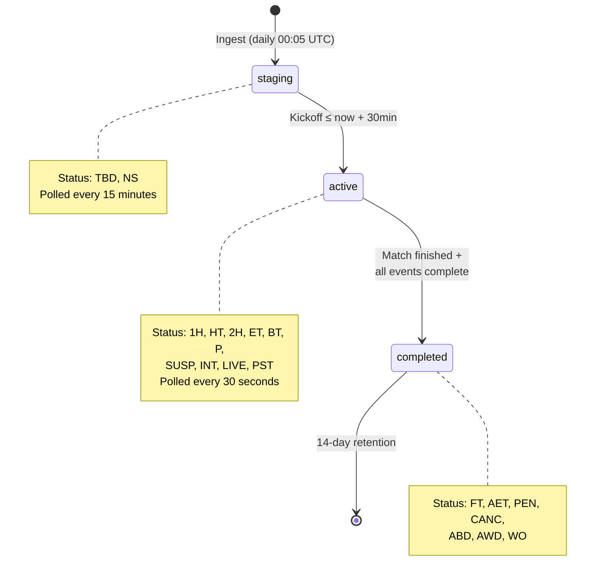
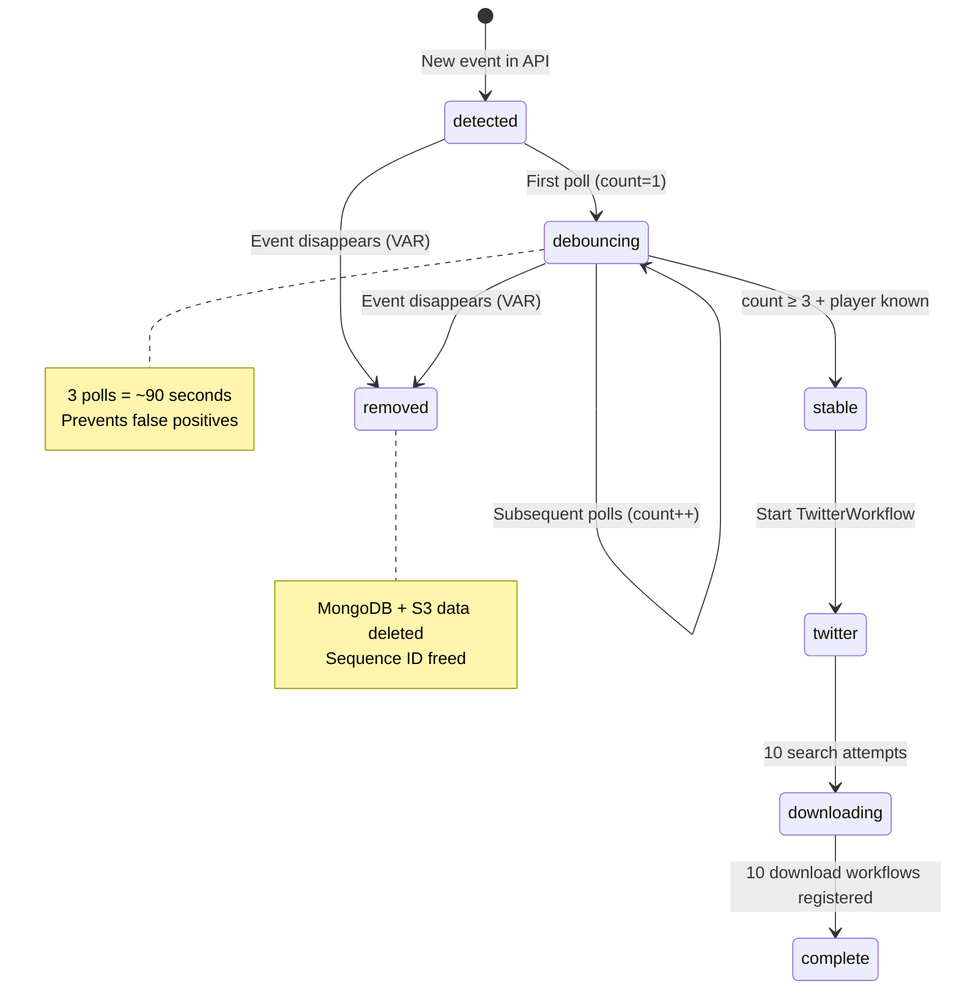

# Orchestration — Event Lifecycle & State Machine

How Found Footy discovers, debounces, and processes football events.

## Fixture Lifecycle



**Key**: PST (Postponed) is treated as **active**, not completed. Short delays (15–30 min) are common and the match may still happen.

### Staging Polling Optimization

Staging fixtures are polled on **15-minute intervals** (`:00`, `:15`, `:30`, `:45`). Each fixture stores a `_last_monitor` timestamp. If the current interval matches the fixture's last-polled interval, it's skipped → ~97% fewer staging API calls.

### Completion Conditions

A fixture moves to `fixtures_completed` when **both**:
1. API status is in completed set (FT, AET, PEN, CANC, ABD, AWD, WO)
2. **Every** event has `_download_complete = true`

---

## Event State Machine



### Event ID Format

```
{fixture_id}_{team_id}_{player_id}_{event_type}_{sequence}
```

Example: `5000_40_234_Goal_1` — Fixture 5000, team 40 (Liverpool), player 234 (Szoboszlai), first Goal.

**Sequence numbering**: Per player, per type. If player 234 scores twice, the second goal is `5000_40_234_Goal_2`.

**VAR handling**: When an event disappears from the API, it's deleted from MongoDB and S3. The sequence number is freed. If the same player scores a new goal later, it reuses the freed sequence number without collision.

---

## Event Tracking Fields

These fields track an event's progress through the pipeline. All prefixed with `_` to indicate internal enrichment.

| Field | Type | Set By | When |
|-------|------|--------|------|
| `_event_id` | string | Monitor | Event first detected |
| `_monitor_workflows` | string[] | Monitor | Each poll that sees the event (`$addToSet`) |
| `_monitor_complete` | bool | TwitterWorkflow | At the **start** of TwitterWorkflow |
| `_first_seen` | datetime | Monitor | First appearance |
| `_twitter_aliases` | string[] | TwitterWorkflow | After alias resolution |
| `_discovered_videos` | object[] | TwitterWorkflow | After each search attempt |
| `_download_workflows` | string[] | DownloadWorkflow | Each completed download attempt |
| `_download_complete` | bool | UploadWorkflow | When `len(_download_workflows) >= 10` |
| `_removed` | bool | Monitor | Event disappeared from API (VAR) |

### Why `_monitor_complete` is set by TwitterWorkflow

If Monitor set the flag, a failed TwitterWorkflow spawn would leave the flag true — Monitor would never retry. By having TwitterWorkflow set it at its own start, retry semantics work naturally:

- Monitor sees `count >= 3 AND _monitor_complete = false` → spawn Twitter
- Twitter starts → sets `_monitor_complete = true`
- If Twitter fails to start → flag stays false → next Monitor cycle retries

### Why workflow-ID arrays instead of counters

`_monitor_workflows` and `_download_workflows` use `$addToSet` (idempotent). Benefits:
- **Idempotent**: Temporal retries don't double-count
- **Auditable**: Can see exactly which workflows processed the event
- **Failure-resistant**: No race between increment and read

---

## Debouncing Logic

Events must appear in **3 consecutive monitor polls** (~90 seconds) before triggering:

```
Poll 1: Goal detected → _monitor_workflows = ["monitor-T0:30"]     → count=1
Poll 2: Goal still there → _monitor_workflows += ["monitor-T1:00"]  → count=2
Poll 3: Goal still there → _monitor_workflows += ["monitor-T1:30"]  → count=3 → TRIGGER
```

Additional requirement: **player must be identified**. The API sometimes reports goals with `player.name = null` or `"Unknown"` before identifying the scorer. We wait for identification because Twitter searches require a player name.

When the player becomes identified, the `player_id` changes → new `_event_id`. The old unknown-player event is removed via VAR logic (set comparison).

---

## Workflow Triggering Chain

```
MonitorWorkflow (every 30s)
  │
  ├─ Detects stable event (3 polls + player known)
  │
  └─ start_child_workflow(TwitterWorkflow, parent_close_policy=ABANDON)
       │
       ├─ Resolves team aliases (cache hit or RAG pipeline)
       │
       └─ 10× search attempts (1-min durable timers)
            │
            └─ start_child_workflow(DownloadWorkflow, BLOCKING)
                 │
                 ├─ Downloads + AI validates + hashes
                 │
                 └─ signal_with_start(UploadWorkflow, id="upload-{event_id}")
                      │
                      └─ Scoped dedup + S3 upload + rank
```

| Transition | Pattern | Why |
|------------|---------|-----|
| Monitor → Twitter | Fire-and-forget (ABANDON) | Monitor must not block on 10-min Twitter lifecycle |
| Twitter → Download | BLOCKING child | Must track completion in `_download_workflows` |
| Download → Upload | Signal-with-start | Many downloads → one serialized upload per event |

---

## Parallel Fixture Processing

The MonitorWorkflow processes **all active fixtures in parallel** using `asyncio.gather()`. Each fixture is independent:

```python
fixture_tasks = [process_fixture(f) for f in fixtures]
fixture_results = await asyncio.gather(*fixture_tasks)
```

Each `process_fixture()` call runs `store_and_compare` → `process_fixture_events` → optionally `complete_fixture_if_ready` for that single fixture. Results are aggregated after all complete.

---

## Timeline Example

```
00:05 UTC   IngestWorkflow fetches fixtures → staging collection
14:30       Fixture 5000 (Liverpool vs Arsenal, 15:00 KO) pre-activated → active
14:55       Monitor polls staging, activates remaining fixtures  
15:00       Match kicks off — status changes 1H
15:23:00    API shows goal (Szoboszlai, 23') — Poll 1
15:23:30    Same goal still in API — Poll 2
15:24:00    Same goal, 3rd poll → stable
                Monitor starts TwitterWorkflow
                Twitter sets _monitor_complete = true
                Twitter resolves aliases: ["Liverpool", "LFC", "Reds"]
15:24:30    Twitter search #1 → finds 2 videos
                DownloadWorkflow: download → AI validate → hash
                Signals UploadWorkflow (upload-5000_40_234_Goal_1)
                Upload: scoped dedup → S3 → rank
15:25:30    Twitter search #2 → finds 1 new video (HD this time)
                Download → validate → hash → signal Upload
                Upload: hash matches existing → larger file → REPLACE
15:26:30    Twitter search #3–10 continue...
15:34:30    All 10 attempts done → _download_complete = true
16:50       Match ends (FT) + all events have _download_complete
                Fixture moved to fixtures_completed
                Temp directories cleaned up
```
