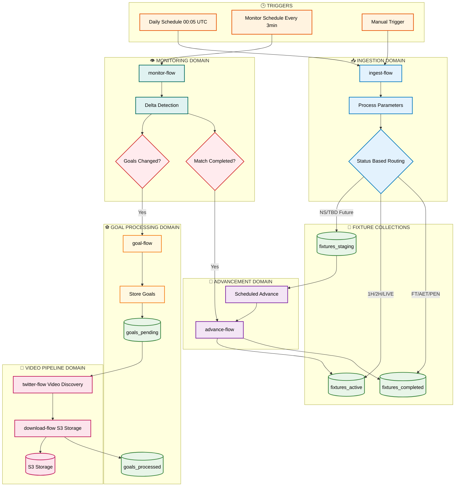
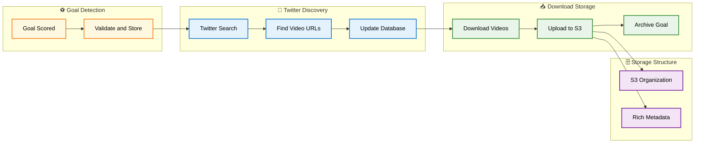

# Found Footy - Enterprise Football Data Pipeline

## 🎯 **Executive Summary**

Found Footy is an **enterprise-grade, real-time football data processing platform** built with Prefect 3 and modern microservices architecture. The system features **domain-separated flows** with dedicated worker pools and a **two-stage video pipeline** for goal content discovery and storage.

### **Key Business Value:**
- ⚡ **Sub-3-minute goal detection** - Average 90-second response to scoring events
- 🏗️ **Domain-separated architecture** - Clean separation with dedicated worker pools
- 🔄 **Zero-downtime monitoring** - Continuous 24/7 operation with intelligent resource management
- 🎯 **Direct flow triggering** - No automation complexity, pure `run_deployment()` calls
- 📊 **Status-driven lifecycle** - Intelligent fixture routing based on FIFA API status codes
- 🚀 **Rich flow naming** - Contextual names for instant debugging clarity
- 📥 **Two-stage video pipeline** - Clean separation of video discovery and S3 storage

## 🏗️ **Complete System Architecture**

### **🌊 Main Data Flow**



### **📊 Video Pipeline Flow**



## 🎨 **Architecture Legend**

| Color | Domain | Purpose | Examples |
|-------|--------|---------|----------|
| 🟠 **Trigger** | External Events | System initiation | Daily schedules, manual triggers |
| 🔵 **Ingest** | Data Ingestion | API data fetching | Fixture ingestion, parameter processing |
| 🟢 **Storage** | Data Persistence | MongoDB collections | fixtures_active, goals_pending |
| 🟣 **Advance** | Data Movement | Collection transfers | staging → active → completed |
| 🟢 **Monitor** | Live Monitoring | Real-time detection | Goal detection, status changes |
| 🟡 **Goal** | Goal Processing | Goal event handling | Validation, storage, triggering |
| 🔴 **Video** | Video Pipeline | Content discovery/storage | Twitter search, S3 upload |
| 🔴 **Decision** | Flow Control | Conditional routing | Goal changed?, Match completed? |

## 🔧 **Domain-Separated Flow Architecture**

### **📁 Flow Structure**
```
found_footy/flows/
├── shared_tasks.py          # Reusable API/storage components
├── ingest_flow.py          # ingest-flow (Pure ingestion domain)
├── monitor_flow.py         # monitor-flow (Live monitoring domain)  
├── advance_flow.py         # advance-flow (Collection movement domain)
├── goal_flow.py            # goal-flow (Goal processing domain)
├── twitter_flow.py         # twitter-flow (Video discovery domain)
├── download_flow.py        # download-flow (S3 storage domain)
├── flow_naming.py          # Rich naming service
└── flow_triggers.py        # Async scheduling utilities
```

### **🎯 Flow Responsibilities**

| Flow Name | Domain | Worker Pool | Purpose | Triggers |
|-----------|--------|-------------|---------|----------|
| **ingest-flow** | Ingestion | `ingest-pool` | Status-driven fixture routing | Daily schedule + Manual |
| **monitor-flow** | Monitoring | `monitor-pool` | Live goal detection | Every 3 minutes |
| **advance-flow** | Movement | `advance-pool` | Collection advancement | Scheduled + Event-driven |
| **goal-flow** | Processing | `goal-pool` | Goal validation + Twitter triggering | Monitor-triggered |
| **twitter-flow** | Discovery | `twitter-pool` | Video search & URL discovery | Goal-triggered |
| **download-flow** | Storage | `download-pool` | Video download & S3 upload | Twitter-triggered |

## 🌊 **Two-Stage Video Pipeline**

The system uses a clean separation of concerns for video processing:

```
Goal Detected → Goal Flow → Twitter Flow (Search) → Download Flow (S3) → Complete
     ⚽             🎯           🔍 Discovery        📥 Storage        ✅
```

### **📱 Twitter Video Discovery**

The Twitter flow searches for goal videos and collects URLs:

1. **Search Strategy**: Uses player name, team name, minute, and fixture context
2. **URL Discovery**: Extracts video URLs from tweet media entities
3. **Metadata Collection**: Gathers quality, duration, and source information
4. **Database Update**: Stores discovered videos in `goals_pending`

**Example Search Terms:**
```python
search_terms = [
    "Messi goal",
    "Barcelona goal 67",
    "Messi Barcelona", 
    "goal 67'"
]
```

### **📥 Download & S3 Storage**

The Download flow handles video downloading and S3 storage:

1. **Video Download**: Uses yt-dlp for reliable video extraction
2. **S3 Upload**: Organizes videos by fixture and goal
3. **Rich Metadata**: Stores comprehensive information with each video
4. **Cleanup**: Removes temporary files and moves goal to `goals_processed`

**S3 Structure:**
```
fixtures/
├── 12345/
│   └── goals/
│       ├── 12345_67_789_1.mp4
│       └── 12345_67_789_2.mp4
└── 67890/
    └── goals/
        └── 67890_23_456_1.mp4
```

**S3 Metadata:**
```json
{
    "goal_id": "12345_67_789",
    "search_term": "Messi goal",
    "uploaded_at": "2025-01-15T10:35:00Z"
}
```

## 🗄️ **Storage Services**

| Service | Purpose | URL | Credentials |
|---------|---------|-----|-------------|
| **Prefect UI** | Flow Management | http://localhost:4200 | No auth |
| **MinIO Console** | S3 Management UI | http://localhost:9001 | footy_admin / footy_secure_pass |
| **MinIO S3 API** | Programmatic Access | http://localhost:9000 | footy_admin / footy_secure_pass |
| **MongoDB Admin** | Database Management | http://localhost:8083 | admin / admin123 |

## 📊 **Data Collections**

| Collection | Purpose | Document Count | Key Fields |
|------------|---------|----------------|------------|
| `fixtures_staging` | Future matches awaiting kickoff | ~50-100 | fixture_id, kickoff_time, teams |
| `fixtures_active` | Live matches being monitored | ~10-30 | fixture_id, goals, status, last_checked |
| `fixtures_completed` | Archived completed matches | ~1000+ | fixture_id, final_score, completed_at |
| `goals_pending` | Goals awaiting video processing | ~5-20 | goal_id, player_name, discovered_videos |
| `goals_processed` | Goals with videos downloaded | ~500+ | goal_id, s3_keys, download_stats |

## ⚡ **Performance Metrics**

- **Goal Detection Speed**: 90-180 seconds from API to database
- **Video Discovery**: 2-5 videos found per goal on average
- **S3 Upload Speed**: ~30 seconds per video (720p)
- **Worker Pool Utilization**: 
  - Monitor: 1 worker (dedicated)
  - Goal: 3 workers (burst processing)
  - Twitter: 2 workers (API rate limits)
  - Download: 2 workers (I/O intensive)

## 🔧 **Quick Start**

### **1. Start the System**
```bash
./start.sh
```

### **2. Monitor Flows**
```bash
# Check deployment status
docker-compose logs app

# Monitor specific worker
docker-compose logs -f monitor-worker

# Watch goal processing
docker-compose logs -f goal-worker
```

### **3. Manual Operations**
```bash
# Manual fixture ingest (via Prefect UI)
# Navigate to: http://localhost:4200
# Run: ingest-manual deployment

# Or via CLI in container:
docker-compose exec ingest-worker python -c "
from found_footy.flows.ingest_flow import ingest_flow
ingest_flow()
"
```

### **4. Test S3 Connection**
```bash
docker-compose exec download-worker python /app/found_footy/debug/s3_debug.py
```

## 🎯 **Monitoring & Debugging**

### **Web Interfaces**
- **Flow Runs**: http://localhost:4200 (Prefect UI)
- **Database**: http://localhost:8083 (MongoDB Admin)
- **S3 Videos**: http://localhost:9001 (MinIO Console)

### **Log Commands**
```bash
# All services overview
docker-compose ps

# Specific service logs
docker-compose logs [service-name]

# Follow logs in real-time
docker-compose logs -f [service-name]

# Worker health check
docker-compose exec [worker-name] python -c "print('Worker healthy!')"
```

### **Database Queries**
```bash
# Check active fixtures
docker-compose exec mongodb mongosh --eval "
use found_footy; 
db.fixtures_active.countDocuments()
"

# Check pending goals
docker-compose exec mongodb mongosh --eval "
use found_footy; 
db.goals_pending.find().limit(5)
"
```

## 🚀 **Benefits of This Architecture**

✅ **Clean Separation**: Twitter discovers, Download stores  
✅ **Better Error Handling**: Can retry downloads independently of search  
✅ **Scalability**: Download pool tuned for heavy I/O operations  
✅ **Monitoring**: Clear visibility into search vs download success rates  
✅ **Flexibility**: Can reprocess downloads without re-searching Twitter  
✅ **Rich Naming**: Contextual flow names for instant debugging clarity  
✅ **Direct Triggering**: Pure `run_deployment()` calls, no automation complexity  

The system is designed for **24/7 operation** with automatic error recovery and intelligent resource management across all domains.