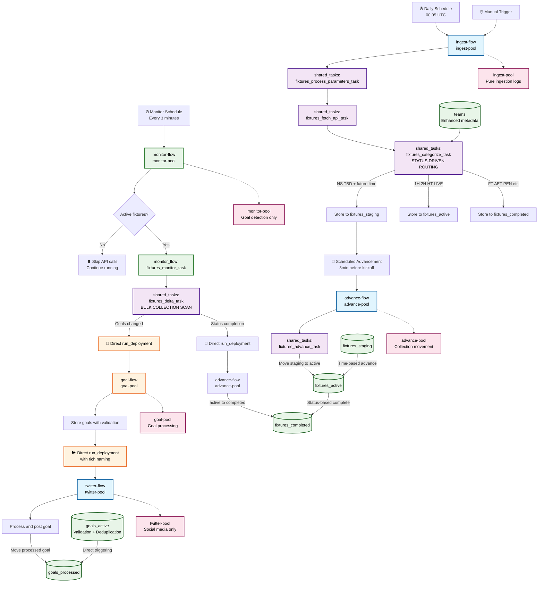
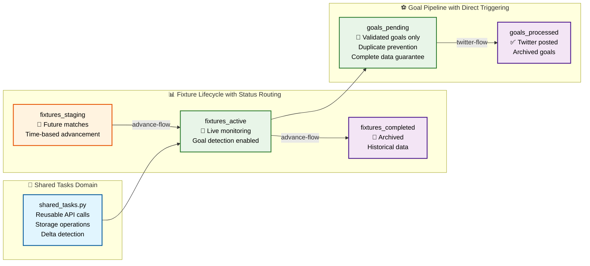

# ✅ UPDATED: README.md - Method names and collection names

# Found Footy - Enterprise Football Data Pipeline

## 🎯 **Executive Summary**

Found Footy is an **enterprise-grade, real-time football data processing platform** built with Prefect 3 and modern microservices architecture. The system features **domain-separated flows** with dedicated worker pools for maximum clarity and scalability.

### **Key Business Value:**
- ⚡ **Sub-3-minute goal detection** - Average 90-second response to scoring events
- 🏗️ **Domain-separated architecture** - Clean separation with dedicated worker pools
- 🔄 **Zero-downtime monitoring** - Continuous 24/7 operation with intelligent resource management
- 🎯 **Direct flow triggering** - No automation complexity, pure `run_deployment()` calls
- 📊 **Status-driven lifecycle** - Intelligent fixture routing based on FIFA API status codes
- 🚀 **Rich flow naming** - Contextual names for instant debugging clarity

## 🏗️ **Architecture Overview**

### **🌊 Domain-Separated Flow Architecture**



### **📊 Enhanced Data Pipeline**



## 🔧 **Domain-Separated Flow Architecture**

### **📁 Clean File Structure**
```
found_footy/flows/
├── shared_tasks.py          # ✅ Reusable API/storage components
├── ingest_flow.py          # ✅ ingest-flow (Pure ingestion domain)
├── monitor_flow.py         # ✅ monitor-flow (Live monitoring domain)  
├── advance_flow.py         # ✅ advance-flow (Collection movement domain)
├── goal_flow.py            # ✅ goal-flow (Goal processing domain)
├── twitter_flow.py         # ✅ twitter-flow (Social media domain)
├── flow_naming.py          # ✅ Rich naming service
└── flow_triggers.py        # ✅ Async scheduling utilities
```

### **🎯 Flow Responsibilities**

| Flow Name | Domain | Worker Pool | Purpose | Triggers |
|-----------|--------|-------------|---------|----------|
| **ingest-flow** | Ingestion | `ingest-pool` | Status-driven fixture routing | Daily schedule + Manual |
| **monitor-flow** | Monitoring | `monitor-pool` | Live goal detection | Every 3 minutes |
| **advance-flow** | Movement | `advance-pool` | Collection advancement | Scheduled + Event-driven |
| **goal-flow** | Processing | `goal-pool` | Goal validation + Twitter triggering | Monitor-triggered |
| **twitter-flow** | Social Media | `twitter-pool` | Goal posting + archiving | Goal-triggered |

### **🔄 Direct Flow Triggering (No Automation)**

**Key Innovation:** We replaced complex Prefect automations with **direct `run_deployment()` calls** for:

- ✅ **Predictable execution** - No template parsing issues
- ✅ **Rich flow naming** - Uses our `flow_naming.py` service directly
- ✅ **Clear debugging** - Direct cause-and-effect in logs
- ✅ **Non-blocking** - Async execution without hanging

```python
# ✅ EXAMPLE: Direct triggering with rich naming
from found_footy.flows.flow_naming import get_twitter_flow_name  # ✅ UPDATED

twitter_flow_name = get_twitter_flow_name(goal_id)  # ✅ UPDATED

run_deployment(
    name="twitter-flow/twitter-flow",
    parameters={"goal_id": goal_id},
    flow_run_name=twitter_flow_name  # ✅ Rich naming
)

# Result: "⚽ GOAL: Messi (67') for Argentina vs Brazil [#12345]"
```

### **🎯 Flow Naming Service**

Our centralized flow naming service provides rich, contextual names for all flows:

```python
# ✅ FLOW NAMING METHODS - Match flow names exactly
from found_footy.flows.flow_naming import (
    get_ingest_flow_name,     # ✅ ingest-flow
    get_monitor_flow_name,    # ✅ monitor-flow  
    get_advance_flow_name,    # ✅ advance-flow
    get_goal_flow_name,       # ✅ goal-flow
    get_twitter_flow_name     # ✅ twitter-flow
)

# Examples of rich naming
ingest_name = get_ingest_flow_name("20250910", 50)
# Result: "📥 INGEST: Tue Sep 10 (50 teams)"

monitor_name = get_monitor_flow_name()
# Result: "👁️ MONITOR: 14:23:45 - Active Check"

advance_name = get_advance_flow_name("fixtures_staging", "fixtures_active", 12345)
# Result: "🚀 KICKOFF: Barcelona vs Real Madrid [#12345]"

goal_name = get_goal_flow_name(12345, 2)
# Result: "⚽ GOALS: Liverpool 1-0 Arsenal - 2 events [#12345]"

twitter_name = get_twitter_flow_name("12345_67_789")
# Result: "⚽ Liverpool: Salah (67') for Liverpool vs Arsenal [#12345]"
```

### **📊 Data Collections Architecture**

Our 6-collection MongoDB architecture with clear goal pipeline:

| Collection | Purpose | Data Flow |
|------------|---------|-----------|
| `teams` | Team metadata with rankings | Static reference data |
| `fixtures_staging` | Future matches awaiting kickoff | → `fixtures_active` |
| `fixtures_active` | Live matches under monitoring | → `fixtures_completed` |
| `fixtures_completed` | Archived completed matches | Final storage |
| `goals_pending` | ✅ New goals awaiting Twitter posting | → `goals_processed` |
| `goals_processed` | ✅ Goals posted to social media | Final storage |
````