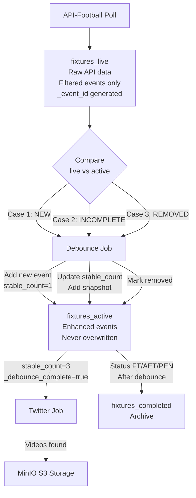
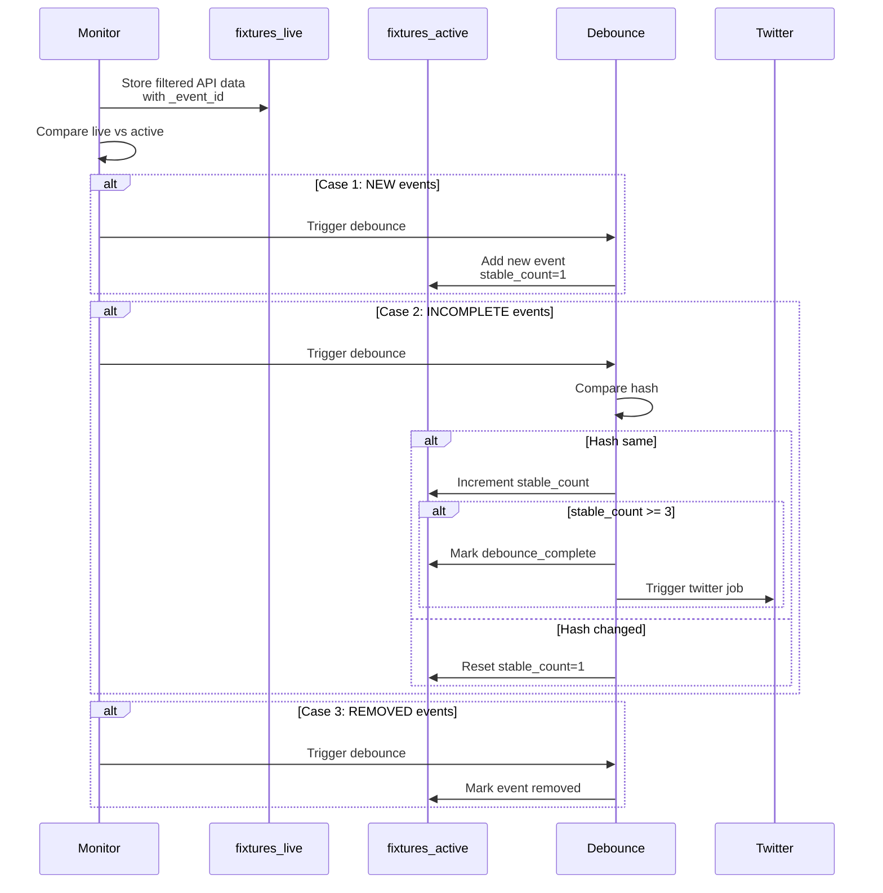

# ⚽ Found Footy - Automated Football Goal Highlights Pipeline

**4-collection in-place debounce architecture** - detects football goals in real-time, validates stability with hash-based debounce, discovers videos on Twitter, and stores in S3. Built with Dagster orchestration and MongoDB storage.

---

## 🎯 Architecture Overview

**4-Collection Design with In-Place Enhancement**

Raw API data stored in `fixtures_live` for comparison, enhanced data in `fixtures_active` - **never overwritten!**

```
fixtures_staging     → Waiting to start (TBD, NS)
     ↓ (start time reached, activated with empty events array)
fixtures_active      → Enhanced events with debounce fields (NEVER replaced)
     ↓ (monitor stores fresh API data here ↓)
fixtures_live        → Temporary raw API data for comparison (overwritten each poll)
     ↓ (status FT/AET/PEN, after final debounce)
fixtures_completed   → Archive with all enhancements intact
```



### Event Enhancement Pattern

**fixtures_live:** Raw API data with `_event_id` generated (filtered to Goals only):
```javascript
{
  "player": {"id": 234, "name": "D. Szoboszlai"},
  "team": {"id": 40, "name": "Liverpool"},
  "type": "Goal",
  "detail": "Normal Goal",
  "time": {"elapsed": 23},
  "_event_id": "5000_234_23_Goal_Normal Goal"  // Generated by monitor
}
```

**fixtures_active:** Enhanced events with debounce tracking (added in-place):
```javascript
{
  // Raw API fields (from live)
  "player": {"id": 234, "name": "D. Szoboszlai"},
  "team": {"id": 40, "name": "Liverpool"},
  "type": "Goal",
  "detail": "Normal Goal",
  "time": {"elapsed": 23},
  
  // Enhanced fields (added by debounce_job)
  "_event_id": "5000_234_23_Goal_Normal Goal",
  "_stable_count": 3,
  "_debounce_complete": true,
  "_twitter_complete": false,
  "_first_seen": "2025-11-24T15:23:45Z",
  "_snapshots": [
    {"timestamp": "2025-11-24T15:23:45Z", "hash": "abc123"},
    {"timestamp": "2025-11-24T15:24:45Z", "hash": "abc123"},
    {"timestamp": "2025-11-24T15:25:45Z", "hash": "abc123"}
  ],
  "_score_before": {"home": 0, "away": 0},
  "_score_after": {"home": 1, "away": 0},
  "_scoring_team": "home",
  "_twitter_search": "Szoboszlai Liverpool"
}
```

---

## 🔄 Pipeline Flow



### 1. Ingest Job (Daily 00:05 UTC)

Fetches today's fixtures and routes to appropriate collections:

```
1. Fetch fixtures from API-Football
2. Filter to 50 tracked teams
3. Route by status:
   - TBD/NS → fixtures_staging
   - LIVE → fixtures_active (with empty events array)
   - FT/AET/PEN → fixtures_completed
```

### 2. Monitor Job (Every Minute)

Activates fixtures and triggers debounce when needed:

```
1. Activate fixtures (staging → active with EMPTY events array)
2. Batch fetch fresh API data for ALL active fixtures
3. Filter events (Goals only) and store in fixtures_live WITH _event_id
4. Compare fixtures_live vs fixtures_active (3 trigger cases)
5. If needs_debounce: directly invoke debounce_job(fixture_id)
6. After debounce: Move FT/AET/PEN fixtures to completed
```

**3 Cases That Trigger Debounce:**
- **NEW:** Event in live but NOT in active
- **INCOMPLETE:** Event in both but `_debounce_complete=false`
- **REMOVED:** Event in active but NOT in live (VAR disallowed)

### 3. Debounce Job (Per Fixture)

Processes events using clean iteration pattern:

```
1. Get live events (with _event_id) and active events
2. Build dict of live events by _event_id
3. Iterate active events:
   
   IF event_id in live_events_dict:
     Pop event from dict
     
     IF hash unchanged:
       → Increment stable_count
       → Add snapshot
       → If stable_count >= 3: mark debounce_complete, trigger twitter
     ELSE:
       → Reset stable_count = 1 (hash changed)
   
   ELSE (not in live):
     → Mark event as removed (VAR case)

4. Whatever's left in live_events_dict = NEW events
   → Add to active with stable_count=1
```

**Hash Fields:** `player_id`, `team_id`, `type`, `detail`, `time_elapsed`, `assist_id`

### 4. Twitter Job (Per Event)

Called when `_debounce_complete=true`:

```
1. Get event from fixtures_active.events array
2. Use prebuilt _twitter_search field
3. Search Twitter for videos
4. Download videos to MinIO
5. Mark _twitter_complete=true
```

---

## 📊 MongoDB Collections (4 Total)

### fixtures_staging

Fixtures waiting to start (status TBD, NS).

```json
{
  "_id": 5000,
  "fixture": {
    "id": 5000,
    "date": "2025-11-24T15:00:00Z",
    "status": {"short": "TBD"}
  },
  "teams": {
    "home": {"id": 40, "name": "Liverpool"},
    "away": {"id": 50, "name": "Man City"}
  }
}
```

### fixtures_live

**Temporary storage** for raw API data with filtered events (Goals only). Gets **overwritten** each poll.

```json
{
  "_id": 5000,
  "stored_at": "2025-11-24T15:25:00Z",
  "fixture": {...},
  "teams": {...},
  "events": [
    {
      "player": {"id": 234, "name": "D. Szoboszlai"},
      "team": {"id": 40, "name": "Liverpool"},
      "type": "Goal",
      "detail": "Normal Goal",
      "time": {"elapsed": 23},
      "_event_id": "5000_234_23_Goal_Normal Goal"  // Generated by monitor
    }
  ]
}
```

### fixtures_active

Enhanced fixtures with debounce tracking. Events array **grows incrementally**, **never replaced**.

```json
{
  "_id": 5000,
  "activated_at": "2025-11-24T15:00:00Z",
  "fixture": {...},
  "teams": {...},
  "events": [
    {
      // Raw API fields
      "player": {"id": 234, "name": "D. Szoboszlai"},
      "team": {"id": 40, "name": "Liverpool"},
      "type": "Goal",
      "detail": "Normal Goal",
      "time": {"elapsed": 23},
      
      // Enhanced fields (added by debounce_job, never overwritten)
      "_event_id": "5000_234_23_Goal_Normal Goal",
      "_stable_count": 3,
      "_debounce_complete": true,
      "_twitter_complete": false,
      "_first_seen": "2025-11-24T15:23:45Z",
      "_snapshots": [
        {"timestamp": "2025-11-24T15:23:45Z", "hash": "abc123"},
        {"timestamp": "2025-11-24T15:24:45Z", "hash": "abc123"},
        {"timestamp": "2025-11-24T15:25:45Z", "hash": "abc123"}
      ],
      "_score_before": {"home": 0, "away": 0},
      "_score_after": {"home": 1, "away": 0},
      "_scoring_team": "home",
      "_twitter_search": "Szoboszlai Liverpool"
    }
  ]
}
```

### fixtures_completed

Archive of finished fixtures with all enhancements intact. fixtures_live entry is deleted when moved here.

---

## 🔌 Port Configuration

**Development Access (via SSH forwarding):**
- **Dagster UI:** http://localhost:3100
- **MongoDB Express:** http://localhost:3101  
- **MinIO Console:** http://localhost:3102
- **Twitter VNC:** http://localhost:6080/vnc.html

**Internal Services:**
- PostgreSQL: `postgres:5432`
- MongoDB: `mongo:27017`
- MinIO API: `minio:9000`

---

## 🚀 Getting Started

### Prerequisites

- Docker & Docker Compose
- Python 3.11+
- SSH access to server (for port forwarding)

### Quick Start

```bash
# 1. Clone repo
git clone <repo-url>
cd found-footy

# 2. Set up environment
cp .env.example .env
# Edit .env with your API-Football key

# 3. Start services
docker-compose up -d

# 4. SSH port forwarding (from local machine)
ssh -L 3100:localhost:3100 -L 3101:localhost:3101 -L 3102:localhost:3102 user@server

# 5. Access Dagster UI
# Open http://localhost:3100 in your browser
```

---

## 📂 Project Structure

```
found-footy/
├── src/
│   ├── data/
│   │   ├── mongo_store.py       # 4 collections (staging/live/active/completed)
│   │   └── s3_store.py          # MinIO video storage
│   ├── jobs/
│   │   ├── ingest/              # Daily fixture ingestion
│   │   ├── monitor/             # Per-minute monitoring + comparison
│   │   ├── debounce/            # Per-fixture event validation (clean iteration)
│   │   ├── twitter/             # Per-event video discovery
│   │   └── download/            # Video download & dedup
│   ├── utils/
│   │   └── event_config.py      # Event filtering config (Goals only)
│   └── api/
│       └── mongo_api.py         # API-Football wrapper
├── docker-compose.yml
├── Dockerfile
└── README.md
```

---

## 🎯 Key Features

- **4-Collection Architecture** - Staging → Live (temp) → Active (enhanced) → Completed
- **In-Place Enhancement** - Events enhanced incrementally, never overwritten
- **Clean Iteration Pattern** - Build dict, pop as processed, leftovers are NEW
- **Event Filtering** - Only Goals stored (Normal Goal, Penalty, Own Goal)
- **Hash-Based Stability** - MD5 of critical fields, 3 consecutive stable polls
- **3 Debounce Trigger Cases** - NEW, INCOMPLETE, REMOVED (VAR)
- **Pre-Generated Event IDs** - Set in monitor for clean comparison
- **Smart Twitter Search** - Player last name + team name
- **MinIO Storage** - S3-compatible local video storage
- **Dagster Orchestration** - Visual pipeline monitoring

---

## 🐛 Debugging

### Check Active Fixtures

```bash
# MongoDB Express
http://localhost:3101

# Click: found_footy → fixtures_active
# Look at events array for enhanced fields
```

### Check Dagster Logs

```bash
# Dagster UI
http://localhost:3100

# Click: Runs → Select job → View logs
```

### Manual Job Triggers

```python
# In Dagster UI, go to Jobs and click "Launch Run"
# Provide config for twitter_job:
{
  "ops": {
    "search_and_save_twitter_videos": {
      "config": {
        "fixture_id": 5000,
        "event_id": "5000_234_Goal_1"
      }
    }
  }
}
```

---

## 📝 Notes

- **API Limit:** 7500 requests/day (Pro plan)
- **Batch Endpoint:** Gets fixtures + events + lineups in one call
- **Debounce Window:** 3 polls at 1-minute intervals
- **Twitter Retry:** 2min initial + 3min + 4min (total ~10min)
- **Storage:** MinIO (S3-compatible) at `minio:9000`

---

## 🔮 Future Enhancements

- [ ] Actual Twitter integration (currently placeholder)
- [ ] Video download & deduplication with OpenCV
- [ ] Frontend UI to query fixtures_active
- [ ] Webhook notifications for completed events
- [ ] Multi-league support beyond 50 teams

---

## 📜 License

MIT
