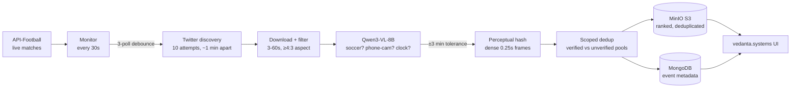

# Found Footy

Real-time football goal video discovery and curation. Polls API-Football
every 30 seconds for live matches across the top-5 European leagues plus
~15 FIFA national teams, debounces detected goals over 3 polls, then fires
off a Twitter video search for each one. Downloads candidate clips,
AI-validates the broadcast clock against the API's reported match minute,
perceptually deduplicates against the existing S3 corpus, and surfaces the
surviving clips through the [vedanta.systems](https://vedanta.systems)
portal in near real-time.

> Personal project; deployed on a private tailnet. Not currently
> public-internet-facing.

## Pipeline


```mermaid
flowchart LR
    API[API-Football<br/>live matches] --> MON[Monitor<br/>every 30s]
    MON -->|3-poll debounce| TW[Twitter discovery<br/>10 attempts, ~1 min apart]
    TW --> DL[Download + filter<br/>3-60s, ≥4:3 aspect]
    DL --> AI[Qwen3-VL-8B<br/>soccer? phone-cam? clock?]
    AI -->|±3 min tolerance| HASH[Perceptual hash<br/>dense 0.25s frames]
    HASH --> DEDUP[Scoped dedup<br/>verified vs unverified pools]
    DEDUP --> S3[(MinIO S3<br/>ranked, deduplicated)]
    DEDUP --> META[(MongoDB<br/>event metadata)]
    S3 --> UI[vedanta.systems UI]
    META --> UI
```

## Stack

- Python 3.10 + Temporal Python SDK + asyncio
- MongoDB 7 (5-collection design — see [`docs/architecture.md`](./docs/architecture.md))
- MinIO (S3-compatible object storage)
- Firefox + Selenium browser automation for Twitter scraping (cookies persisted; scaled 2–8 instances)
- Qwen3-VL-8B vision model via llama.cpp on a separate node, reached at `http://llama-small.joi`
- Caddy reverse proxy on a shared `proxy` docker network for all HTTP services

## Quick start

```bash
cp .env.example .env
$EDITOR .env                                                   # set API_FOOTBALL_KEY, TWITTER_*, LLAMA_URL

docker compose -f docker-compose.dev.yml up -d --build         # dev
# or
docker compose -f docker-compose.yml up -d --build             # prod (auto-scaler manages worker + twitter replicas)
```

UIs (replace `<base-domain>` with the value of `$BASE_DOMAIN`):
- Temporal: `http://found-footy-{dev,prod}-temporal-ui.<base-domain>`
- MongoDB: `http://found-footy-dev-mongoku.<base-domain>` / `http://found-footy-prod-mongo-express.<base-domain>`
- MinIO: `http://found-footy-{dev,prod}-minio.<base-domain>`
- Twitter VNC: `http://found-footy-{dev,prod}-twitter[-vnc].<base-domain>`

See [`deploy/INFRA-NOTES.md`](./deploy/INFRA-NOTES.md) for Caddy routes and
the cross-project shared-network setup that lives outside this repo.

## Documentation

- [`docs/architecture.md`](./docs/architecture.md) — 5-collection MongoDB design, workflow hierarchy, video pipeline, scoped dedup
- [`docs/orchestration.md`](./docs/orchestration.md) — event lifecycle, debouncing, VAR handling
- [`docs/temporal.md`](./docs/temporal.md) — per-activity timeouts, retries, heartbeats
- [`docs/logging.md`](./docs/logging.md) — structured-logging reference
- [`docs/rag.md`](./docs/rag.md) — Wikidata + LLM team-alias resolution
- [`docs/twitter-auth.md`](./docs/twitter-auth.md) — browser auth and cookie management
- [`docs/operations.md`](./docs/operations.md) — runbook (bring-up, scaling, common issues)
- [`docs/decisions.md`](./docs/decisions.md) — architectural decisions log
- [`docs/todo.md`](./docs/todo.md) — active work + open bugs
- [`docs/proposals/`](./docs/proposals/) — design docs for in-flight feature work

If you're an agent working on this repo, read [`AGENTS.md`](./AGENTS.md) first.

## License

MIT
