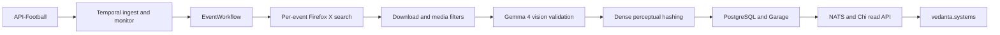

# Found Footy

Found Footy discovers and curates football-event videos in near real time. It
polls API-Football for live fixtures, tracks goals, red cards, and missed
penalties, and starts a 15-attempt X discovery workflow for each confirmed
event. Candidate clips pass media filters, vision validation, perceptual
deduplication, and ranking before the surviving assets reach
[vedanta.systems](https://vedanta.systems).

Production has run the Go rebuild since the 2026-08-15 cutover. The retired
Python implementation remains under [`archive/`](./archive/) as behavior and
rollback evidence.

## Pipeline


```mermaid
flowchart LR
    API[API-Football] --> INGEST[Temporal ingest and monitor]
    INGEST --> EVENT[EventWorkflow]
    EVENT --> SEARCH[Per-event Firefox X search]
    SEARCH --> MEDIA[Download and media filters]
    MEDIA --> VISION[Gemma 4 vision validation]
    VISION --> HASH[Dense perceptual hashing]
    HASH --> STORE[PostgreSQL and Garage]
    STORE --> FEED[NATS and Chi read API]
    FEED --> UI[vedanta.systems]
```

Perceptual deduplication is intentionally scoped by event and validation
category. See the [orchestration ledger](./docs/orchestration.md) for the
shipped workflow contracts.

## Stack

- Go 1.25 and the Temporal Go SDK
- PostgreSQL for fixtures, events, candidates, assets, and workflow state
- Garage for S3-compatible object storage
- A Go/Playwright service with one Firefox instance per active event
- Gemma 4 12B through a remote llama.cpp-compatible vision endpoint
- NATS for feed events and a Chi HTTP API for reads
- Docker Compose and Caddy on the shared proxy network

## Development

The toolchain runs in Docker; no host Go installation is required.

```bash
cp .env.example .env
$EDITOR .env
make dev-up
```

Do not start dev while
[`FF-001`](./docs/todo.md#ff-001--firefox-fleet-is-not-environment-scoped)
is open: dev and prod currently share an unscoped Firefox fleet on one Docker
daemon. Production is live and every production mutation requires explicit
per-action approval. Use the [deployment ledger](./docs/deployment.md) instead
of inferring production commands from this README.

Useful local checks:

```bash
make test-short
make test
make test-race
make test-corpus
```

## Documentation

- [`docs/README.md`](./docs/README.md) — routing index and authority map
- [`docs/todo.md`](./docs/todo.md) — canonical bugs and deferred work
- [`docs/architecture.md`](./docs/architecture.md) — as-built package and adapter ledger
- [`docs/orchestration.md`](./docs/orchestration.md) — workflow and activity contracts
- [`docs/deployment.md`](./docs/deployment.md) — Compose, routing, and bootstrap
- [`docs/operations.md`](./docs/operations.md) — current safety boundary and runbook status
- [`docs/decisions.md`](./docs/decisions.md) — append-only architectural decisions
- [`docs/design/README.md`](./docs/design/README.md) — design history and audit evidence

Agents working in this repository must read [`AGENTS.md`](./AGENTS.md) first.

## License

MIT
