# ⚽ Found Footy - Automated Football Goal Highlights Pipeline

**End-to-end automation** - detects football goals in real-time, validates stability with set-based debounce, discovers videos on Twitter via browser automation, downloads and deduplicates, then stores in S3 with metadata tags. Built with **Temporal.io** orchestration and MongoDB storage.

---

## 🎯 Architecture Overview

```mermaid
graph TB
    subgraph "🗓️ Daily Ingestion (00:05 UTC)"
        A1[IngestWorkflow]
        A2[Fetch Today's Fixtures<br/>from API-Football]
        A3{Categorize<br/>by Status}
        A4[fixtures_staging<br/>TBD, NS]
        A5[fixtures_active<br/>LIVE, 1H, HT, etc]
        A6[fixtures_completed<br/>FT, AET, PEN]
        
        A1 --> A2 --> A3
        A3 -->|Not Started| A4
        A3 -->|In Progress| A5
        A3 -->|Finished| A6
    end
    
    subgraph "⏱️ MonitorWorkflow (Every Minute)"
        B1[Activate Ready Fixtures<br/>staging → active]
        B2[Fetch Active Fixtures<br/>from API-Football]
        B3[Filter Events<br/>Goals only, with player_id]
        B4[Store in fixtures_live]
        B5[Process Events Inline<br/>Pure set operations]
        B6{Stable Event?<br/>count >= 3}
        B7[→ TwitterWorkflow]
        
        B1 --> B2 --> B3 --> B4 --> B5 --> B6
        B6 -->|Yes| B7
    end
    
    subgraph "🐦 TwitterWorkflow (Per Stable Event)"
        C1[Build Search Query<br/>player + team]
        C2[POST to twitter:8888<br/>Firefox automation]
        C3[Save discovered_videos]
        C4{Videos Found?}
        C5[→ DownloadWorkflow]
        
        C1 --> C2 --> C3 --> C4
        C4 -->|Yes| C5
    end
    
    subgraph "⬇️ DownloadWorkflow (Per Event)"
        D1[fetch_event_data]
        D2[download_single_video ×N<br/>3 retries each]
        D3[deduplicate_videos<br/>MD5 hash, keep largest]
        D4[upload_single_video ×N<br/>3 retries each]
        D5[mark_download_complete]
        
        D1 --> D2 --> D3 --> D4 --> D5
    end
    
    subgraph "💾 Storage"
        F1[(fixtures_staging)]
        F2[(fixtures_live)]
        F3[(fixtures_active)]
        F4[(fixtures_completed)]
        F5[☁️ MinIO S3<br/>fixture_id/event_id/<br/>videos with tags]
    end
    
    style A1 fill:#e1f5ff
    style B7 fill:#e8f5e9
    style C5 fill:#fce4ec
    style D3 fill:#fff3e0
```



---

## 🔄 Key Features

### Set-Based Debounce (No Hash Comparison)

Events are identified by `{fixture_id}_{team_id}_{player_id}_{event_type}_{sequence}`. This means:

- **Player changes (VAR)** → Different event_id → Automatically detected by set operations
- **No MD5 hashing** → Pure set operations (O(n) to build, O(1) lookups)
- **Simpler code** → All debounce logic inline in MonitorWorkflow

```python
# Algorithm in process_fixture_events activity
live_ids = {e["_event_id"] for e in live_events}
active_ids = {e["_event_id"] for e in active_events}

new_ids = live_ids - active_ids       # NEW events
removed_ids = active_ids - live_ids   # REMOVED (VAR)
matching_ids = live_ids & active_ids  # Increment stable_count
```

### Per-Video Retry (Granular Activities)

DownloadWorkflow uses 5 separate activities:
1. `fetch_event_data` - Get event from MongoDB
2. `download_single_video` - Download ONE video (3 retry attempts)
3. `deduplicate_videos` - MD5 hash, keep largest per hash
4. `upload_single_video` - Upload ONE video to S3 (3 retry attempts)
5. `mark_download_complete` - Update MongoDB, cleanup

**Benefits**: If 3/5 videos succeed, those are preserved. Failures don't lose progress.

### Firefox Browser Automation for Twitter

Twitter service uses Firefox with a saved profile at `/data/firefox_profile`:
- No API keys needed
- Handles login state persistently
- Manual login once, then automated searches

---

## 📋 Workflow Breakdown

### 1️⃣ IngestWorkflow (Daily, 00:05 UTC)

**Purpose**: Fetch today's fixtures and route by status

| Status | Collection |
|--------|------------|
| TBD, NS | fixtures_staging |
| LIVE, 1H, HT, 2H, ET, P, BT | fixtures_active |
| FT, AET, PEN | fixtures_completed |

---

### 2️⃣ MonitorWorkflow (Every Minute)

**Purpose**: Poll active fixtures, process events inline, trigger Twitter for stable events

**Activities**:
1. `activate_fixtures` - Move staging → active when start time reached
2. `fetch_active_fixtures` - Batch fetch from API-Football
3. `store_and_compare` - Filter to Goals, generate event_id, store in live
4. `process_fixture_events` - Pure set operations, increment stable_count
5. `sync_fixture_metadata` - Keep fixture score/status fresh
6. `complete_fixture_if_ready` - Move to completed when done

**Debounce Logic**:
- NEW event → Add to active with `_stable_count=1`
- MATCHING event → Increment `_stable_count`
- REMOVED event → Mark `_removed=true` (VAR disallowed)
- `_stable_count >= 3` → Trigger TwitterWorkflow

---

### 3️⃣ TwitterWorkflow (Per Stable Event)

**Purpose**: Search Twitter for event videos

**3 Granular Activities**:
1. `get_twitter_search_data` - Get search query from MongoDB (10s, 2 retries)
2. `execute_twitter_search` - POST to Firefox automation (150s, 3 retries)
3. `save_twitter_results` - Save videos to MongoDB (10s, 2 retries)

**Why 3 activities?**
- If search fails → only retry search (not MongoDB reads)
- If save fails → videos preserved in workflow state

**If videos found** → Triggers DownloadWorkflow as child

---

### 4️⃣ DownloadWorkflow (Per Event with Videos)

**Purpose**: Download, deduplicate, upload videos

**Activities**:
1. `fetch_event_data` - Get event from fixtures_active
2. `download_single_video` (loop) - Download each video individually
3. `deduplicate_videos` - Keep largest file per MD5 hash
4. `upload_single_video` (loop) - Upload each unique video to S3
5. `mark_download_complete` - Update MongoDB, cleanup temp dir

**S3 Structure**: `{fixture_id}/{event_id}/{md5_hash}.mp4`

---

## 🗄️ 4-Collection Architecture

| Collection | Purpose | Update Pattern |
|------------|---------|----------------|
| fixtures_staging | Pre-match fixtures | Insert/Delete |
| fixtures_live | Comparison buffer | Overwrite each poll |
| fixtures_active | Enhanced events | Incremental updates only |
| fixtures_completed | Archive | Insert only |

### Event Enhancement Fields

```javascript
{
  // Original API fields
  "player": {"id": 306, "name": "Mohamed Salah"},
  "team": {"id": 40, "name": "Liverpool"},
  "type": "Goal",
  
  // Enhancement fields (added by debounce)
  "_event_id": "123456_40_306_Goal_1",
  "_stable_count": 3,
  "_debounce_complete": true,
  "_twitter_complete": true,
  "_twitter_search": "Salah Liverpool",
  "_score_before": {"home": 0, "away": 0},
  "_score_after": {"home": 1, "away": 0},
  
  // Added by Twitter
  "discovered_videos": [...],
  
  // Added by Download
  "s3_urls": [...]
}
```

---

## 🔌 Port Configuration

**Development Access (via SSH forwarding):**
- **Temporal UI:** http://localhost:4100
- **MongoDB Express:** http://localhost:4101
- **MinIO Console:** http://localhost:9001
- **Twitter VNC:** http://localhost:6080/vnc.html

**Internal Services:**
- Temporal Server: `temporal:7233`
- MongoDB: `mongo:27017`
- MinIO API: `minio:9000`
- Twitter Service: `twitter:8888`

---

## 🚀 Getting Started

### Prerequisites

- Docker & Docker Compose
- Python 3.11+
- SSH access to server (for port forwarding)

### Quick Start

```bash
# 1. Clone repo
git clone <repo-url>
cd found-footy

# 2. Set up environment
cp .env.example .env
# Edit .env with your API-Football key

# 3. Start services
docker compose -f docker-compose.dev.yml up -d

# 4. One-time Twitter setup (interactive)
docker compose -f docker-compose.dev.yml exec twitter python -m twitter.firefox_manual_setup

# 5. SSH port forwarding (from local machine)
ssh -L 4100:localhost:4100 -L 4101:localhost:4101 -L 9001:localhost:9001 user@server

# 6. Access Temporal UI
# Open http://localhost:4100 in your browser
```

---

## 📂 Project Structure

```
found-footy/
├── src/
│   ├── workflows/           # Temporal workflows
│   │   ├── ingest_workflow.py
│   │   ├── monitor_workflow.py
│   │   ├── twitter_workflow.py
│   │   └── download_workflow.py
│   ├── activities/          # Temporal activities
│   │   ├── ingest.py
│   │   ├── monitor.py       # Includes process_fixture_events
│   │   ├── twitter.py
│   │   └── download.py      # 5 granular activities
│   ├── data/
│   │   ├── mongo_store.py   # 4-collection architecture
│   │   └── s3_store.py      # MinIO video storage
│   ├── utils/
│   │   ├── event_config.py  # Event filtering (Goals only)
│   │   └── team_data.py     # 50 tracked teams
│   └── worker.py            # Temporal worker
├── twitter/                 # Firefox browser automation
│   ├── service.py           # HTTP server (:8888)
│   └── firefox_manual_setup.py
├── docker-compose.dev.yml
└── README.md
```

---

## 🎯 Workflow Naming Convention

| Workflow | ID Format | Example |
|----------|-----------|---------|
| IngestWorkflow | `ingest-{DD_MM_YYYY}` | `ingest-05_12_2024` |
| MonitorWorkflow | `monitor-{DD_MM_YYYY}-{HH:MM}` | `monitor-05_12_2024-15:23` |
| TwitterWorkflow | `twitter-{Team}-{LastName}-{min}-{event_id}` | `twitter-Liverpool-Salah-45+3min-123_40_306_Goal_1` |
| DownloadWorkflow | `download-{Team}-{LastName}-{count}vids-{event_id}` | `download-Liverpool-Salah-3vids-123_40_306_Goal_1` |

---

## 🐛 Debugging

### Check Active Fixtures
```bash
# MongoDB Express at http://localhost:4101
# Click: found_footy → fixtures_active → Look at events array
```

### Check Temporal UI
```bash
# http://localhost:4100
# View workflow hierarchy, inputs/outputs, retry status
```

### View Worker Logs
```bash
docker compose -f docker-compose.dev.yml logs -f worker
```

---

## 📝 Notes

- **API Limit:** 7500 requests/day (Pro plan)
- **Debounce Window:** 3 polls at 1-minute intervals (~3 minutes)
- **Twitter Timeout:** 120s for browser automation
- **Download Retry:** 3 attempts per video with 5s initial interval
- **50 Tracked Teams:** Top European clubs (see `team_data.py`)

---

## 📜 License

MIT
