# ⚽ Found Footy - Automated Football Goal Highlights Pipeline

**End-to-end automation** - detects football goals in real-time, validates stability with set-based debounce, discovers videos on Twitter via browser automation, downloads and deduplicates using perceptual hashing, then stores in S3 with metadata tags. Built with **Temporal.io** orchestration and MongoDB storage.

---

## 🎯 Architecture Overview

```mermaid
graph TB
    subgraph "🗓️ Daily Ingestion (00:05 UTC)"
        A1[IngestWorkflow]
        A2[Fetch Today's Fixtures<br/>from API-Football]
        A3{Categorize<br/>by Status}
        A4[fixtures_staging<br/>TBD, NS]
        A5[fixtures_active<br/>LIVE, 1H, HT, etc]
        A6[fixtures_completed<br/>FT, AET, PEN]
        
        A1 --> A2 --> A3
        A3 -->|Not Started| A4
        A3 -->|In Progress| A5
        A3 -->|Finished| A6
    end
    
    subgraph "⏱️ MonitorWorkflow (Every Minute)"
        B1[Activate Ready Fixtures<br/>staging → active]
        B2[Fetch Active Fixtures<br/>from API-Football]
        B3[Filter Events<br/>Goals only, with player_id]
        B4[Store in fixtures_live]
        B5[Process Events Inline<br/>Pure set operations]
        B6{Stable Event?<br/>count >= 3}
        B7[→ TwitterWorkflow]
        
        B1 --> B2 --> B3 --> B4 --> B5 --> B6
        B6 -->|Yes| B7
    end
    
    subgraph "🐦 TwitterWorkflow (3x Per Stable Event)"
        C1[Build Search Query<br/>player + team]
        C2[POST to twitter:8888<br/>Firefox automation]
        C3[Pass exclude_urls<br/>Skip already found]
        C4{Videos Found?}
        C5[→ DownloadWorkflow]
        
        C1 --> C2 --> C3 --> C4
        C4 -->|Yes| C5
    end
    
    subgraph "⬇️ DownloadWorkflow (Per Event)"
        D1[fetch_event_data]
        D2[download_single_video ×N<br/>Duration filter: 5-60s]
        D3[deduplicate_videos<br/>Perceptual hash + quality]
        D4[upload_single_video ×N<br/>Replace if better quality]
        D5[save_processed_urls]
        
        D1 --> D2 --> D3 --> D4 --> D5
    end
    
    subgraph "💾 Storage"
        F1[(fixtures_staging)]
        F2[(fixtures_live)]
        F3[(fixtures_active)]
        F4[(fixtures_completed)]
        F5[☁️ MinIO S3<br/>fixture_id/event_id/<br/>videos with metadata]
    end
    
    style A1 fill:#e1f5ff
    style B7 fill:#e8f5e9
    style C5 fill:#fce4ec
    style D3 fill:#fff3e0
```



---

## 🔄 Key Features

### Set-Based Debounce (No Hash Comparison)

Events are identified by `{fixture_id}_{team_id}_{player_id}_{event_type}_{sequence}`. This means:

- **Player changes (VAR)** → Different event_id → Automatically detected by set operations
- **No MD5 hashing** → Pure set operations (O(n) to build, O(1) lookups)
- **Simpler code** → All debounce logic inline in MonitorWorkflow

```python
# Algorithm in process_fixture_events activity
live_ids = {e["_event_id"] for e in live_events}
active_ids = {e["_event_id"] for e in active_events}

new_ids = live_ids - active_ids       # NEW events
removed_ids = active_ids - live_ids   # REMOVED (VAR)
matching_ids = live_ids & active_ids  # Increment stable_count
```

### 3 Twitter Attempts with URL Exclusion

Each stable event gets **3 Twitter searches** to find the best quality videos:

- **Attempt 1**: Immediately when stable - find early uploads
- **Attempt 2**: ~5 minutes later - find more/better uploads
- **Attempt 3**: ~5 minutes later - final search, mark complete

**Key improvement**: Each search passes `exclude_urls` to skip already-discovered videos:
```python
# Twitter service skips URLs during scraping
if tweet_url in exclude_set:
    print(f"⏭️ Skipping already-discovered URL: {tweet_url}")
    continue
```

This means **5 NEW videos per search** (not the same 5 repeatedly).

### Perceptual Hashing for Deduplication

Same video at different resolutions = same perceptual hash:

```python
# Duration (0.5s tolerance) + 3 frame hashes
perceptual_hash = f"{duration:.1f}_{hash1}_{hash2}_{hash3}"
# Example: "15.2_4c33b33b_f8d2d234_48b2a460"
```

**Quality comparison** (when hashes match):
1. Resolution score (width × height) - Higher wins
2. Bitrate - Higher wins
3. File size - Higher wins

### Duration Filtering

Videos are filtered before download:
- **Too short**: < 5 seconds (usually just celebrations)
- **Too long**: > 60 seconds (usually full match compilations)
- **Just right**: 5-60 seconds (goal clips)

Filtered URLs are still tracked in `_discovered_videos` to prevent re-discovery.

### Per-Video Retry (Granular Activities)

DownloadWorkflow uses 7 separate activities:
1. `fetch_event_data` - Get event + existing S3 metadata
2. `download_single_video` - Download ONE video (3 retry attempts)
3. `deduplicate_videos` - Perceptual hash, quality compare
4. `replace_s3_video` - Delete old video if better found
5. `upload_single_video` - Upload ONE video to S3 (3 retry attempts)
6. `save_processed_urls` - Track all URLs for dedup
7. `mark_download_complete` - Update MongoDB, cleanup

**Benefits**: If 3/5 videos succeed, those are preserved. Failures don't lose progress.

---

## 📋 Workflow Breakdown

### 1️⃣ IngestWorkflow (Daily, 00:05 UTC)

**Purpose**: Fetch today's fixtures and route by status

| Status | Collection |
|--------|------------|
| TBD, NS | fixtures_staging |
| LIVE, 1H, HT, 2H, ET, P, BT | fixtures_active |
| FT, AET, PEN | fixtures_completed |

---

### 2️⃣ MonitorWorkflow (Every Minute)

**Purpose**: Poll active fixtures, process events inline, trigger Twitter for stable events

**Activities**:
1. `activate_fixtures` - Move staging → active when start time reached
2. `fetch_active_fixtures` - Batch fetch from API-Football
3. `store_and_compare` - Filter to Goals, generate event_id, store in live
4. `process_fixture_events` - Pure set operations, increment stable_count
5. `sync_fixture_metadata` - Keep fixture score/status fresh
6. `complete_fixture_if_ready` - Move to completed when done

**Debounce Logic**:
- NEW event → Add to active with `_stable_count=1`
- MATCHING event → Increment `_stable_count`
- REMOVED event → Mark `_removed=true` (VAR disallowed)
- `_stable_count >= 3` → Trigger TwitterWorkflow

---

### 3️⃣ TwitterWorkflow (3x Per Stable Event)

**Purpose**: Search Twitter for event videos

**3 Granular Activities**:
1. `get_twitter_search_data` - Get search query + existing URLs from MongoDB
2. `execute_twitter_search` - POST to Firefox automation with `exclude_urls`
3. `save_discovered_videos` - Save NEW videos to MongoDB

**Why 3 activities?**
- If search fails → only retry search (not MongoDB reads)
- If save fails → videos preserved in workflow state

**Search parameters**:
- `max_results: 5` - Find up to 5 videos per search
- `exclude_urls: [...]` - Skip already-discovered URLs during scraping

**If videos found** → Triggers DownloadWorkflow as child

---

### 4️⃣ DownloadWorkflow (Per Event with Videos)

**Purpose**: Download, deduplicate, upload videos with quality comparison

**Pipeline**:
```
Download → Duration Filter → Perceptual Hash → Quality Compare → Upload/Replace
```

**S3 Structure**: `{fixture_id}/{event_id}/{short_hash}.mp4`

**Metadata stored on each S3 object**:
- `x-amz-meta-width`, `x-amz-meta-height`
- `x-amz-meta-bitrate`, `x-amz-meta-file-size`
- `x-amz-meta-perceptual-hash`
- `x-amz-meta-source-url`

---

## 🗄️ 4-Collection Architecture

| Collection | Purpose | Update Pattern |
|------------|---------|----------------|
| fixtures_staging | Pre-match fixtures | Insert/Delete |
| fixtures_live | Comparison buffer | Overwrite each poll |
| fixtures_active | Enhanced events | Incremental updates only |
| fixtures_completed | Archive | Insert only |

### Event Enhancement Fields

```javascript
{
  // Original API fields
  "player": {"id": 306, "name": "Mohamed Salah"},
  "team": {"id": 40, "name": "Liverpool"},
  "type": "Goal",
  
  // Enhancement fields (added by debounce)
  "_event_id": "123456_40_306_Goal_1",
  "_stable_count": 3,
  "_monitor_complete": true,
  "_twitter_count": 3,
  "_twitter_complete": true,
  "_twitter_search": "Salah Liverpool",
  
  // Video tracking
  "_discovered_videos": [
    {"video_page_url": "https://x.com/i/status/123", "tweet_text": "..."}
  ],
  "_s3_videos": [
    {
      "s3_key": "123456/123456_40_306_Goal_1/abc123.mp4",
      "perceptual_hash": "15.2_abc_def_ghi",
      "width": 1920, "height": 1080,
      "bitrate": 5000000
    }
  ]
}
```

---

## 🔌 Port Configuration

**Development (4100-4109):**
- **Temporal UI:** http://localhost:4100
- **MongoDB Express:** http://localhost:4101
- **MinIO Console:** http://localhost:4102
- **Twitter VNC:** http://localhost:4103

**Production (3100-3109):**
- **Temporal UI:** http://localhost:3100
- **MongoDB Express:** http://localhost:3101
- **MinIO Console:** http://localhost:3102
- **Twitter VNC:** http://localhost:3103

**Internal Services:**
- Temporal Server: `temporal:7233`
- MongoDB: `mongo:27017`
- MinIO API: `minio:9000`
- Twitter Service: `twitter:8888`

---

## 🚀 Getting Started

### Prerequisites

- Docker & Docker Compose
- Python 3.11+
- SSH access to server (for port forwarding)

### Quick Start

```bash
# 1. Clone repo
git clone <repo-url>
cd found-footy

# 2. Set up environment
cp .env.example .env
# Edit .env with your API-Football key

# 3. Start services
docker compose -f docker-compose.dev.yml up -d

# 4. First-time Twitter login (via VNC)
# Open http://localhost:4103 and login to Twitter in Firefox

# 5. SSH port forwarding (from local machine)
ssh -L 4100:localhost:4100 -L 4101:localhost:4101 -L 4102:localhost:4102 -L 4103:localhost:4103 user@server

# 6. Access Temporal UI
# Open http://localhost:4100 in your browser
```

### Test the Pipeline

```bash
# Insert a test fixture
docker exec found-footy-worker python /workspace/tests/workflows/test_pipeline.py --fixture-id 1469132

# Watch logs
docker compose -f docker-compose.dev.yml logs -f worker
```

---

## 📂 Project Structure

```
found-footy/
├── src/
│   ├── workflows/           # Temporal workflows
│   │   ├── ingest_workflow.py
│   │   ├── monitor_workflow.py
│   │   ├── twitter_workflow.py
│   │   └── download_workflow.py
│   ├── activities/          # Temporal activities
│   │   ├── ingest.py
│   │   ├── monitor.py
│   │   ├── twitter.py
│   │   └── download.py
│   ├── data/
│   │   ├── mongo_store.py   # 4-collection architecture
│   │   └── s3_store.py      # MinIO video storage
│   ├── utils/
│   │   ├── event_config.py  # Event filtering (Goals only)
│   │   └── team_data.py     # 50 tracked teams
│   └── worker.py            # Temporal worker
├── twitter/                 # Firefox browser automation
│   ├── app.py               # FastAPI server (:8888)
│   ├── session.py           # Browser session manager
│   └── start_with_vnc.sh    # VNC startup script
├── tests/                   # Integration tests
├── docker-compose.dev.yml   # Development (ports 4100-4109)
├── docker-compose.yml       # Production (ports 3100-3109)
├── ARCHITECTURE.md          # Detailed architecture docs
├── TEMPORAL_WORKFLOWS.md    # Workflow documentation
├── TWITTER_AUTH.md          # Twitter auth guide
└── README.md
```

---

## 🎯 Workflow Naming Convention

| Workflow | ID Format | Example |
|----------|-----------|---------|
| IngestWorkflow | `ingest-{DD_MM_YYYY}` | `ingest-05_12_2024` |
| MonitorWorkflow | `monitor-{DD_MM_YYYY}-{HH:MM}` | `monitor-05_12_2024-15:23` |
| TwitterWorkflow | `twitter{N}-{Team}-{LastName}-{min}-{event_id}` | `twitter1-Liverpool-Salah-45+3min-123_40_306_Goal_1` |
| DownloadWorkflow | `download{N}-{Team}-{LastName}-{count}vids-{event_id}` | `download1-Liverpool-Salah-3vids-123_40_306_Goal_1` |

---

## 🔁 Retry Strategy

All activities have exponential backoff for transient failures:

| Activity Type | Max Attempts | Initial Interval | Backoff |
|--------------|--------------|------------------|---------|
| MongoDB reads | 2-3 | 1s | 2.0x |
| MongoDB writes | 3 | 1s | 2.0x |
| API-Football | 3 | 1s | 2.0x |
| Twitter search | 3 | 10s | 1.5x |
| Video download | 3 | 2s | 2.0x |
| S3 upload | 3 | 2s | 1.5x |
| S3 delete | 3 | 2s | 2.0x |

---

## 🐛 Debugging

### Check Active Fixtures
```bash
# MongoDB Express at http://localhost:4101
# Click: found_footy → fixtures_active → Look at events array
```

### Check Temporal UI
```bash
# http://localhost:4100
# View workflow hierarchy, inputs/outputs, retry status
```

### View Worker Logs
```bash
docker compose -f docker-compose.dev.yml logs -f worker
```

### Check S3 Videos
```bash
docker exec found-footy-worker python -c "
from src.data.s3_store import FootyS3Store
s3 = FootyS3Store()
objs = s3.s3_client.list_objects_v2(Bucket='footy-videos', Prefix='')
for obj in objs.get('Contents', []):
    print(obj['Key'])
"
```

---

## 📝 Notes

- **API Limit:** 7500 requests/day (Pro plan)
- **Debounce Window:** 3 polls at 1-minute intervals (~3 minutes)
- **Twitter Search:** 5 videos per search, 3 searches per event
- **Duration Filter:** 5-60 seconds (skip too short/long)
- **Video Download Timeout:** 60s per video
- **50 Tracked Teams:** Top European clubs (see `team_data.py`)

---

## 🚀 Future Improvements

- [ ] **Twitter scroll pagination** - Currently only scans ~4-10 tweets from initial page load. Adding scroll functionality would load more tweets and significantly increase the video pool (see `twitter/session.py` search_videos method)
- [ ] **Corporate media handling** - Some accounts (SonySportsNetwk, etc.) have DRM that blocks yt-dlp. Could skip these accounts or use alternative download methods
- [ ] **Parallel downloads** - Currently downloads videos sequentially. Could parallelize for faster processing

---

## 📜 License

MIT
