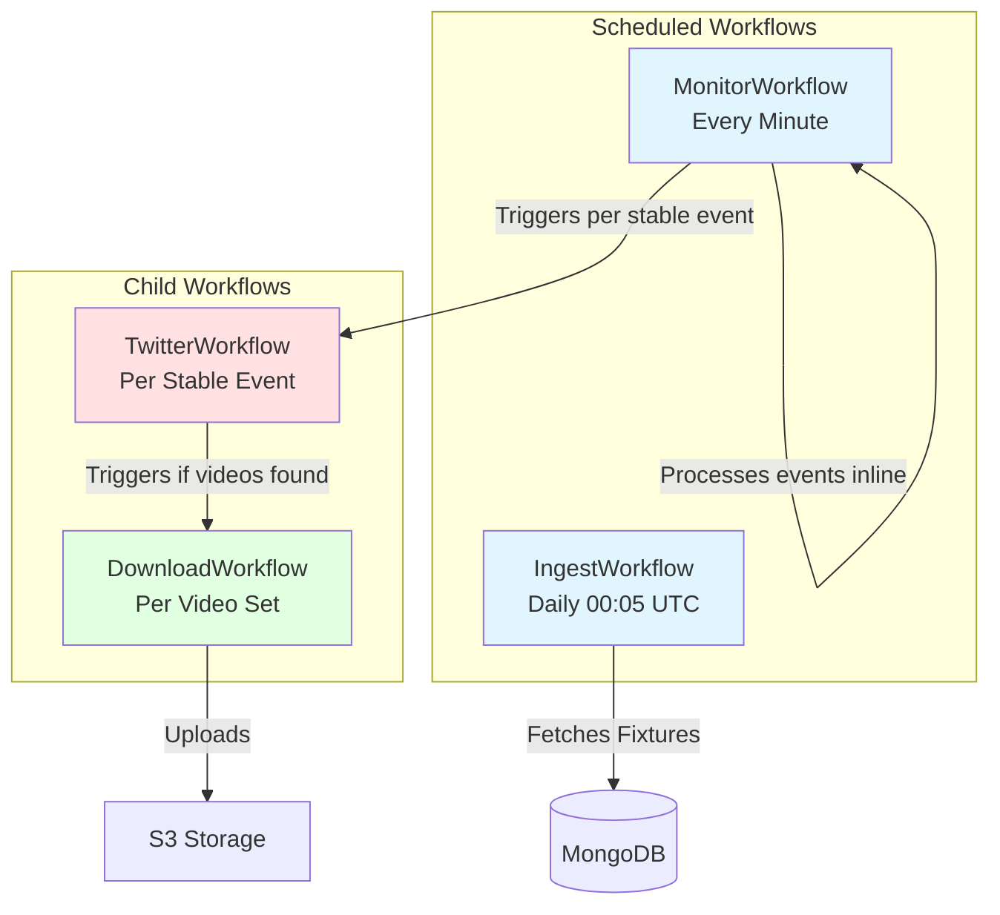
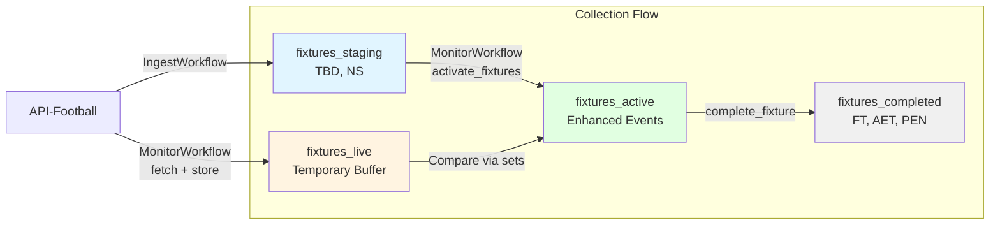
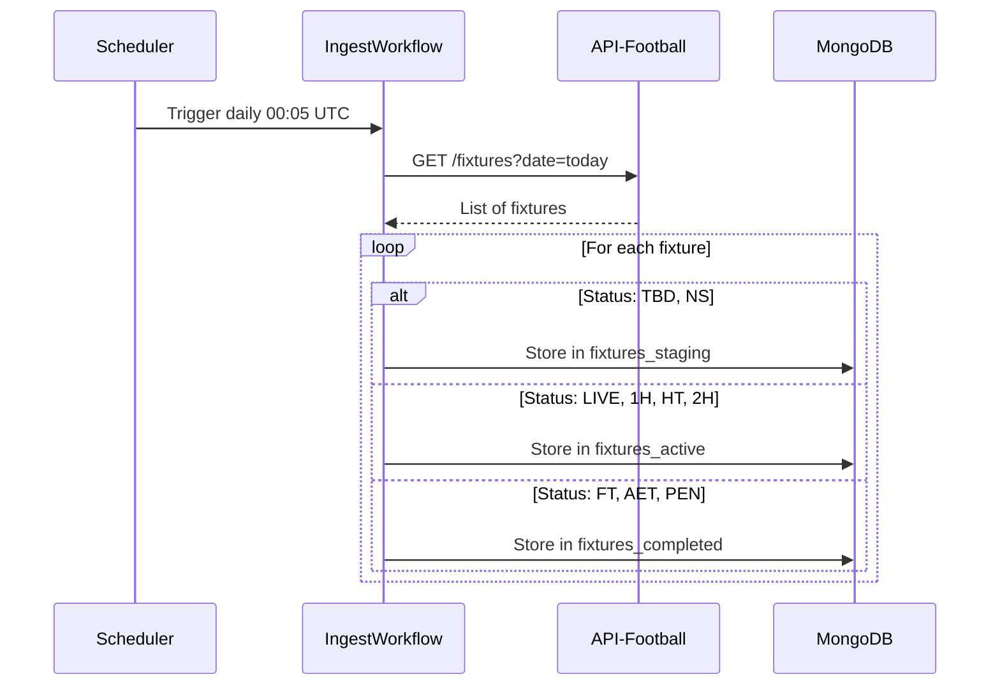
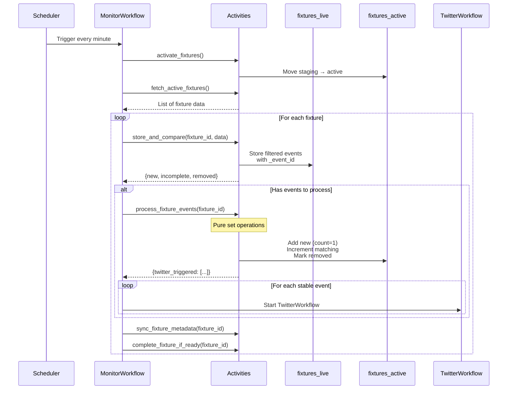
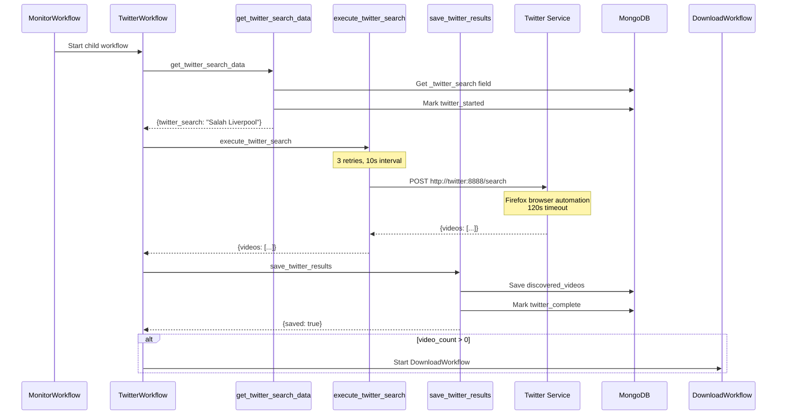
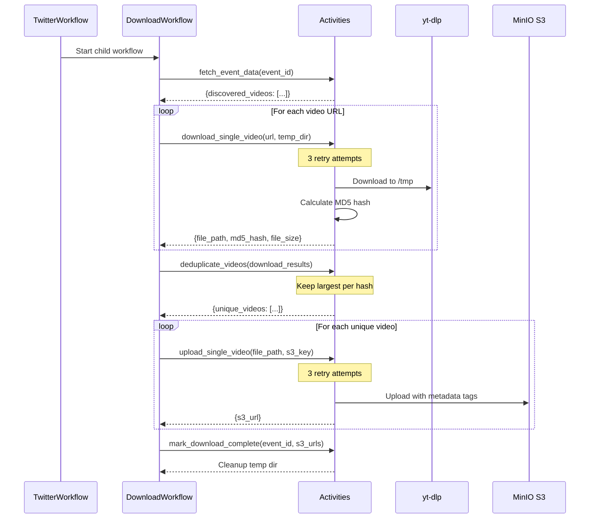

# Found Footy - Temporal Workflow Architecture

## Overview

This system uses Temporal.io to orchestrate the discovery, tracking, and archival of football goal videos from social media. The architecture consists of **4 workflows** that form a parent-child cascade, managing the full pipeline from fixture ingestion to video download.

---

## Workflow Hierarchy



---

## Workflow Naming Convention

All workflows use human-readable IDs for easy debugging in Temporal UI:

| Workflow | ID Format | Example |
|----------|-----------|---------|
| **IngestWorkflow** | `ingest-{DD_MM_YYYY}` | `ingest-05_12_2024` |
| **MonitorWorkflow** | `monitor-{DD_MM_YYYY}-{HH:MM}` | `monitor-05_12_2024-15:23` |
| **TwitterWorkflow** | `twitter-{Team}-{LastName}-{min}[+extra]-{event_id}` | `twitter-Liverpool-Salah-45+3min-123456_40_306_Goal_1` |
| **DownloadWorkflow** | `download-{Team}-{LastName}-{count}vids-{event_id}` | `download-Liverpool-Salah-3vids-123456_40_306_Goal_1` |

**Notes:**
- Team names use full name with underscores for spaces/dots (A.C. Milan → A_C__Milan)
- Player names use last name only
- Minutes include extra time when present (45+3 for 45' + 3' added time)
- Event IDs are unique: `{fixture_id}_{team_id}_{player_id}_{event_type}_{sequence}`

---

## MongoDB Collection Architecture

The system uses a **4-collection architecture** designed for robust change tracking:



### Collection Purposes

| Collection | Purpose | Update Pattern |
|------------|---------|----------------|
| **fixtures_staging** | Pre-match fixtures (TBD, NS) | Insert/Delete |
| **fixtures_live** | Temporary comparison buffer | Overwrite each poll |
| **fixtures_active** | In-progress with enhancements | Incremental only |
| **fixtures_completed** | Archive of finished matches | Insert only |

---

## 1. IngestWorkflow

**Schedule**: Daily at 00:05 UTC (PAUSED by default)  
**Purpose**: Fetch today's fixtures and route to correct collections



### Activities
1. **fetch_todays_fixtures**: GET request to API-Football
2. **categorize_and_store_fixtures**: Route fixtures based on status

---

## 2. MonitorWorkflow

**Schedule**: Every minute (ENABLED)  
**Purpose**: Poll active fixtures, process events inline, trigger Twitter for stable events

This workflow contains the **debounce logic inline** - no separate EventWorkflow needed.



### Activities

#### 1. **activate_fixtures**
Moves fixtures from `staging` → `active` when start time is reached.

#### 2. **fetch_active_fixtures**
Batch fetch all active fixtures from API-Football.

#### 3. **store_and_compare**
- Filters events to Goals only
- Generates `_event_id` per event
- Stores in `fixtures_live` (overwrites)
- Quick comparison to determine if processing needed

#### 4. **process_fixture_events** (Core Debounce Logic)

This activity implements **set-based debounce**:

```python
# 1. Build sets from event IDs
live_ids = {e["_event_id"] for e in live_events}
active_ids = {e["_event_id"] for e in active_events}

# 2. Compute deltas
new_ids = live_ids - active_ids       # NEW events
removed_ids = active_ids - live_ids   # VAR disallowed
matching_ids = live_ids & active_ids  # Existing events

# 3. Process each category
for event_id in new_ids:
    add_to_active(stable_count=1)

for event_id in removed_ids:
    mark_removed()

for event_id in matching_ids:
    if not debounce_complete:
        increment_stable_count()
        if stable_count >= 3:
            mark_debounce_complete()
            twitter_triggered.append(event_id)
```

**Why this works**: Event ID format includes player_id, so VAR player changes create a different event_id automatically. No hash comparison needed!

#### 5. **sync_fixture_metadata**
Updates fixture-level data (score, status) from live to active.

#### 6. **complete_fixture_if_ready**
Moves fixture to `completed` when all criteria met.

---

## 3. TwitterWorkflow

**Trigger**: Child workflow per stable event  
**Purpose**: Search Twitter for event videos, trigger Download if found

Uses 3 granular activities for proper retry semantics:



### 3 Granular Activities

| Activity | Purpose | Timeout | Retries |
|----------|---------|---------|---------|
| `get_twitter_search_data` | Get search query, mark started | 10s | 2 |
| `execute_twitter_search` | POST to Firefox (risky call) | 150s | 3 |
| `save_twitter_results` | Save videos, mark complete | 10s | 2 |

**Why 3 activities?**
- If Twitter search fails → only retry the search (not MongoDB reads)
- If save fails → videos preserved in workflow state
- Clear visibility in Temporal UI of which step failed

---

## 4. DownloadWorkflow

**Trigger**: Child workflow per event with videos  
**Purpose**: Download, deduplicate, upload videos with per-video retry



### 5 Granular Activities

| Activity | Purpose | Timeout | Retries |
|----------|---------|---------|---------|
| `fetch_event_data` | Get event from MongoDB | 10s | 2 |
| `download_single_video` | Download ONE video | 2min | 3 |
| `deduplicate_videos` | Hash-based dedup | 30s | 2 |
| `upload_single_video` | Upload ONE video to S3 | 2min | 3 |
| `mark_download_complete` | Update MongoDB, cleanup | 10s | 2 |

**Why granular?** Each video gets individual retry policy. If 3/5 videos succeed, those are preserved.

### Deduplication Logic

```python
def deduplicate_videos(download_results):
    seen_hashes = {}  # md5_hash -> {file_path, file_size}
    
    for result in download_results:
        hash = result["md5_hash"]
        
        if hash in seen_hashes:
            # Keep larger file (better quality)
            if result["file_size"] > seen_hashes[hash]["file_size"]:
                os.remove(seen_hashes[hash]["file_path"])
                seen_hashes[hash] = result
            else:
                os.remove(result["file_path"])
        else:
            seen_hashes[hash] = result
    
    return list(seen_hashes.values())
```

### S3 Structure

```
bucket/
├── {fixture_id}/
│   ├── {event_id}/
│   │   ├── {md5_hash_1}.mp4
│   │   ├── {md5_hash_2}.mp4
│   │   └── {md5_hash_3}.mp4
```

Each video has metadata tags: `player_name`, `team_name`, `event_id`, `fixture_id`

---

## Event ID Format

The event ID uniquely identifies each goal, including the player:

```
{fixture_id}_{team_id}_{player_id}_{event_type}_{sequence}
```

**Example**: `123456_40_306_Goal_1`
- Fixture: 123456
- Team: 40 (Liverpool)
- Player: 306 (Mohamed Salah)
- Type: Goal
- Sequence: 1 (Salah's 1st goal in this match)

**Why include player_id?** VAR player changes create a different event_id automatically. No hash comparison needed!

---

## Event Enhancement Fields

Events in `fixtures_active` have these enhancement fields:

| Field | Purpose | Set By |
|-------|---------|--------|
| `_event_id` | Unique identifier | store_and_compare |
| `_stable_count` | Debounce counter (0-3) | process_fixture_events |
| `_debounce_complete` | true when count >= 3 | process_fixture_events |
| `_twitter_started` | true when search begun | get_twitter_search_data |
| `_twitter_complete` | true when searched | save_twitter_results |
| `_twitter_search` | Search query | process_fixture_events |
| `_score_before` | Score before goal | process_fixture_events |
| `_score_after` | Score after goal | process_fixture_events |
| `_removed` | VAR disallowed | process_fixture_events |
| `discovered_videos` | Video URLs from Twitter | save_twitter_results |
| `s3_urls` | Uploaded video URLs | mark_download_complete |

---

## Error Handling & Retries

### Workflow-Level
- All child workflows inherit parent retry policy
- Failed workflows visible in Temporal UI
- Can retry manually from UI

### Activity-Level

| Activity | Timeout | Max Attempts | Initial Interval |
|----------|---------|--------------|------------------|
| fetch_todays_fixtures | 30s | 3 | 1s |
| activate_fixtures | 30s | 2 | 1s |
| store_and_compare | 10s | 2 | 1s |
| process_fixture_events | 60s | 3 | 1s |
| execute_twitter_search | 150s | 3 | 10s |
| download_single_video | 2min | 3 | 5s |
| upload_single_video | 2min | 3 | 5s |

---

## Development Workflow

### 1. Start Infrastructure
```bash
docker compose -f docker-compose.dev.yml up -d
```

### 2. View Worker Logs
```bash
docker compose -f docker-compose.dev.yml logs -f worker
```

### 3. Monitor in Temporal UI
```
http://localhost:4100
```

### 4. Check MongoDB
```
http://localhost:4101 (MongoDB Express)
```

### 5. Restart Worker (reload code)
```bash
docker compose -f docker-compose.dev.yml restart worker
```

---

## Troubleshooting

### Fixtures Not Moving to Completed
Check that all events have:
- `_debounce_complete: true`
- `_twitter_complete: true`
- `_download_complete: true` (if videos found)

### Twitter Search Failing
1. Check Twitter service is running: `docker logs found-footy-twitter`
2. Check VNC browser: http://localhost:4103
3. Verify Firefox profile exists: `/data/firefox_profile`
4. May need to re-login via VNC GUI

### Downloads Failing
1. Check yt-dlp is installed in worker container
2. Verify video URLs are valid
3. Check MinIO is running and accessible

---

## Summary

| Workflow | Schedule | Purpose | Activities |
|----------|----------|---------|------------|
| IngestWorkflow | Daily 00:05 | Fetch fixtures | 2 |
| MonitorWorkflow | Every minute | Process events | 6 |
| TwitterWorkflow | Per stable event | Find videos | 3 |
| DownloadWorkflow | Per event with videos | Download & upload | 5 |

**Total**: 4 workflows, 14 activities (2 ingest, 6 monitor, 3 twitter, 3 download)

Key architecture decisions:
- ✅ **Set-based debounce** - No hash comparison, player_id in event_id
- ✅ **Inline processing** - No separate EventWorkflow
- ✅ **Granular activities** - Per-video/per-step retry for resilience
- ✅ **Browser automation** - Firefox for Twitter (no API keys)
