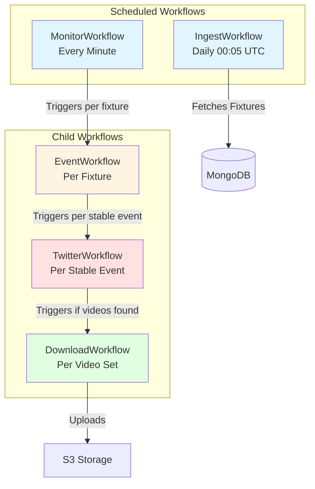
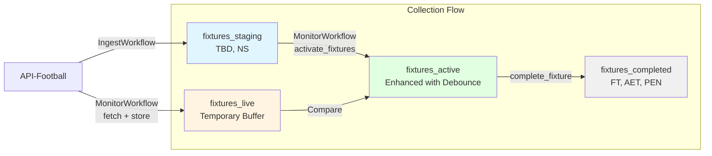
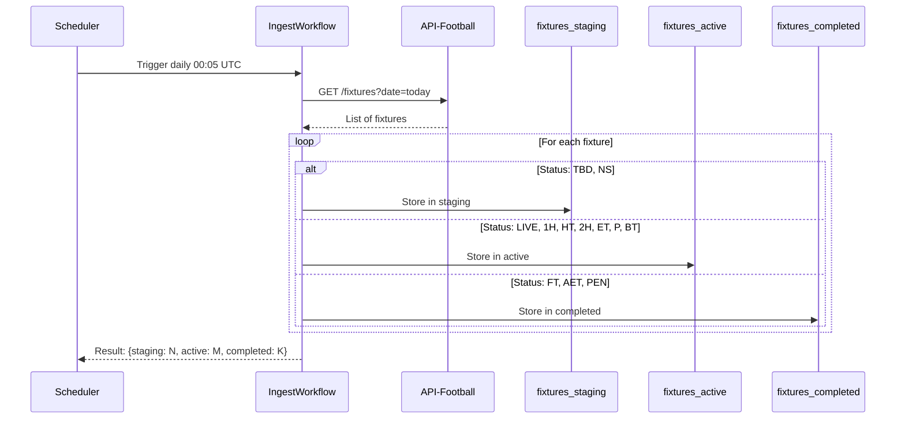
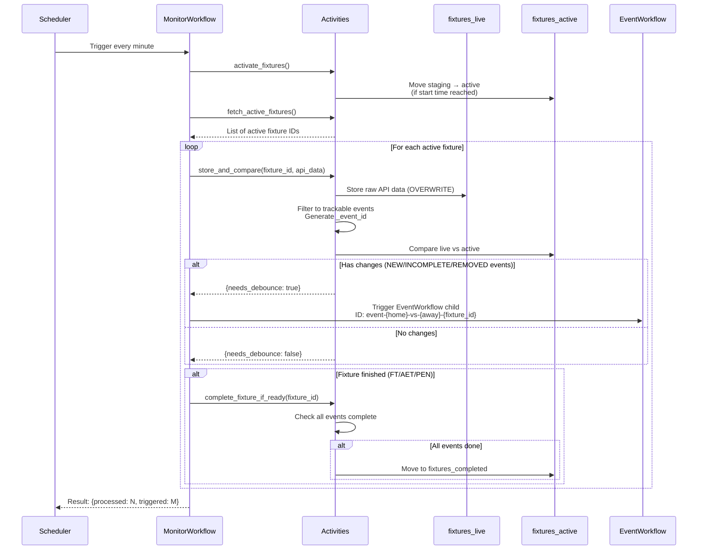
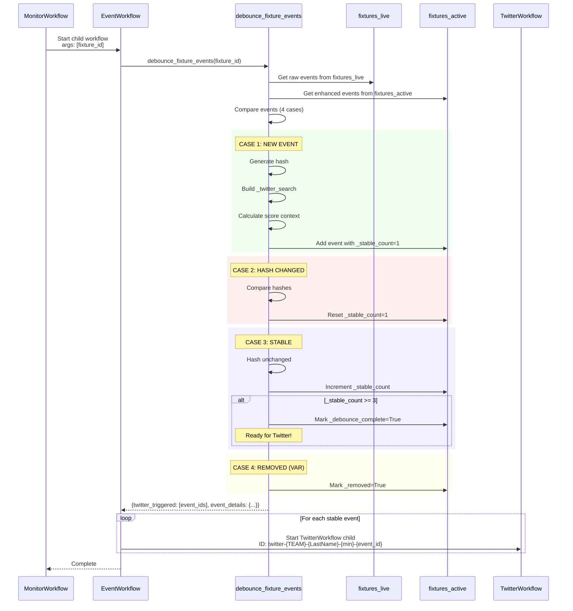
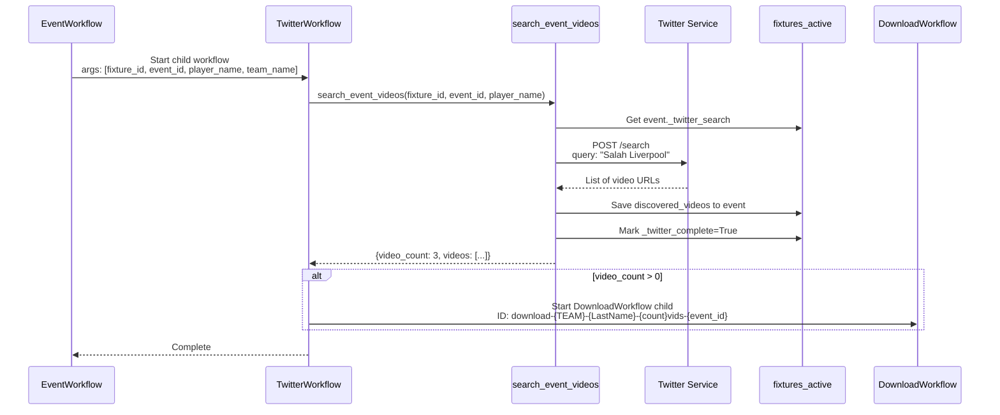
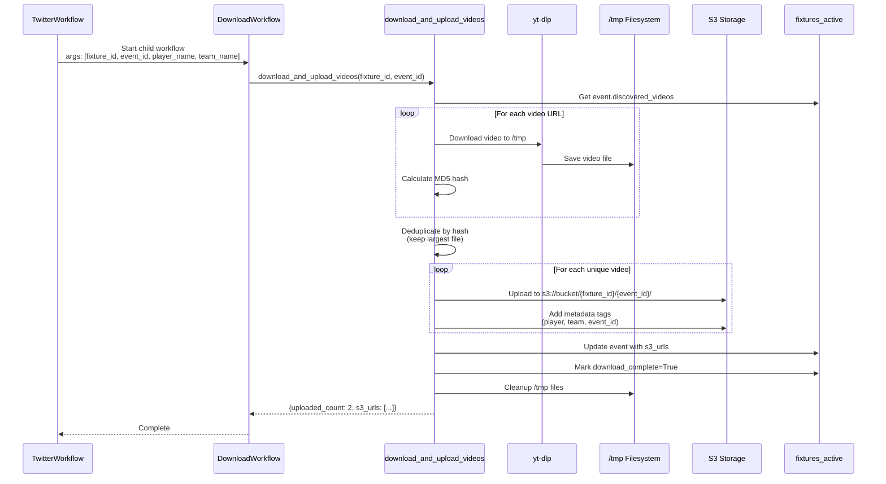
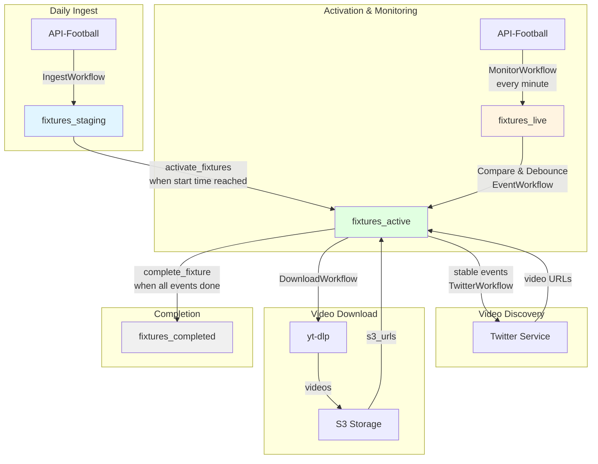

# Found Footy - Temporal Workflow Architecture

## Overview

This system uses Temporal.io to orchestrate the discovery, tracking, and archival of football goal videos from social media. The architecture consists of 5 workflows that form a parent-child cascade, managing the full pipeline from fixture ingestion to video download.

## Workflow Hierarchy



---

## Workflow Naming Convention

All workflows use human-readable IDs for easy debugging in Temporal UI:

| Workflow | ID Format | Example |
|----------|-----------|---------|
| **IngestWorkflow** | `ingest-{DD_MM_YYYY}` | `ingest-04_12_2024` |
| **MonitorWorkflow** | `monitor-{DD_MM_YYYY}-{HH:MM}` | `monitor-04_12_2024-15:23` |
| **EventWorkflow** | `event-{home}-vs-{away}-{fixture_id}` | `event-Liverpool-vs-Arsenal-1378993` |
| **TwitterWorkflow** | `twitter-{Team_Name}-{LastName}-{min}[+extra]-{event_id}` | `twitter-Liverpool-Salah-45+3min-1378993_40_Goal_1` |
| **DownloadWorkflow** | `download-{Team_Name}-{LastName}-{count}vids-{event_id}` | `download-Liverpool-Salah-3vids-1378993_40_Goal_1` |

**Notes:**
- Team names use full name with underscores for spaces/dots (A.C. Milan → A_C_Milan)
- Player names use last name only
- Minutes include extra time when present (45+3 for 45' + 3' added time)
- Event IDs are unique: `{fixture_id}_{team_id}_{event_type}_{sequence}`
- Spaces not allowed in Temporal workflow IDs (must be URL-safe)

---

## MongoDB Collection Architecture

The system uses a **4-collection architecture** designed for robust change tracking and debounce:



### Collection Purposes

#### 1. **fixtures_staging** (Pre-match)
- **Purpose**: Hold fixtures that haven't started yet
- **Statuses**: `TBD`, `NS` (Time to Be Determined, Not Started)
- **Content**: Raw API data
- **Lifetime**: Until match start time is reached

#### 2. **fixtures_live** (Comparison Buffer)
- **Purpose**: Temporary storage for raw API data during comparison
- **Content**: Raw API response + generated `_event_id` for matching
- **Update Pattern**: **Overwritten** on every poll (replace_one with upsert)
- **Lifetime**: Ephemeral - only exists for comparison, then discarded
- **Why Needed**: Active events have enhancement fields that change (e.g., `_stable_count`), so we can't hash them directly. We need pristine API data for hash comparison.

#### 3. **fixtures_active** (Enhanced, Never Overwritten)
- **Purpose**: Track in-progress fixtures with debounce state
- **Content**: Original API data + 9 enhancement fields per event
- **Update Pattern**: **Selective updates only** - never replace entire events
  - NEW events: Added with `_stable_count=1`
  - EXISTING events: Only update `_stable_count` and `_snapshots` fields
  - **NEVER** overwrite the entire event object
- **Lifetime**: Until fixture completes (FT/AET/PEN) AND all events finish processing

#### 4. **fixtures_completed** (Archive)
- **Purpose**: Long-term storage of finished fixtures
- **Statuses**: `FT`, `AET`, `PEN` (Full Time, After Extra Time, Penalties)
- **Content**: Full fixture data + all event metadata
- **Completion Criteria**:
  1. Fixture status is FT/AET/PEN
  2. All events have `_debounce_complete=True`
  3. All events have `_twitter_complete=True`

---

## 1. IngestWorkflow

**Schedule**: Daily at 00:05 UTC (currently PAUSED)  
**Purpose**: Fetch today's fixtures and route to correct collections



### Activities
1. **fetch_todays_fixtures**: GET request to API-Football for today's date
2. **categorize_and_store_fixtures**: Route fixtures based on status

### Return Value
```python
{
    "staging_count": 8,
    "active_count": 3,
    "completed_count": 12,
    "total_fixtures": 23
}
```

---

## 2. MonitorWorkflow

**Schedule**: Every minute (ENABLED)  
**Purpose**: Poll active fixtures, detect changes, trigger EventWorkflow children



### Activities

#### 1. **activate_fixtures**
Moves fixtures from `staging` → `active` when start time is reached. Initializes empty `events` array.

#### 2. **fetch_active_fixtures**
Batch fetch all active fixtures from API-Football (efficient single call).

#### 3. **store_and_compare**
**Quick pre-check** - determines if EventWorkflow needs to run:

```python
def store_and_compare(fixture_id, api_data):
    # 1. Store in fixtures_live (OVERWRITE with raw API data)
    store.store_live_fixture(fixture_id, api_data)
    # Filters to trackable events (Goals only) and generates _event_id
    
    # 2. Quick comparison using set operations on event_ids
    comparison = store.compare_live_vs_active(fixture_id)
    # Algorithm:
    # - Build set from live_events: {e["_event_id"] for e in live_events}
    # - Build set from active_events: {e["_event_id"] for e in active_events}
    # - Compare: live_ids - active_ids (NEW)
    # - Compare: active_ids - live_ids (REMOVED)
    # - Check: any events with _debounce_complete=False (INCOMPLETE)
    
    return comparison  # {needs_debounce: bool, counts...}
```

**EventWorkflow is triggered when ANY of these is true**:
1. **NEW events**: Event IDs exist in `fixtures_live` but NOT in `fixtures_active`
2. **INCOMPLETE events**: Event IDs exist in BOTH, but `_debounce_complete=False` in active
3. **REMOVED events**: Event IDs exist in `fixtures_active` but NOT in `fixtures_live` (VAR disallowed)

**This is just a cheap pre-check** using Python set operations (fast). The actual **hash comparison** happens inside EventWorkflow's `debounce_fixture_events` activity using the iterate-and-drop pattern.

**Why keep this pre-check?**
- Avoids spinning up EventWorkflows when nothing changed
- Set operations are very fast (O(n) to build sets, O(1) for membership checks)
- Only checks event_id presence, not event content
- If fixture has no changes and all events complete → skip EventWorkflow entirely

**Why fixtures_live gets overwritten**:
- It's a temporary comparison buffer
- Contains pristine API data for hash comparison
- Active events have changing fields (`_stable_count`), can't hash them directly
- Standard CDC (Change Data Capture) pattern

#### 4. **complete_fixture_if_ready**
Checks if fixture can move to `completed`:
- Fixture status is FT/AET/PEN
- All events have `_debounce_complete=True`
- All events have `_twitter_complete=True`

If all criteria met, moves fixture from `active` → `completed`.

### Return Value
```python
{
    "fixtures_processed": 5,
    "event_workflows_triggered": 2,
    "active_fixture_count": 5
}
```

---

## 3. EventWorkflow (Debounce)

**Trigger**: Child workflow per fixture with changes  
**Purpose**: Debounce events, trigger TwitterWorkflow when stable

This workflow implements the **core debounce logic** that prevents premature Twitter searches when API data is still changing.



### Two-Stage Comparison Architecture

**Stage 1: Quick Check** (in MonitorWorkflow → `compare_live_vs_active`)
```python
# Build sets (one iteration each)
live_ids = {e["_event_id"] for e in fixtures_live.events}
active_ids = {e["_event_id"] for e in fixtures_active.events}

# Set operations (fast)
new = live_ids - active_ids          # In live, not in active
removed = active_ids - live_ids      # In active, not in live
incomplete = [e for e in active if not e._debounce_complete]

# Trigger EventWorkflow if ANY case has events
return needs_debounce = (len(new) > 0 or len(removed) > 0 or len(incomplete) > 0)
```

**Stage 2: Hash Comparison** (in EventWorkflow → `debounce_fixture_events`)
```python
# Build dict for O(1) lookup (one iteration)
live_dict = {e["_event_id"]: e for e in fixtures_live.events}

# Iterate and drop pattern (one pass through active events)
for active_event in fixtures_active.events:
    if active_event.id in live_dict:
        live_event = live_dict.pop(active_event.id)  # Mark processed
        
        # Compare hash (THIS is where we detect data changes)
        if hash(live_event) == active_event.last_hash:
            increment_stable_count()  # CASE 3
        else:
            reset_stable_count()      # CASE 2
    else:
        mark_removed()                # CASE 4

# Whatever's left in live_dict = NEW events
for event_id, live_event in live_dict.items():
    add_new_event()                   # CASE 1
```

**Why two stages?**
- Stage 1 is cheap (just event_id presence check) - avoids triggering workflows unnecessarily
- Stage 2 is expensive (hash computation, database updates) - only runs when needed
- If no changes detected in Stage 1 → skip Stage 2 entirely

---

### Debounce Logic (4 Cases)

The debounce activity uses the **iterate-and-drop pattern** to process events efficiently.

#### CASE 1: NEW EVENT
Event exists in `live` but NOT in `active`.

```python
# Generate hash from critical fields
event_hash = generate_event_hash(live_event)

# Build enhancement fields
twitter_search = build_twitter_search(live_event, live_fixture)
score_context = calculate_score_context(live_fixture, live_event)

# Create enhanced event
enhanced_event = {
    **live_event,  # Original API data
    "_event_id": "1378993_40_Goal_1",
    "_stable_count": 1,
    "_debounce_complete": False,
    "_twitter_complete": False,
    "_first_seen": "2024-12-04T15:23:00Z",
    "_snapshots": [{"timestamp": now, "hash": event_hash}],
    "_twitter_search": "Salah Liverpool",
    "_score_before": "0-0",
    "_score_after": "1-0",
    "_removed": False
}

store.add_event_to_active(fixture_id, enhanced_event)
```

#### CASE 2: HASH CHANGED
Event exists in both, but hash differs (API data changed).

```python
live_hash = generate_event_hash(live_event)
last_hash = active_event["_snapshots"][-1]["hash"]

if live_hash != last_hash:
    # Data changed - reset debounce
    store.update_event_stable_count(fixture_id, event_id, 1, snapshot)
```

**Why this happens**: API-Football sometimes updates event details (assist changes, time adjustments, player name corrections).

**Important**: If the hash changes, we reset to `_stable_count=1` and wait for 3 more stable polls. This ensures we only trigger Twitter search with the final, stable data.

#### CASE 3: STABLE
Event exists in both, hash unchanged.

```python
live_hash = generate_event_hash(live_event)
last_hash = active_event["_snapshots"][-1]["hash"]

if live_hash == last_hash:
    stable_count = active_event.get("_stable_count", 0)
    new_stable_count = stable_count + 1
    
    store.update_event_stable_count(fixture_id, event_id, new_stable_count, snapshot)
    
    if new_stable_count >= 3:
        # 3 consecutive polls with no changes - STABLE!
        store.mark_event_debounce_complete(fixture_id, event_id)
        twitter_triggered.append(event_id)
```

**Threshold**: 3 consecutive unchanged polls = ~3 minutes of stability.

**Fixture Data Sync**: After any successful debounce operation (new, updated, or completed events), we sync the fixture's top-level data from `fixtures_live` to `fixtures_active`. This updates score, status, time, etc. while preserving our enhanced events array. This ensures the fixture metadata stays fresh even as events are being debounced.

#### CASE 4: REMOVED (VAR)
Event in `active` but NOT in `live` (removed by VAR/referee).

```python
if not active_event.get("_removed", False):
    store.mark_event_removed(fixture_id, event_id)
```

### Event Hash Generation

Only includes fields that shouldn't change if event is stable:

```python
def generate_event_hash(event: dict) -> str:
    key_fields = {
        "player_id": event.get("player", {}).get("id"),
        "team_id": event.get("team", {}).get("id"),
        "type": event.get("type"),
        "detail": event.get("detail"),
        "time_elapsed": event.get("time", {}).get("elapsed"),
        "assist_id": event.get("assist", {}).get("id"),
    }
    return hashlib.md5(json.dumps(key_fields, sort_keys=True).encode()).hexdigest()
```

**Excluded**: Comments, stats, timestamps - these change but don't matter for video search.

### Enhancement Fields Explained

| Field | Purpose | Can Remove? |
|-------|---------|-------------|
| `_event_id` | Primary key for matching | ❌ Required |
| `_stable_count` | Debounce state tracker | ❌ Required |
| `_debounce_complete` | Workflow trigger flag | ❌ Required |
| `_twitter_complete` | Completion tracking | ❌ Required |
| `_first_seen` | Debug timestamp | ✅ Can remove |
| `_snapshots` | Hash history (debug) | ✅ Can remove |
| `_twitter_search` | Search string | ⚠️ Could recompute |
| `_score_before` | UI display | ⚠️ Could recompute |
| `_score_after` | UI display | ⚠️ Could recompute |
| `_removed` | VAR handling | ❌ Required |

**Recommendation**: Remove `_first_seen` and `_snapshots` (debug only). Keep score/search fields because recomputing is expensive.

### Return Value
```python
{
    "status": "success",
    "fixture_id": 1378993,
    "new_events": 1,
    "updated_events": 2,
    "completed_events": 1,
    "removed_events": 0,
    "twitter_triggered": ["1378993_40_Goal_1"],
    "event_details": {
        "1378993_40_Goal_1": {
            "player": "Mohamed Salah",
            "team": "Liverpool",
            "minute": 45,
            "extra": 3  # or None
        }
    }
}
```

---

## 4. TwitterWorkflow

**Trigger**: Child workflow per stable event  
**Purpose**: Search Twitter for event videos, trigger DownloadWorkflow if found



### Activities

#### **search_event_videos**
```python
async def search_event_videos(fixture_id, event_id, player_name):
    # 1. Get event from fixtures_active
    event = store.get_event(fixture_id, event_id)
    twitter_search = event["_twitter_search"]  # "Salah Liverpool"
    
    # 2. POST to twitter-session service (:8888/search)
    response = requests.post(
        "http://twitter-session:8888/search",
        json={"query": twitter_search}
    )
    
    # 3. Parse video URLs from response
    videos = response.json().get("videos", [])
    
    # 4. Save to event
    store.update_event(fixture_id, event_id, {
        "discovered_videos": videos
    })
    
    # 5. Mark twitter complete
    store.mark_event_twitter_complete(fixture_id, event_id)
    
    return {
        "video_count": len(videos),
        "videos": videos,
        "player_name": player_name
    }
```

### Return Value
```python
{
    "fixture_id": 1378993,
    "event_id": "1378993_40_Goal_1",
    "videos_found": 3
}
```

---

## 5. DownloadWorkflow

**Trigger**: Child workflow per event with videos found  
**Purpose**: Download videos, deduplicate, upload to S3



### Activities

#### **download_and_upload_videos**
```python
async def download_and_upload_videos(fixture_id, event_id):
    # 1. Get discovered videos
    event = store.get_event(fixture_id, event_id)
    video_urls = event["discovered_videos"]
    
    # 2. Download with yt-dlp
    downloaded = []
    for url in video_urls:
        filepath = ytdlp.download(url, output_dir="/tmp")
        md5_hash = calculate_md5(filepath)
        downloaded.append({"path": filepath, "hash": md5_hash, "url": url})
    
    # 3. Deduplicate (keep largest per hash)
    unique_videos = deduplicate_by_hash(downloaded)
    
    # 4. Upload to S3
    s3_urls = []
    for video in unique_videos:
        s3_key = f"{fixture_id}/{event_id}/{video['hash']}.mp4"
        s3_url = s3_client.upload(
            video["path"],
            bucket="found-footy-videos",
            key=s3_key,
            metadata={
                "player": event["player"]["name"],
                "team": event["team"]["name"],
                "event_id": event_id,
                "fixture_id": str(fixture_id),
            }
        )
        s3_urls.append(s3_url)
    
    # 5. Update event
    store.update_event(fixture_id, event_id, {"s3_urls": s3_urls})
    store.mark_event_download_complete(fixture_id, event_id)
    
    # 6. Cleanup
    for video in downloaded:
        os.remove(video["path"])
    
    return {
        "uploaded_count": len(unique_videos),
        "s3_urls": s3_urls
    }
```

### Return Value
```python
{
    "fixture_id": 1378993,
    "event_id": "1378993_40_Goal_1",
    "videos_uploaded": 2,
    "s3_urls": [
        "s3://found-footy-videos/1378993/1378993_40_Goal_1/abc123.mp4",
        "s3://found-footy-videos/1378993/1378993_40_Goal_1/def456.mp4"
    ]
}
```

---

## Complete Data Flow



---

## Event Data Structure Evolution

### Raw API Event (from API-Football)
```json
{
  "time": {
    "elapsed": 45,
    "extra": 3
  },
  "team": {
    "id": 40,
    "name": "Liverpool",
    "logo": "https://..."
  },
  "player": {
    "id": 306,
    "name": "Mohamed Salah"
  },
  "assist": {
    "id": 289,
    "name": "Roberto Firmino"
  },
  "type": "Goal",
  "detail": "Normal Goal",
  "comments": null
}
```

### Enhanced Event (in fixtures_active)
```json
{
  // ... all raw API fields above ...
  
  // Enhancement fields (added by debounce)
  "_event_id": "1378993_40_Goal_1",
  "_stable_count": 3,
  "_debounce_complete": true,
  "_twitter_complete": true,
  "_download_complete": true,
  "_first_seen": "2024-12-04T15:23:00Z",
  "_snapshots": [
    {"timestamp": "2024-12-04T15:23:00Z", "hash": "abc123..."},
    {"timestamp": "2024-12-04T15:24:00Z", "hash": "abc123..."},
    {"timestamp": "2024-12-04T15:25:00Z", "hash": "abc123..."}
  ],
  "_twitter_search": "Salah Liverpool",
  "_score_before": "0-0",
  "_score_after": "1-0",
  "_removed": false,
  
  // Added by Twitter workflow
  "discovered_videos": [
    "https://twitter.com/..../video/1",
    "https://twitter.com/..../video/2"
  ],
  
  // Added by Download workflow
  "s3_urls": [
    "s3://found-footy-videos/1378993/1378993_40_Goal_1/abc123.mp4",
    "s3://found-footy-videos/1378993/1378993_40_Goal_1/def456.mp4"
  ]
}
```

---

## UI Data Display Pattern

For goal events, the UI will display:

```
🏠 Liverpool (1) - 0 Manchester United  🚶
    Mohamed Salah • 45+3'
    
    [Video 1] [Video 2]
```

**Data extraction**:
- **Home team** (always left): `fixture.teams.home.name`
- **Away team** (always right): `fixture.teams.away.name`
- **Scoring team**: Determine from `event.team.id` vs `fixture.teams.home.id`
- **Score after**: Use `event._score_after` (computed during debounce)
- **Player name**: `event.player.name`
- **Minute**: `event.time.elapsed` + `event.time.extra` (if present)

**Edge case**: Neutral venue (neither team at home) - display as-is, order doesn't matter.

**Future events**: Red cards, VAR decisions will follow same pattern but with different icons/styling.

---

## Configuration

### Event Filtering (event_config.py)

Only certain event types are tracked:

```python
TRACKABLE_EVENTS = {
    "Goal": True,      # ✅ Enabled
    "Card": False,     # ❌ Disabled (future)
    "subst": False,    # ❌ Disabled
    "Var": False,      # ❌ Disabled (future)
}

def should_track_event(event: dict) -> bool:
    event_type = event.get("type")
    return TRACKABLE_EVENTS.get(event_type, False)
```

**Why filter**: Reduces noise, focuses on key moments. Cards and VAR will be enabled later.

### Debounce Threshold

Defined in `event.py`:

```python
STABLE_THRESHOLD = 3  # Number of consecutive unchanged polls
```

With MonitorWorkflow running every minute, this means **3 minutes of stability** before triggering Twitter search.

**Tuning**: Increase for more stability (less premature searches), decrease for faster response.

---

## Error Handling & Retries

### Workflow-Level Retries
- **IngestWorkflow**: 3 attempts with exponential backoff (1s → 10s)
- **MonitorWorkflow**: 2 attempts for activation, 3 for fetch
- **TwitterWorkflow**: 3 attempts with 10s initial delay
- **DownloadWorkflow**: 3 attempts with 10s initial delay

### Activity Timeouts
| Activity | Timeout | Reason |
|----------|---------|--------|
| fetch_todays_fixtures | 30s | API call |
| fetch_active_fixtures | 60s | Batch API call |
| activate_fixtures | 30s | DB operations |
| store_and_compare | 10s | DB operations |
| debounce_fixture_events | 60s | Complex logic |
| search_event_videos | 120s | External service |
| download_and_upload_videos | 10min | Large file downloads |

### Idempotency
All workflows are idempotent:
- MongoDB operations use `upsert` where appropriate
- S3 uploads overwrite if key exists
- Workflow IDs are deterministic (same input = same ID)
- Activities check state before modifying

---

## Monitoring & Debugging

### Temporal UI
- **URL**: `http://localhost:4100`
- **Features**:
  - View workflow hierarchy (parent/child relationships)
  - Inspect workflow history (every state transition)
  - See activity inputs/outputs
  - Retry failed workflows
  - Pause/resume schedules

### MongoDB Express
- **URL**: `http://localhost:4101`
- **Features**:
  - Inspect collections
  - View event enhancement fields
  - Track fixture progression
  - Verify data ordering

### Logging
All activities log to stdout with emojis for easy filtering:
- ✨ NEW EVENT
- 📊 STABLE (count incrementing)
- ✅ DEBOUNCE COMPLETE
- ⚠️ HASH CHANGED (reset)
- 🚫 REMOVED (VAR)
- 🏁 COMPLETED (fixture done)

---

## Development Workflow

### 1. Start Infrastructure
```bash
docker compose -f docker-compose.dev.yml up -d
```

Services:
- Temporal Server: `localhost:7233`
- Temporal UI: `localhost:4100`
- MongoDB: `localhost:27017`
- MongoDB Express: `localhost:4101`
- Twitter Service: `localhost:8888`

### 2. Run Worker
```bash
# In container
docker compose -f docker-compose.dev.yml up worker

# Or locally (dev mode)
source .venv/bin/activate
python src/worker.py
```

### 3. Trigger Test Pipeline
```bash
# Via Python
python src/scripts/test_integration_real.py

# Or via Temporal CLI
temporal workflow start \
  --type IngestWorkflow \
  --task-queue found-footy \
  --workflow-id ingest-04_12_2024
```

### 4. Monitor Progress
- **Temporal UI**: Check workflow execution
- **MongoDB Express**: Verify data in collections
- **Worker Logs**: Watch for emoji indicators

### 5. Debugging
```bash
# View worker logs
docker compose -f docker-compose.dev.yml logs -f worker

# Check MongoDB
docker exec -it found-footy-mongodb mongosh found_footy

# Restart worker (reload code)
docker compose -f docker-compose.dev.yml restart worker
```

---

## Future Enhancements

### Event Types
- [ ] Red Card tracking
- [ ] Yellow Card tracking
- [ ] VAR Decision tracking
- [ ] Penalty tracking (separate from goals)

### Optimization
- [ ] Remove debug fields (`_first_seen`, `_snapshots`)
- [ ] Batch Twitter searches (multiple events in one request)
- [ ] Parallel video downloads
- [ ] CDN caching for team logos

### Features
- [ ] Real-time WebSocket updates
- [ ] Video thumbnail generation
- [ ] Automatic highlight compilation
- [ ] Social media posting (auto-tweet)

---

## Troubleshooting

### Fixtures Not Advancing to Completed
**Symptoms**: Fixtures stuck in `fixtures_active` after FT.

**Causes**:
1. Events still have `_debounce_complete=False`
2. Events still have `_twitter_complete=False`
3. Fixture status not FT/AET/PEN

**Debug**:
```javascript
// In MongoDB Express
db.fixtures_active.find({
  "fixture.id": 1378993,
  "events._debounce_complete": false
})
```

### fixtures_live Not Being Dropped
**Symptoms**: `fixtures_live` collection grows over time.

**Solution**: This is by design - `fixtures_live` is overwritten per fixture (not dropped). Each fixture has its own document that gets replaced on each poll.

### Data Ordering Issues
**Symptoms**: Events appear out of order in MongoDB Express.

**Cause**: API-Football returns events in chronological order, and we preserve that order.

**Verification**:
```javascript
// Check _event_id sequences
db.fixtures_active.findOne({"fixture.id": 1378993}).events.map(e => e._event_id)
// Should see: [..._Goal_1, ..._Goal_2, ..._Goal_3]
```

### Workflow Not Triggering
**Symptoms**: MonitorWorkflow runs but no EventWorkflow children.

**Causes**:
1. No changes detected (needs_debounce=False)
2. Fixture not in `fixtures_active`
3. API returning empty events array

**Debug**: Check worker logs for "needs_debounce" messages.

---

## Architecture Decisions

### Why 4 Collections Instead of 2?
**Alternative**: Just `active` and `completed`.

**Why We Need `staging`**: Prevents premature activation. If a fixture is scheduled for 3pm but API returns it at 2pm, we don't want to start monitoring until 3pm.

**Why We Need `live`**: Can't hash enhanced events in `active` because `_stable_count` changes every poll. Need pristine API data for comparison. Standard CDC pattern.

### Why Not Use Temporal Queries?
**Alternative**: Store debounce state in workflow variables.

**Why MongoDB**: 
- Persistent across worker restarts
- Queryable for debugging
- Enables batch operations
- Supports complex comparisons

Temporal is for orchestration, MongoDB is for state.

### Why Parent-Child Workflows Instead of Just Activities?
**Alternative**: MonitorWorkflow calls all activities directly.

**Why Children**:
- **Parallel execution**: Multiple fixtures/events processed simultaneously
- **Independent retry policies**: Each child can retry independently
- **Better visibility**: Temporal UI shows hierarchy
- **Scalability**: Can distribute across workers

### Why Overwrite fixtures_live Instead of Delete?
**Alternative**: Drop and recreate each time.

**Why Overwrite**:
- Atomic operation (no race conditions)
- Maintains indexes
- Simpler error handling
- MongoDB optimized for replace_one with upsert

---

## Summary

This architecture provides a robust, scalable pipeline for discovering and archiving football goal videos:

1. **IngestWorkflow** fetches fixtures daily
2. **MonitorWorkflow** polls every minute, detects changes
3. **EventWorkflow** debounces events (3-minute stability threshold)
4. **TwitterWorkflow** searches for videos when stable
5. **DownloadWorkflow** downloads, deduplicates, uploads to S3

Key features:
- ✅ Debounce prevents premature searches
- ✅ 4-collection architecture ensures data integrity
- ✅ Parent-child workflows enable parallel processing
- ✅ Human-readable workflow IDs aid debugging
- ✅ Idempotent operations allow safe retries
- ✅ Future-ready for cards, VAR, penalties

All orchestrated by Temporal.io with persistent state in MongoDB.
