# Found Footy - Temporal Workflow Architecture

## Overview

This system uses Temporal.io to orchestrate the discovery, tracking, and archival of football goal videos from social media. The architecture consists of **4 workflows** that form a parent-child cascade, managing the full pipeline from fixture ingestion to video download.

**Key Features:**
- **Non-blocking child workflows** - Monitor doesn't wait for downloads
- **Per-activity retry with exponential backoff** - Granular failure recovery
- **3 Twitter attempts per event** - Better video quality over time
- **URL exclusion** - Each search finds NEW videos, not duplicates
- **Cross-retry quality replacement** - Higher resolution videos replace lower ones
- **Duration filtering** - Skip videos < 5s or > 60s

---

## Workflow Hierarchy


**Critical Architecture Note:**
- `start_child_workflow` with `parent_close_policy=ABANDON` means **parent doesn't wait**
- Monitor triggers Twitter workflow and immediately continues to next fixture
- This prevents downloads from blocking the 1-minute monitor cycle

---

## Workflow Naming Convention

All workflows use human-readable IDs for easy debugging in Temporal UI:

| Workflow | ID Format | Example |
|----------|-----------|---------|
| **IngestWorkflow** | `ingest-{DD_MM_YYYY}` | `ingest-05_12_2024` |
| **MonitorWorkflow** | `monitor-{DD_MM_YYYY}-{HH:MM}` | `monitor-05_12_2024-15:23` |
| **TwitterWorkflow** | `twitter{N}-{Team}-{LastName}-{min}-{event_id}` | `twitter1-Liverpool-Salah-45+3min-123456_40_306_Goal_1` |
| **DownloadWorkflow** | `download{N}-{Team}-{LastName}-{count}vids-{event_id}` | `download1-Liverpool-Salah-3vids-123456_40_306_Goal_1` |

**Notes:**
- `N` in TwitterWorkflow = attempt number (1, 2, or 3)
- Team names use underscores for spaces/dots (A.C. Milan → A_C__Milan)
- Player names use last name only
- Minutes include extra time when present (45+3min)

---

## MongoDB Collection Architecture


| Collection | Purpose | Update Pattern |
|------------|---------|----------------|
| **fixtures_staging** | Pre-match fixtures (TBD, NS) | Insert/Delete |
| **fixtures_live** | Temporary comparison buffer | Overwrite each poll |
| **fixtures_active** | In-progress with enhancements | Incremental only |
| **fixtures_completed** | Archive of finished matches | Insert only |

---

## 1. IngestWorkflow

**Schedule**: Daily at 00:05 UTC  
**Purpose**: Fetch today's fixtures and route to correct collections


### Activities

| Activity | Timeout | Retries | Backoff |
|----------|---------|---------|---------|
| `fetch_todays_fixtures` | 30s | 3 | 2.0x from 1s |
| `categorize_and_store_fixtures` | 30s | 3 | 2.0x from 1s |

---

## 2. MonitorWorkflow

**Schedule**: Every minute  
**Purpose**: Poll active fixtures, process events inline, trigger Twitter for stable events

```mermaid
sequenceDiagram
    participant S as Scheduler
    participant MW as MonitorWorkflow
    participant Act as Activities
    participant Live as fixtures_live
    participant Active as fixtures_active
    participant TW as TwitterWorkflow
    
    S->>MW: Trigger every minute
    
    MW->>Act: activate_fixtures()
    Note over Act: 2 retries
    Act->>Active: Move staging → active
    
    MW->>Act: fetch_active_fixtures()
    Note over Act: 3 retries
    Act-->>MW: List of fixture data
    
    loop For each fixture
        MW->>Act: store_and_compare(fixture_id, data)
        Note over Act: 3 retries, 2.0x backoff
        Act->>Live: Store filtered events with _event_id
        
        MW->>Act: process_fixture_events(fixture_id)
        Note over Act: 3 retries
        Act->>Active: Add new / Increment matching / Mark removed
        Act-->>MW: {twitter_triggered, twitter_retry_needed}
        
        loop For each stable event (first time)
            MW->>TW: start_child_workflow (attempt 1)
            Note over TW: Non-blocking!
        end
        
        loop For each event needing more searches
            MW->>TW: start_child_workflow (attempt 2 or 3)
            Note over TW: Non-blocking!
        end
        
        alt Fixture finished (FT/AET/PEN)
            MW->>Act: complete_fixture_if_ready()
            Note over Act: 3 retries, 2.0x backoff
        end
    end
```



### Activities

| Activity | Timeout | Retries | Backoff |
|----------|---------|---------|---------|
| `activate_fixtures` | 30s | 2 | - |
| `fetch_active_fixtures` | 60s | 3 | - |
| `store_and_compare` | 10s | 3 | 2.0x from 1s |
| `process_fixture_events` | 60s | 3 | - |
| `complete_fixture_if_ready` | 10s | 3 | 2.0x from 1s |

### Event Processing Logic

```python
# Pure set operations - no hash comparison needed!
live_ids = {e["_event_id"] for e in live_events}
active_ids = {e["_event_id"] for e in active_events}

new_ids = live_ids - active_ids       # NEW events → add with count=1
removed_ids = active_ids - live_ids   # VAR disallowed → mark _removed
matching_ids = live_ids & active_ids  # Existing → increment count

# When count hits 3 → trigger Twitter
# _twitter_count tracks how many Twitter searches have run
# When _twitter_count < 3 → add to twitter_retry_needed
```

---

## 3. TwitterWorkflow

**Trigger**: Child workflow per stable event (runs 3 times per event)  
**Purpose**: Search Twitter for event videos, trigger Download if found


### Activities

| Activity | Timeout | Retries | Backoff |
|----------|---------|---------|---------|
| `get_twitter_search_data` | 10s | 2 | - |
| `execute_twitter_search` | 150s | 3 | 1.5x from 10s |
| `save_discovered_videos` | 10s | 3 | 2.0x from 1s |

### Search Parameters

```python
# Request to Twitter service
{
    "search_query": "Salah Liverpool",
    "max_results": 5,           # Up to 5 videos per search
    "exclude_urls": [...]       # Skip already-discovered URLs
}
```

### 3 Attempts Strategy

```
Attempt 1: Triggered immediately when _stable_count = 3
           Find early uploads (often lower quality)
           exclude_urls = []
           
Attempt 2: Triggered ~5 min later (via twitter_retry_needed)
           Find more uploads, potentially better quality
           exclude_urls = [URLs from attempt 1]
           
Attempt 3: Triggered ~5 min later (final attempt)
           Last chance for high-quality videos
           exclude_urls = [URLs from attempts 1 & 2]
           Sets _twitter_complete = true
```

**Why 3 attempts with exclude_urls?**
- Goal videos are uploaded over 10-15 minutes after the goal
- Without exclude_urls, you get the same 5 videos every time
- With exclude_urls, you can find up to 15 unique videos (5 × 3)
- Early uploads often SD, later uploads often HD

---

## 4. DownloadWorkflow

**Trigger**: Child workflow per Twitter search with videos  
**Purpose**: Download, filter, deduplicate, upload videos with cross-retry quality comparison


### Activities

| Activity | Timeout | Retries | Backoff |
|----------|---------|---------|---------|
| `fetch_event_data` | 15s | 2 | - |
| `download_single_video` | 60s | 3 | 2.0x from 2s |
| `deduplicate_videos` | 30s | 2 | - |
| `replace_s3_video` | 15s | 3 | 2.0x from 2s |
| `upload_single_video` | 30s | 3 | 1.5x from 2s |
| `save_processed_urls` | 10s | 3 | 2.0x from 1s |
| `mark_download_complete` | 10s | 3 | 2.0x from 1s |

### Duration Filtering

```python
MIN_VIDEO_DURATION = 5   # seconds
MAX_VIDEO_DURATION = 60  # seconds

# In download_single_video activity
if duration < MIN_VIDEO_DURATION:
    return {"status": "filtered", "reason": "too_short", "source_url": url}
if duration > MAX_VIDEO_DURATION:
    return {"status": "filtered", "reason": "too_long", "source_url": url}
```

Filtered videos are tracked in `_discovered_videos` to prevent re-download.

### Perceptual Hash Deduplication

```python
def compute_perceptual_hash(file_path):
    """
    Duration-based perceptual hash for video deduplication.
    Same video at different bitrates → same hash
    """
    # Get duration (0.5s tolerance)
    duration = get_video_duration(file_path)
    
    # Extract 3 frames at fixed positions
    frames = extract_frames(file_path, positions=[1.0, 2.0, 3.0])
    
    # Compute dHash (64-bit difference hash) for each frame
    hashes = [dhash(frame) for frame in frames]
    
    # Combine: "15.2_abc123_def456_ghi789"
    return f"{duration:.1f}_{'_'.join(hashes)}"
```

### Quality Comparison

```python
def is_better_quality(new_video, existing_s3):
    """Compare videos with matching perceptual hash"""
    # 1. Resolution (width × height)
    new_score = new_video["width"] * new_video["height"]
    old_score = existing_s3["width"] * existing_s3["height"]
    if new_score > old_score:
        return True  # 1080p > 720p
    
    # 2. Bitrate (same resolution)
    if new_video["bitrate"] > existing_s3["bitrate"]:
        return True
    
    # 3. File size (last resort)
    if new_video["file_size"] > existing_s3["file_size"]:
        return True
    
    return False
```

### S3 Structure

```
bucket/
├── {fixture_id}/
│   ├── {event_id}/
│   │   ├── {short_hash_1}.mp4
│   │   ├── {short_hash_2}.mp4
│   │   └── {short_hash_3}.mp4
```

Each video has metadata headers:
- `x-amz-meta-player-name`
- `x-amz-meta-team-name`
- `x-amz-meta-width`
- `x-amz-meta-height`
- `x-amz-meta-bitrate`
- `x-amz-meta-file-size`
- `x-amz-meta-perceptual-hash`
- `x-amz-meta-source-url`

---

## Event ID Format

```
{fixture_id}_{team_id}_{player_id}_{event_type}_{sequence}
```

**Example**: `123456_40_306_Goal_1`
- Fixture: 123456
- Team: 40 (Liverpool)
- Player: 306 (Mohamed Salah)
- Type: Goal
- Sequence: 1 (Salah's 1st goal in this match)

**Why include player_id?** VAR player changes create a different event_id automatically!

---

## Event Enhancement Fields

| Field | Set By | Purpose |
|-------|--------|---------|
| `_event_id` | store_and_compare | Unique identifier |
| `_stable_count` | process_fixture_events | Debounce counter (0-3) |
| `_monitor_count` | process_fixture_events | Total times seen |
| `_monitor_complete` | process_fixture_events | true when count >= 3 |
| `_twitter_count` | process_fixture_events | Twitter searches run (0-3) |
| `_twitter_complete` | TwitterWorkflow (attempt 3) | true after 3rd attempt |
| `_first_seen` | process_fixture_events | First appearance timestamp |
| `_twitter_search` | process_fixture_events | Search query |
| `_removed` | process_fixture_events | VAR disallowed |
| `_discovered_videos` | save_discovered_videos | Video URLs from Twitter |
| `_s3_videos` | mark_download_complete | S3 video metadata |

---

## Retry Strategy Overview

### Activity-Level Retries

| Category | Max Attempts | Initial Interval | Backoff | Example Activities |
|----------|--------------|------------------|---------|-------------------|
| MongoDB reads | 2 | 1s | - | `fetch_event_data` |
| MongoDB writes | 3 | 1s | 2.0x | `store_and_compare`, `mark_download_complete` |
| External APIs | 3 | 1-10s | 1.5-2.0x | `fetch_active_fixtures`, `execute_twitter_search` |
| Video operations | 3 | 2s | 2.0x | `download_single_video`, `replace_s3_video` |
| S3 uploads | 3 | 2s | 1.5x | `upload_single_video` |

### Retry Timing Example

For `download_single_video` (3 attempts, 2s initial, 2.0x backoff):
```
Attempt 1: immediate
[fail] → wait 2s
Attempt 2: 2s later
[fail] → wait 4s  
Attempt 3: 6s total elapsed
[fail] → activity fails, logged in workflow
```

### Workflow-Level Handling

- Activity failures are caught and logged
- Partial success is preserved (3/5 videos = 3 in S3)
- Workflows continue on individual failures
- Final status tracked in MongoDB

---

## Development Workflow

### 1. Start Infrastructure
```bash
docker compose -f docker-compose.dev.yml up -d
```

### 2. View Worker Logs
```bash
docker compose -f docker-compose.dev.yml logs -f worker
```

### 3. Monitor in Temporal UI
```
http://localhost:4100
```

### 4. Check MongoDB
```
http://localhost:4101 (MongoDB Express)
```

### 5. Test Pipeline
```bash
docker exec found-footy-worker python /workspace/tests/workflows/test_pipeline.py --fixture-id 1469132
```

### 6. Restart Worker (reload code)
```bash
docker compose -f docker-compose.dev.yml build worker && docker compose -f docker-compose.dev.yml up worker -d
```

---

## Troubleshooting

### Fixtures Not Moving to Completed

Check that all events have:
- `_monitor_complete: true` (stable_count >= 3)
- `_twitter_complete: true` (3 Twitter attempts done)

```javascript
// In MongoDB Express
db.fixtures_active.find({
  "events": {
    "$elemMatch": {
      "_twitter_complete": {"$ne": true}
    }
  }
})
```

### Twitter Search Failing

1. Check Twitter service: `docker logs found-footy-twitter`
2. Check VNC browser: http://localhost:4103
3. Verify Firefox profile exists
4. May need to re-login via VNC GUI

### Same Videos Found Every Search

Check that `exclude_urls` is being passed:
```bash
docker logs found-footy-twitter | grep "excluding"
```

Should show: `🔍 Searching: Salah Liverpool (excluding 5 already-discovered URLs)`

### Downloads Failing

1. Check yt-dlp in worker: `docker exec found-footy-worker yt-dlp --version`
2. Check ffprobe: `docker exec found-footy-worker ffprobe -version`
3. Check MinIO: `docker logs found-footy-minio`
4. Look for 403 errors (rate limits) in logs

### Quality Replacement Not Working

1. Check perceptual hash computation: `docker logs found-footy-worker | grep "phash"`
2. Verify S3 metadata: list objects and check headers
3. Check dedup activity output in Temporal UI

---

## Summary

| Workflow | Schedule | Purpose | Activities |
|----------|----------|---------|------------|
| IngestWorkflow | Daily 00:05 | Fetch fixtures | 2 |
| MonitorWorkflow | Every minute | Process events | 6 |
| TwitterWorkflow | 3x per event | Find videos | 3 |
| DownloadWorkflow | Per search | Download & upload | 7 |

**Total**: 4 workflows, 18 activities

### Key Architecture Decisions

| Decision | Reason |
|----------|--------|
| Non-blocking child workflows | Monitor must complete in ~30s |
| Per-activity retry | Granular failure recovery |
| 3 Twitter attempts | Better video quality over time |
| exclude_urls parameter | Find NEW videos each attempt |
| Duration filtering (5-60s) | Skip celebrations and compilations |
| Perceptual hashing | Same video at different bitrates = same hash |
| Quality-based replacement | 1080p replaces 720p automatically |
| `$max` for `_last_activity` | Timestamps only move forward |
| Browser automation | No Twitter API keys needed |
