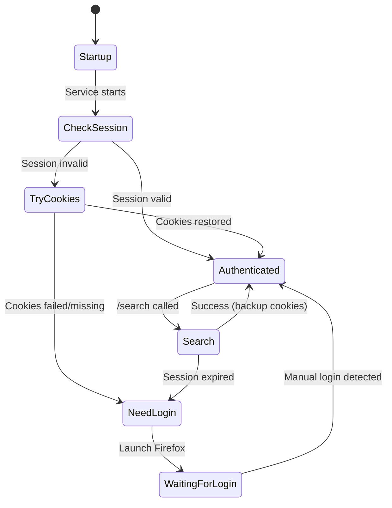

# Twitter Authentication

The Twitter service uses **browser automation with VNC access** for authentication and video searching.

## Architecture

```
┌─────────────────────────────────────────────────────┐
│ found-footy-twitter container                       │
│                                                     │
│  ┌─────────────────┐   ┌──────────────────────────┐ │
│  │ FastAPI :8888   │   │ Firefox Browser          │ │
│  │  /search        │──▶│ (Selenium + Profile)     │ │
│  │  /health        │   └──────────────────────────┘ │
│  └─────────────────┘              │                 │
│                                   │                 │
│  ┌─────────────────┐   ┌──────────┴───────────────┐ │
│  │ noVNC :6080     │──▶│ Xvfb Virtual Display :99 │ │
│  │  (Web access)   │   └──────────────────────────┘ │
│  └─────────────────┘                                │
└─────────────────────────────────────────────────────┘
        │
        │ Port 4103 (dev) / 3103 (prod)
        ▼
    http://localhost:4103 → VNC browser GUI
```

## How It Works

### Automatic Authentication Flow

On startup and before each search, the service:

1. **Check existing session** - Is browser alive and logged in?
2. **Try cookie restore** - Load from `/config/twitter_cookies.json`
3. **Verify login** - Navigate to twitter.com/home and check for redirect
4. **If all fail** → Launch Firefox for manual login

### Cookie Backup

Cookies are automatically:
- **Exported** after successful login to `/config/twitter_cookies.json`
- **Restored** on container restart before authentication check
- **Refreshed** after each successful search

## Quick Start

### 1. Start Services
```bash
docker compose -f docker-compose.dev.yml up -d
```

### 2. Check Status
```bash
# Health check
curl http://localhost:8888/health

# Should return:
# {"status": "healthy", "authenticated": true}
```

### 3. First-Time Login (if needed)

If `authenticated: false`, open VNC:

```
http://localhost:4103
```

This opens a browser showing Firefox. Log into Twitter:
1. Navigate to twitter.com (or x.com)
2. Enter credentials
3. Complete any 2FA
4. Service auto-detects login success
5. Cookies backed up automatically

## API Endpoints

### GET /health
```bash
curl http://localhost:8888/health
```

Returns:
```json
{"status": "healthy", "authenticated": true}
```

Or if login needed:
```json
{"status": "unhealthy", "authenticated": false, "message": "Not authenticated - open http://localhost:4103 to login via VNC"}
```

### POST /search
```bash
curl -X POST http://localhost:8888/search \
  -H "Content-Type: application/json" \
  -d '{"search_query": "Salah Liverpool goal", "max_results": 5, "exclude_urls": []}'
```

**Parameters:**
- `search_query` (required): Search terms
- `max_results` (default: 5): Maximum videos to return
- `exclude_urls` (default: []): URLs to skip during scraping

Returns:
```json
{
  "status": "success",
  "videos": [
    {
      "tweet_url": "https://twitter.com/user/status/123",
      "tweet_text": "What a goal by Salah!",
      "video_page_url": "https://x.com/i/status/123",
      "duration_seconds": 15.0
    }
  ],
  "count": 1
}
```

**Error (503)**: Authentication required - open VNC to login

### POST /authenticate
Force re-authentication:
```bash
curl -X POST http://localhost:8888/authenticate \
  -H "Content-Type: application/json" \
  -d '{"force_reauth": true}'
```

### POST /auth/verify
Verify login and switch to Selenium mode after manual login:
```bash
curl -X POST http://localhost:8888/auth/verify
```

## URL Exclusion Feature

The `exclude_urls` parameter allows the caller to skip already-discovered videos:

```python
# In Temporal activity
response = requests.post(
    "http://twitter:8888/search",
    json={
        "search_query": "Salah Liverpool",
        "max_results": 5,
        "exclude_urls": ["https://x.com/user/status/123", "https://x.com/user/status/456"]
    }
)
```

The Twitter service logs when skipping URLs:
```
🔍 Searching: Salah Liverpool (excluding 2 already-discovered URLs)
   ⏭️ Skipping already-discovered URL: https://x.com/user/status/123...
```

This enables finding **NEW videos** across multiple search attempts.

## Cookie Backup Location

```
/config/twitter_cookies.json  (inside container)
~/.config/found-footy/twitter_cookies.json  (host mount)
```

This file is:
- **Host-mounted** - Survives container rebuilds
- **Auto-created** - After first successful login
- **JSON format** - Human-readable for debugging

## Troubleshooting

### "authenticated: false" or 503 errors

1. Open VNC: http://localhost:4103
2. Log into Twitter manually
3. Wait for auto-detection (service logs show success)

### VNC Not Accessible

```bash
# Check container is running
docker ps | grep twitter

# Check logs
docker logs found-footy-twitter

# Restart if needed
docker compose -f docker-compose.dev.yml restart twitter
```

### Cookies Not Restoring

Check the backup file exists:
```bash
ls -la ~/.config/found-footy/twitter_cookies.json
```

If missing, login via VNC - it will be created automatically.

Check logs for cookie restore:
```bash
docker logs found-footy-twitter | grep -i cookie
```

Should show:
```
🍪 Attempting cookie restore...
📦 Found backup from 2025-12-10T07:45:09Z with 12 cookies
✅ Added 12 cookies (0 failed)
✅ Cookie restore SUCCESSFUL - authenticated!
```

### Twitter Login Loop

Twitter may require additional verification. Use VNC to:
1. Complete any CAPTCHA
2. Verify phone/email
3. Accept new terms

### Search Returns Same Videos

If you're getting the same videos repeatedly:
1. Ensure `exclude_urls` is being passed
2. Check worker logs for `(excluding N already-discovered URLs)`
3. Check Twitter service logs for `⏭️ Skipping already-discovered URL`

## Environment Variables

| Variable | Default | Purpose |
|----------|---------|---------|
| `TWITTER_SERVICE_PORT` | 8888 | API port |
| `TWITTER_COOKIE_BACKUP_PATH` | `/config/twitter_cookies.json` | Cookie backup location |
| `TWITTER_HEADLESS` | false | Run browser headless (no GUI) |
| `VNC_PUBLIC_URL` | http://localhost:4103 | VNC URL in notifications |

## Session Lifecycle



## Ports Summary

| Environment | VNC Port | API Port |
|-------------|----------|----------|
| Development | 4103 | 8888 (internal) |
| Production | 3103 | 8888 (internal) |

## Integration with Temporal

The Twitter service is called by `execute_twitter_search` activity:

```python
@activity.defn
async def execute_twitter_search(
    twitter_search: str, 
    max_results: int = 5,
    existing_video_urls: Optional[List[str]] = None
) -> Dict[str, Any]:
    response = requests.post(
        f"{session_url}/search",
        json={
            "search_query": twitter_search, 
            "max_results": max_results,
            "exclude_urls": existing_video_urls or []
        },
        timeout=120
    )
```

This activity has:
- **3 retries** with 1.5x exponential backoff from 10s
- **150s timeout** for browser automation
- **503 handling** - raises RuntimeError to trigger retry
