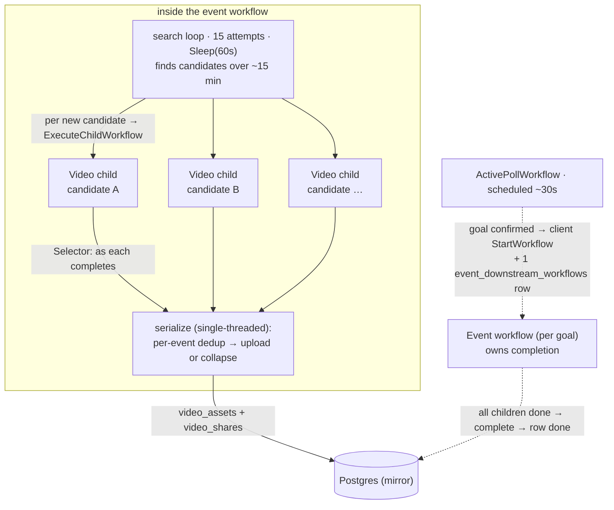

# V-phase orchestration — the per-event workflow model

**Status:** design agreed 2026-07-27 in a walkthrough with the user. This
**supersedes the orchestration model** in
[`proposals/video-dedup.md`](./proposals/video-dedup.md) — the three-workflow
fan-out (Discovery / Video / Asset) with signal-with-start + queue-drain, and
all cross-event/corpus dedup. That doc is retained for its **dedup-algorithm
detail** (dHash, sliding-window match, thresholds), but its *workflow shape* is
replaced by what's below. Records the model to build V against.

Related: [`../orchestration.md`](../orchestration.md) (as-built workflow map +
the "no Temporal children" note that this design changes for the downstream
chain), [`../decisions.md`](../decisions.md) 2026-07-25 (per-event dedup) +
2026-07-16 (Temporal-direct spawn).

## TL;DR

- **Temporal owns completion; Postgres is a queryable mirror** — not the
  completion authority.
- One **per-event orchestrator workflow** (the evolved `DiscoveryWorkflow`)
  owns a goal's entire pipeline: search → download/validate → dedup → upload.
- **Video processing is a child workflow per candidate.** Each candidate is a
  multi-step independent unit (download → metadata → filter → hash →
  clock-check), so it's workflow-shaped, not activity-shaped. The parent fans
  them out and joins them.
- **Dedup + upload run serialized in the parent.** Workflow code is
  single-threaded and deterministic, so the parent *is* the serialization
  point — race-free, with **no signal-queue and no idle-timeout**.
- **Dedup is per-event, content-based** (md5 / perceptual), against *this
  event's* already-uploaded assets. The `UNIQUE(event_id, hash)` constraint
  on `video_assets` **is** the dedup.

## The pipeline, end to end

1. **Poll → event workflow (client spawn, 1 pg row).** When `ReconcileFixture`
   confirms a goal (3-vote debounce), it inserts one `event_downstream_workflows`
   row and `client.StartWorkflow`s the per-event workflow (`discovery-<eventID>`).
   This hop *must* be client-spawn + pg-tracked because the poll is a short-lived
   scheduled workflow that can't parent a ~15-minute child. This one row is the
   pg mirror's completion handle for the whole event.
2. **Search loop — 15 attempts, 60 s apart.** Inside the event workflow, a loop
   of `MaxAttempts` (=15) search calls, `workflow.Sleep(60s)` between them, with
   an accumulating exclude-list. This is *time coverage*: goal clips get posted
   to Twitter over the ~15 minutes after a goal, so we re-search to catch them
   as they appear. Attempts are **loop iterations, not workflows and not batches.**
3. **Video child per candidate — streaming fan-out.** As each attempt surfaces a
   *new* candidate URL, the parent spawns a **Video child workflow** for it
   (`ExecuteChildWorkflow`, fire the future, don't block the loop). Children run
   in parallel and overlap the remaining search window — by minute 15 most are
   already validated. One child **per candidate URL** (finer than Python's
   per-attempt batch).
4. **Video child = the per-candidate pipeline (parallel work).** download →
   extract metadata → hard-filter → content hash (md5) → clock-check (vision #1:
   is-soccer + does the broadcast clock match the goal minute?). Survivors also
   get a perceptual hash. The child returns `{survived, verified, md5,
   perceptual_hash, bytes_location}`. All of this is parallelizable, so it lives
   in the child.
5. **Parent joins + serializes dedup/upload (single-threaded).** The parent uses
   a `Selector` to handle each Video child **as it completes**, and for each
   survivor runs the **per-event dedup-then-upload** in its own single-threaded
   code — so no two uploads race. This is the "serialize back."
6. **Completion.** When the search loop has finished *and* all Video children
   have been drained, the event workflow completes. Temporal knew exactly when
   the children were done (native await) — the parent then flips its one pg row
   to `completed`. **Fixture completion = no pending event-workflow rows** for
   the fixture.

## Why this shape

**Temporal owns completion; pg is the mirror.** With a real parent that awaits
its children, Temporal natively knows "is the whole pipeline done." We don't
hand-build a completion contract for the downstream chain (that's what created
the recovery-sweep + started-then-died edges). The pg tables still exist — for
the *data* (candidates, per-candidate outcomes) and for the API/dashboards — but
they're a **queryable mirror**, not the source of truth for "done." The only pg
row that's load-bearing for completion is the single **poll → event-workflow**
row (that hop can't be a Temporal child, because the poll is short-lived).

**Video is a child workflow, not an activity.** A candidate isn't one operation
— it's a 5-step sequence with its own retries. That's workflow-shaped. Modelling
each candidate as a child workflow keeps it clean, independently retryable, and
individually visible in the Temporal UI; the alternative (N parallel 5-step
activity-chains inside one workflow) is messier.

**Serialization is free.** Workflow code runs single-threaded and
deterministically, so doing the dedup-decision + upload in the *parent* is
automatically race-free. This deletes the entire reason a separate AssetWorkflow
+ signal-queue + queue-drain existed — those only faked a join across detached
workflows. A `Selector` over the children *is* the join.

## Dedup + upload — the serialized join, in detail

- **Scope: per-event.** A new survivor is deduped against *this event's* other
  candidates and *this event's* already-uploaded assets — **never** the global
  corpus (cross-event dedup is dead, [decisions.md 2026-07-25]).
- **Identity: content, not URL.** The dedup key is `video_assets.md5` /
  `perceptual_hash`, decoupled from the public `video_shares` id (`s_<hex>`) +
  tweet URL. This is the fix for Python's core flaw (URL *was* the identity, so
  N same-content clips could never collapse to 1 asset).
- **The constraint is the dedup.** `UNIQUE(event_id, md5)` +
  `UNIQUE(event_id, perceptual_hash)`. New survivor → optimistic insert →
  `ON CONFLICT` means "already have this content for this event" → collapse
  (bump popularity / attach reference) instead of a duplicate asset.
- **Incremental upload.** Survivors go to S3 *as they validate* across the
  15-min window (not all at the end) — which is exactly why the "dedup against
  this event's S3 assets" step exists: a clip found on attempt 8 that matches
  one uploaded on attempt 3 collapses onto it. Lower latency: clips surface as
  they're validated.
- **Layered, cheap-first:** exact-byte (md5) collapse short-circuits before the
  expensive perceptual hash + vision; perceptual near-match handles
  same-clip-different-encoding within the event.

## What this replaces from `video-dedup.md`

- ❌ Separate `AssetWorkflow` (per-event, signal-with-start, FIFO) → folded into
  the parent's serialized join.
- ❌ Signal-queue + queue-drain completion / idle-timeout → `Selector` over
  children + native completion.
- ❌ Cross-event / S3-corpus dedup, cross-event multi-share, cross-event race
  handling, replace-and-absorb across events → all gone (per-event).
- ❌ `event_download_workflows` as a second tracking table → the pg layer is a
  mirror; one event row is the completion handle.
- ✅ **Kept:** the dedup *algorithm* (dHash, histogram-eq, offset-tolerant
  sliding-window match, thresholds), the two vision calls, the metadata
  hard-filter, `video_assets`/`video_shares` schema, the search loop.

## Reference: how Python did it (grain of salt — 3.5/3.7-era learning code)

Verified from `archive/src/workflows/`. Python reached for this shape but
hand-rolled the hard parts:

- **`start_child_workflow` + `ParentClosePolicy.ABANDON` + fire-and-forget** —
  used the child API but *detached* the children, so no real parent-awaits-child.
  Same effective shape as "spawn independent workflows."
- **Per-attempt `DownloadWorkflow`** (`download{attempt}-…`) — coarser than
  per-candidate.
- **`UploadWorkflow` completed on a 5-minute idle timeout** (`upload_workflow.py`
  "Process batches until idle timeout") — the wasteful "it just waits" tail. →
  replaced by deterministic parent-await.
- **URL-as-identity dedup** — the storage/share key *was* the tweet URL, so
  same-content-different-URL never collapsed and N→1 was structurally impossible.
  → replaced by content-hash identity + the asset/share split.

Take specifics with a grain of salt; the *behavioral intent* is the useful part.

## Open sub-questions for the build path

1. **Naming.** Does `DiscoveryWorkflow` get renamed to an `EventWorkflow` (it now
   owns more than discovery), or keep the name and grow it? (User is particular
   about naming.)
2. **Search-loop ↔ child-drain interleaving.** The parent must both keep
   searching (spawn children) for 15 min *and* process completed children. One
   `Selector` over {sleep-timer, child futures}, or a cleaner structure?
3. **Where the md5 short-circuit lives** — a parallel read in the child, vs the
   serialized decision in the parent. (Reads don't race; the upload/collapse
   decision must be serialized.)
4. **Asset step: inline in the parent, or one final child workflow?**
5. **Video download dependency (T/f):** CDN Referer/Origin headers — done, or
   the first thing to build?
6. **Vision model on joi** — which model, is it live? (blocks clock-check.)
7. **`event_tweets` vs the shipped `event_search_candidates`** — reconcile to one
   mirror table.
8. **Per-candidate video children in the Temporal UI** vs one big workflow —
   confirmed we want the per-child visibility (yes, per this design).
