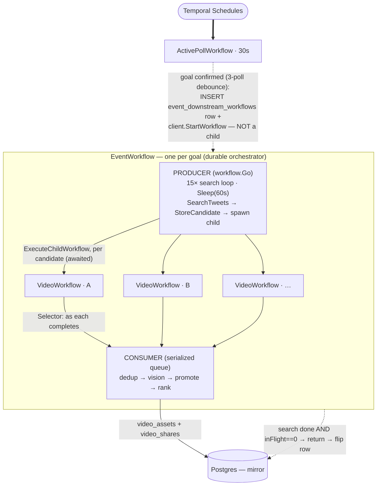

# V-phase orchestration — the per-event `EventWorkflow` (streaming queue)

**Status:** settled 2026-07-27 over an extended design walkthrough with the
user. This **supersedes** both the earlier draft of this doc (which was
batch-ambiguous and left 8 open sub-questions) and the three-workflow fan-out
in [`proposals/video-dedup.md`](./proposals/video-dedup.md). `video-dedup.md`
is retained **only** for its dedup-*algorithm* detail (frame hashing,
offset-tolerant sliding-window match, thresholds); its *workflow shape* is
dead.

Related: [`../orchestration.md`](../orchestration.md) (as-built workflow map),
[`../decisions.md`](../decisions.md) — 2026-07-25 (per-event dedup), 2026-07-16
(Temporal-direct spawn), and the 2026-07-27 rung entries (ffmpeg, dHash,
hard-filter, download/hash activities).

---

## TL;DR — the model

- **One `EventWorkflow` per goal** — a durable orchestrator. Client-spawned by
  the 30 s poll (**not** a Temporal child); a single `event_downstream_workflows`
  pg row is the queryable mirror.
- **Search runs *inline*** as the "discovery phase" — `SearchTweets` /
  `StoreCandidate` activities in a `workflow.Go` producer coroutine. A search
  attempt is *activity-shaped* (one service call), so it is **not** a child
  workflow.
- **One `VideoWorkflow` child per candidate** — the *only* real Temporal
  parent→child. It does **download → hash** and returns fingerprints. Event
  **awaits** it, so completion is free.
- **One per-event serialized queue** (a `workflow.Selector` consumer) runs
  **dedup → vision → promote → rank** as each Video child completes. **No
  batches.**
- **Temporal owns completion.** Event returns when the search loop is done
  **and** nothing is in flight. No idle-timeout, no queue-drain heuristic. pg
  is a mirror.

The single organizing principle: **per-candidate work → the Video child
(parallel); cross-candidate work → the one serialized queue in the parent.**
The lone exception: **vision is parent-*triggered*** (so it fires once per
*unique* clip, not per candidate) but runs in parallel.

---

## The workflow tree



**Node types**

| Node | Kind | Spawned by | Why |
|---|---|---|---|
| `IngestWorkflow`, `ActivePollWorkflow`, `StagingPollWorkflow` | scheduled workflows | Temporal Schedule | independent; no parent |
| `EventWorkflow` | workflow | `client.StartWorkflow` from `ReconcileFixture` | a 30 s poll can't own a ~15-min run → client-spawn + pg mirror |
| `VideoWorkflow` (×N) | **child workflow** (awaited) | `EventWorkflow` | per-candidate pipeline (download→hash) — workflow-shaped; the only real parent→child |
| `SearchTweets`, `StoreCandidate` | activities | `EventWorkflow` (inline) | a search attempt is one service call — activity-shaped |
| `DownloadAndStage`, `HashVideo` | activities | `VideoWorkflow` | the per-candidate steps (✓ #165) |
| `ValidateClip` (vision), `PromoteAndPersist`, `BumpAssetPopularity`, `DeleteStaging` | activities | `EventWorkflow` (the queue) | cross-candidate / serialized work (✓ V/4 + #164b). `PromoteAndPersist` combines the once-separate promote + insert-asset/share/rank — the asset UUID is minted activity-side (deterministic from event+md5) since workflow code can't. |

---

## How the queue works — producer / consumer / completion

`EventWorkflow` runs two things **concurrently** inside itself, via
`workflow.Go`:

**Producer — the search loop** (a coroutine):
```
excludeURLs = [];  assets = [];  pending = [];  inFlight = 0
workflow.Go:
  for attempt in 1..15:
      batch = SearchTweets(query, excludeURLs)        [A]
      for each NEW Ci:
          StoreCandidate(Ci) [A];  excludeURLs += Ci
          fut = ExecuteChildWorkflow VideoWorkflow(Ci)   [C]
          selector.AddFuture(fut, onVideoDone);  inFlight++
      Sleep(60s)                                       [durable timer]
  searchDone = true
```

**Consumer — the serialized queue** (the main loop):
```
while (!searchDone || inFlight > 0):
    selector.Select(ctx)          // blocks until one future fires; runs its callback

onVideoDone(v):                   inFlight--
    if v.rejected: recordOutcome(v); return
    if match(v, assets ∪ pending):        // DEDUP — in-memory, md5 then perceptual
        collapse(v);  return              // dup → bump popularity / supersede-if-better
    pending += v                          // reserve the slot NOW (see race note)
    fut = Vision(v) [A];  selector.AddFuture(fut, onVisionDone);  inFlight++

onVisionDone(v, verdict):         inFlight--
    pending -= v
    if verdict.isGoal:
        promote v: staging→assets [A];  InsertAsset + mint share + Rank [A]
        assets += v
    else:
        delete v.stagingObject [A]        // not the goal; drop
```

Because `Selector.Select()` runs one callback at a time, **the whole consumer
is single-threaded** — `match`, `collapse`, `promote`, and the `assets` /
`pending` mutations are automatically race-free. That single-threadedness *is*
the serialization; there is no lock, no signal-queue, no separate workflow.

### How we know "no more videos are coming" — the completion condition

**`searchDone && inFlight == 0`.**

- `searchDone` — the producer coroutine finished all 15 attempts. No candidate
  will *ever* be found after this; the only source of new work is closed.
- `inFlight == 0` — every spawned Video child **and** every fired vision has
  resolved. Nothing is still processing.

When both hold, the consumer's `while` exits, `EventWorkflow` returns, and
Temporal marks it complete → `MarkComplete` flips the pg mirror row.

This is **structural, not a timeout.** The workflow *cannot* have more work: it
knows its own search is done (its own coroutine finished) and it awaited every
future it created (`inFlight` counts them). Contrast Python (below), which
*detached* its producers and so couldn't know they were done — forcing a
5-minute idle-timeout guess.

---

## Dedup — layered, in the queue, before vision

All dedup happens in the **consumer** (parent, serialized). Nothing is compared
until a Video child completes and hands back its fingerprints.

- **Layer 1 — md5 (exact).** A 16-byte equality: same md5 = the *identical
  file*. Byte-for-byte duplicate; there is no "better" one (see [which-to-keep](#which-to-keep--quality--is-a-separate-decision)).
  Checked first, short-circuits.
- **Layer 2 — perceptual (only on an md5 miss).** *Not* a single value — the
  **sequence of per-frame hashes** (dHash today; **pHash planned** for
  watermark robustness) compared via the **offset-tolerant sliding-window
  matcher**. Catches the same footage re-encoded / watermarked / slightly
  cropped (different bytes → different md5). This is the *real* dedup.

Both fingerprints live **in workflow memory** (`assets` / `pending` hold
`{md5, frameHashes}` per clip), so the whole dedup is an **in-memory
comparison** — it never touches S3 or (on the hot path) pg. It's cheap because
it's **per-event**: ~8–10 kept clips, a pairwise sliding-window is ~6 µs, so a
whole goal's dedup is **~1 ms of CPU** — rounding error next to download
(~1 s), hashing (~1–2 s), and vision (~seconds). Cross-event/corpus dedup is
dead ([decisions.md 2026-07-25]); that scoping is exactly what keeps it O(1 ms)
and lets us skip LSH/prefix-bucketing entirely.

**Dedup runs *before* vision** — deliberately. Hashing is cheap and wide (CPU,
4–8 concurrent on luv); vision is the **bottleneck** (joi serves 2 at a time).
So we hash everything, dedup nearly for free, and spend the scarce vision calls
**once per unique clip**, never per candidate. (found-footy fires vision
activities normally — joi/nexus manages the 2-concurrent throttle upstream; the
worker just uses a generous activity timeout.)

### The `pending` race (why dedup checks `assets ∪ pending`)

Vision is async, so there's a gap between "judged new" and "promoted to
`assets`." If clip B (same footage as A) is deduped *while A's vision is still
in flight*, B won't find A in `assets` yet → both promote → **duplicate.** Fix:
the instant a clip is judged new, put it in `pending`; dedup checks
`assets ∪ pending`. Batching hid this by deduping a whole group *before* any
vision; streaming needs the `pending` set. ~5 lines, load-bearing.

### Which-to-keep (quality) is a *separate* decision

"Are these the same footage?" (dedup) is **not** "which of two same-footage
clips do I keep?" (quality). For **md5** matches there's nothing to decide —
identical bytes. For **perceptual** matches it's real: A might be 720p, B 1080p,
or A watermarked and B clean. Options: keep-first + popularity++ (simple), or
compare quality (resolution/bitrate, or an **LLM "which looks best"** call) and
supersede the worse (`video_assets.superseded_by`). **This quality step is
rung-6 design, not yet built** — for the first cut, `collapse()` = keep-first +
popularity++.

> **Correction (2026-08-09, [decisions.md](../decisions.md); #171).** Two things
> the "dedup → vision" framing in this doc got wrong, now being fixed:
> 1. **Perceptual dedup is post-vision, not pre-vision.** Only **md5**-exact dedup
>    runs at the gate. Perceptual `video.Match` + which-to-keep move into the
>    post-vision path — a clip's verified/unverified category is unknown until
>    vision.
> 2. **Category-scoped:** verified clips dedup ONLY vs verified, unverified ONLY vs
>    unverified (Python spec §3; `upload_workflow.py:321-331`). Same broadcast ⇒
>    similar hashes across *different* moments, so a cross-category perceptual match
>    would collapse two different goals. Verified always ranks above unverified;
>    `IsUpgrade` quality-supersede applies **within** a pool.

---

## Where each operation lives

| Operation | Where | Timing | Why there |
|---|---|---|---|
| Resolve (best mp4 + preview dims) | Video child | parallel | per-candidate |
| **Pre-filter** (aspect + duration) | Video child, **pre-download** | parallel | earliest possible, 0 bytes |
| Download + md5 (inline) | Video child | parallel | per-candidate |
| Probe (ffprobe) | Video child | parallel | per-candidate |
| **Hard-filter** (all 4, authoritative) | Video child, post-probe | parallel | per-candidate |
| Stage → Garage | Video child | parallel | per-candidate |
| Dense frames + perceptual hash | Video child | parallel | per-candidate |
| **Dedup** (md5 → perceptual) | Event queue | **serial** | needs all prior clips |
| **Vision** (clock-check + quality) | Event queue, fired async | parallel (joi ≤2, throttled upstream) | once per *unique* cluster |
| **Promote** staging→assets | Event queue | **serial** | after vision, race-free |
| Insert asset + share + **rank** | Event queue | **serial** | after promote |

All cheap early rejection (portrait, wrong duration/fps, tiny) happens **inside
the Video child, as early as the data allows** — nothing rejectable ever
reaches the queue.

---

## Comparison: streaming vs batching vs Python vs the earlier plan

### Complexity

| | Workflows | Completion | Special cases |
|---|---|---|---|
| **Python** | 3 (Discovery / Download-per-attempt / Upload), **detached** (`ABANDON`) | hand-rolled **5-min idle-timeout** + signal-queue | many |
| **Our earlier batch plan** | Event + Video children | Temporal await | per-attempt **barrier** + **first-batch-parallel** + batch-vs-S3 split |
| **Streaming (this)** | Event + Video children | Temporal await (`searchDone && inFlight==0`) | **none** — one Selector queue + `pending` |

Streaming has the *fewest* moving parts and *no* special cases. Its only added
machinery vs batch is `workflow.Go` + `Selector` (concurrent workflow code) —
which is idiomatic Temporal, not a hack.

### Throughput / runtime

- **Python:** vision ran **per download** (per candidate, not deduped-first) →
  ~2× the joi calls at a 2-wide bottleneck; **and** every event waited a
  **5-minute idle timeout** before completing. Net: an event "finished"
  ~5–6 minutes after its last clip.
- **Batch:** vision once per cluster (good); a per-attempt **barrier** means a
  batch's clips wait on the batch's *slowest* child; completes promptly.
- **Streaming:** vision once per cluster (same as batch); **no barrier** — a
  fast clip surfaces the instant its child finishes; **completes the moment the
  last clip is processed** (no idle tail). For ~18 candidates → ~8 unique →
  ~4 vision rounds (~20 s), event completes ~20–30 s after the last clip vs
  Python's ~5–6 min.

The two big wins over Python are structural: **dedup-before-vision** (halves the
bottleneck's load) and **await-based completion** (deletes the 5-minute tail).
Neither depends on batch vs stream — but streaming realizes them with the
least code.

---

## The "md5 as a key / dedup exact dupes early" idea

md5 **is** an exact duplicate — same md5 ⇒ byte-identical file. So exact dupes
*could* be collapsed anywhere, even before hashing, without any serialization
concern (there's no "which is better"). Two ways this shows up:

1. **Content-address staging by md5** (`staging/<event>/<md5>.mp4`): identical
   clips write the same key, so the second PUT is idempotent and S3 never holds
   two copies. A clean, zero-complexity win — but it doesn't skip *hashing*.
2. **md5-dedup before hashing** (skip the ~1–2 s perceptual hash for exact
   dupes): the real compute saving — but it needs the Video child to consult the
   parent's md5 set *mid-pipeline*, splitting the child awkwardly, or to accept a
   benign parallel race (backstopped by the queue anyway).

**Decision for the first cut:** do **all** dedup (md5 + perceptual) in the
serialized queue — the simple "no comparison until serialization" model. Reason
it's not worth optimizing yet: **Twitter re-encodes uploads**, so exact-md5
dupes are likely a *minority* (most dupes are perceptual and need the full hash
+ sliding-window regardless), and hashing is already cheap-and-wide. Revisit
md5-dedup-before-hashing only if profiling shows exact dupes are common enough
to matter. (Staging stays keyed by `tweet_id` per rung 3b; md5-content-addressed
staging is a noted, deferred option.)

---

## Locked vs. still rung-6 design

- **Locked (this doc):** `EventWorkflow` orchestrator with inline search + a
  per-candidate `VideoWorkflow` child (download→hash) + one serialized Selector
  queue (dedup → vision → promote → rank); Temporal-owned completion
  (`searchDone && inFlight==0`); the `pending` race fix; vision fired async, once
  per unique clip.
- **Resolved since:**
  - ✅ **Dedup algorithm** — dHash **kept**, pHash **rejected** on data
    (decisions.md 2026-07-28); gap-tolerant window params validated. The
    LSH/prefix scheme is dead.
  - ✅ **Vision** — shipped V/4 (`ValidateClip`), model config validated on real
    prod clips (decisions.md 2026-07-28). gemma-4-12b on nexus.
  - ✅ **Schema revision (#166, 2026-08-03)** — `video_assets` now stores
    `frame_hashes BYTEA` (the per-frame sequence) + keeps only
    `UNIQUE(event_id, md5)`; the single `perceptual_hash` + its `UNIQUE` + the
    LSH prefix index are gone. `AssetRepo` swapped its DB-dedup methods for
    `InsertAsset` (ON CONFLICT md5) + `BumpPopularity`. Dedup is decided in
    workflow code before insert.
- **Still open (queue internals, land with #164):**
  - **Which-to-keep / ranking** — keep-first vs quality-supersede; the LLM
    "which looks best" call; `video_shares.rank` rewrite rule. First cut:
    `collapse()` = keep-first + `popularity++`.
  - **Dedup determinism** — `Match` in workflow code needs thresholds passed as
    workflow input + `GetVersion` guarding future algorithm changes.
  - **Not-happy-path bundle** — inFlight-decrement on failure, promote/insert
    idempotency, staging-orphan cleanup, VAR-mid-flight cancellation.

## Download + hard-filter — the VideoWorkflow child (as-built)

Each candidate spawns a `VideoWorkflow` child (`ExecuteChildWorkflow`, awaited)
running two activities: `DownloadAndStage` → `HashVideo`. Downloading is
**off-browser and cookieless** — the twitter *service* only searches; the worker
resolves + fetches media itself
([twitter-service.md](../twitter-service.md)).

### DownloadAndStage

1. **Resolve** — `syndication.ResolveVideo(tweetPageURL)` hits Twitter's public
   syndication API and picks the **highest-bitrate mp4 variant**.
2. **Fetch** — a plain cookieless `GET` of the variant, streamed through
   `io.MultiWriter(file, md5)` so the **md5 is computed inline** during download
   (no second read). Staged to scratch disk.
3. **Probe** — `ffmpeg.ProbeMetadata` (ffprobe): duration / resolution / bitrate
   / framerate.
4. **Hard-filter** — `video.HardFilter` (pure, `filter.go`) gates on metadata
   *before* any hashing/vision. Short-circuits on the first failure, in order:
   **dimensions → duration → aspect → framerate → short-edge**. Reject reasons are
   stable greppable slugs: `invalid_dimensions`, `duration_too_short_<s>`,
   `duration_too_long_<s>`, `aspect_too_narrow_<r>`, `aspect_too_wide_<r>`,
   `framerate_too_low_<fps>`, `short_edge_too_small_<px>`. Thresholds from
   `config.HardFilterConfig`.
5. **Stage** — a survivor uploads to Garage staging; `HashVideo` then extracts its
   per-frame dHash sequence (§ Dedup).

### Terminal vs transient — the reject contract

A **rejection is a normal OUTCOME, not an error.** The syndication adapter's typed
errors split two ways:

- **Terminal** (never retried — return a nil-error `Rejected` slug):
  `geo_restricted`, `not_available`, `no_video_variant`, `malformed_url`,
  truncated-snowflake, and `corrupt` (`ffmpeg.ErrInputCorrupted`) — plus any
  HardFilter reject above. They can't succeed on retry, so they don't consume the
  activity's retry budget.
- **Transient** (returned as an error → Temporal retries): `ErrCDNTimeout`,
  `ErrRateLimited`, generic network failures.

The improvement over Python's undifferentiated retry: a geo-blocked or deleted
clip fails fast instead of burning three attempts.

## Reference: how Python did it (grain of salt — 3.5/3.7-era learning code)

- `start_child_workflow` + `ParentClosePolicy.ABANDON` + fire-and-forget —
  used the child API but **detached** the children, so no real
  parent-awaits-child. That's *why* it needed hand-rolled completion.
- **Per-attempt `DownloadWorkflow`** — coarser than per-candidate.
- **`UploadWorkflow` completed on a 5-minute idle timeout** — the wasteful "it
  just waits" tail → replaced by deterministic parent-await.
- **URL-as-identity dedup** — the storage/share key *was* the tweet URL, so
  same-content-different-URL never collapsed → replaced by content-hash identity
  + the asset/share split.

Take specifics with a grain of salt; the *behavioral intent* is the useful part.
