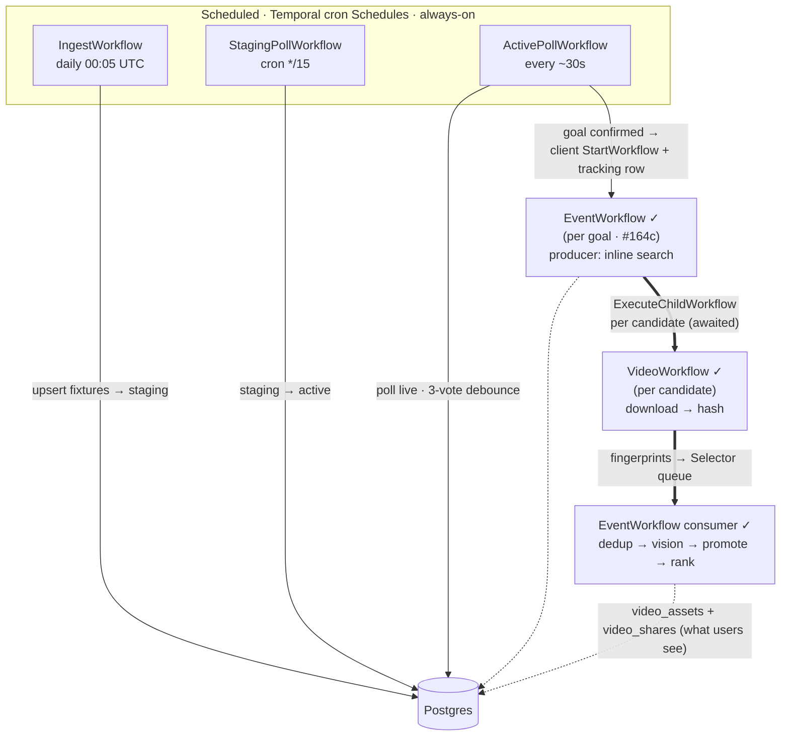

# orchestration.md — Go rebuild ledger

**Purpose.** This doc records what has actually shipped in the
`internal/workflow/` and `internal/activity/` packages — the workflow
inventory, the activities each workflow orchestrates, the state
transitions each triggers, and any divergences from
[`../rebuild-plan.md`](design/rebuild-plan.md) §5.

If code and plan diverge, the divergence is logged in
[`../decisions.md`](decisions.md). This doc is the ledger; the plan
is the intent.

**Update rule.** Every workflow/activity commit updates this doc in
the same commit. Per the [2026-07-07 working rule](decisions.md).

## Workflow inventory (2026-08-06 — Ingest, Monitor split, EventWorkflow #164c, VideoWorkflow #165 all shipped)

| Workflow | Status | Trigger | Location |
|---|---|---|---|
| IngestWorkflow | ✓ O1c shipped + O1e scheduled daily 00:05 UTC | Temporal Schedule `ingest-scheduled-daily` (`5 0 * * *`) | `internal/workflow/ingest.go` |
| ActivePollWorkflow | ✓ O2 shipped + scheduled 2026-07-11 | Temporal Schedule `active-poll-scheduled` (IntervalSpec 30s) | `internal/workflow/active_poll.go` |
| StagingPollWorkflow | ✓ O2 shipped 2026-07-11 | Temporal Schedule `staging-poll-scheduled` (cron `*/15 * * * *`, runtime-tunable) | `internal/workflow/staging_poll.go` |
| EventWorkflow | ✓ #164c shipped 2026-08-04 (ex-DiscoveryWorkflow) | Spawned by Monitor's `ReconcileFixture` via `DownstreamSpawner` (workflow ID `event-{id}`) when `downstream_triggered` flips (2026-07-16 — Temporal-direct spawn, not NATS). **Producer** (`workflow.Go`): discovery search loop, spawns a `VideoWorkflow` child per candidate. **Consumer** (`workflow.Selector`, `event_pipeline.go`): dedup (md5 gate → post-vision category-scoped perceptual + `IsUpgrade` winner-select/supersede, #171) → vision (`ValidateClip`) → promote (`PromoteAndPersist`) → rank, per clip. Temporal-owned completion (`searchDone && inFlight==0`). pg `workflow_type` value stays `'discovery'` (internal label). See [`design/v-phase-orchestration.md`](design/v-phase-orchestration.md). | `internal/workflow/event.go` + `event_pipeline.go` |
| VideoWorkflow | ✓ shipped 2026-08-03 (#165) | **Child** of `EventWorkflow` — one `ExecuteChildWorkflow` per candidate (awaited). Runs `DownloadAndStage → HashVideo`, returns fingerprints. | `internal/workflow/video.go` |
| ~~VideoValidationWorkflow~~ / ~~AssetPersistenceWorkflow~~ | ⊘ **superseded** | The old O4/O5 separate-workflow split is dead — validation (`ValidateClip`) + persistence (`Promote`/`InsertAsset`/`Rank`) run as **activities inside EventWorkflow's serialized queue**, not standalone workflows (streaming redesign, 2026-07-27). | — |

**Note on the ActivePoll + StagingPoll split** (2026-07-11): plan §5 W2
speced a single `MonitorWorkflow` combining active + staging polling
via bucket-suppression. During implementation the bucket math emerged
as a workaround for cramming two cadences into one workflow. Split
into two workflows on independent Temporal Schedules — see
[`../decisions.md` 2026-07-11 workflow-split entry](decisions.md)
for the full reasoning (failure isolation, runtime tunability, config
honesty). `PreActivateUpcoming` renamed to `ActivateUpcoming` at the
same time — the "Pre" prefix was misleading.

### Spawn + tracking map

Two distinct spawn mechanisms:

- **Monitor → EventWorkflow — Temporal client `StartWorkflow`, pg-tracked.**
  The three scheduled workflows are independent Temporal cron Schedules;
  none is a Temporal parent of the others. When a goal's
  `downstream_triggered` flips, `ReconcileFixture` spawns the EventWorkflow
  via the Temporal **client** (`StartWorkflow`, deterministic ID
  `event-{id}`, RejectDuplicate) — **not** a Temporal ChildWorkflow of the
  poll. Its lifecycle is tracked in Postgres via `event_downstream_workflows`
  (one row per spawned workflow; a fixture completes when it has no pending
  rows — the "completion contract"). See
  [`../decisions.md` 2026-07-16 Temporal-direct spawn](decisions.md).
- **EventWorkflow → VideoWorkflow — a real Temporal `ExecuteChildWorkflow`.**
  Each candidate spawns an *awaited* child (with `ParentClosePolicy`), so
  cancelling the EventWorkflow tears its Video children down with it. This
  is the one genuine Temporal parent/child link in the system.



## IngestWorkflow — as shipped

Daily fixture ingest. Refreshes the tracked-teams filter, fetches the
relevant day(s) from api-sports.io with a smart timezone-lookahead,
categorizes each fixture by API state, upserts to Postgres, ensures +
resolves alias rows for every team seen, prunes completed fixtures
beyond retention.

### Signature

```go
package workflow

type IngestWorkflowInput struct {
    ManualDate       *time.Time     // nil = today's anchor (scheduled path); set = re-ingest a specific day
    ManualFixtureIDs []int64        // non-empty = fetch by IDs (bypasses the tracked-teams filter + date scan)
    FetchFuture      bool           // daily schedule sets true → today + smart-lookahead future days
    ActivationWindow time.Duration  // kickoff-lookahead auto-activation; zero → config (WORKFLOWS_ACTIVATION_WINDOW, default 5m)
    RetentionDays    int            // prune completed older than this; zero → config, then skip
}

type IngestWorkflowOutput struct {
    TrackedTeamsRefreshed bool // did RefreshTrackedTeamsIfStale re-fetch this run
    TrackedTeamsCount     int  // cache size after a refresh; 0 on cache-hit runs
    Fetched               int
    FilteredOut           int  // fixtures the tracked-teams filter dropped
    Staging               int
    Active                int
    Completed             int
    ExistingAliases       int
    InsertedAliases       int
    AliasCacheHits        int  // Step 3.5 resolution outcomes ↓
    AliasesResolved       int
    AliasNoMatch          int
    AliasFailed           int
    PrunedFixtures        int
    Errors                []string // aggregated per-fixture/per-team failure context
}
```

**Divergences from plan §5 W1 signature — see
[decisions.md 2026-07-07 IngestWorkflow](decisions.md).**

### Activity sequence

Sequential — each step feeds the next; no parallel branches (daily
ingest isn't throughput-bound, and sequencing keeps failure attribution
simple).

```
0.  GetIngestConfig() → {ActivationWindow, RetentionDays, MaxLookaheadDays}
      Read once at start (workflows can't touch env). Input overrides
      (ActivationWindow, RetentionDays) win; zero falls back to config.
0.5 IF NOT manual-IDs path:
      RefreshTrackedTeamsIfStale()                         [120s timeout]
        → {Refreshed, TotalTeams, PerLeagueCounts}
      Re-fetches each tracked league's current-season roster into
      tracked_teams_cache when stale. Non-fatal: on failure fetch proceeds
      with whatever's cached (possibly empty → fail-open, audit G2/G6).
1.  Fetch (branches on ManualFixtureIDs):
      IF len(ManualFixtureIDs) > 0:
        FetchFixturesByIDs(IDs) → {Fixtures, FailedIDs}
          Targeted-retry loop: re-request only FailedIDs, up to 3 attempts,
          linear backoff (in-cycle recovery beats waiting 24h). By-ID
          bypasses the tracked-teams filter.
      ELSE (by-date, smart timezone-lookahead):
        FetchFixturesForDay(anchor)                          [always]
        IF FetchFuture:
          FetchFixturesForDay(anchor+1)                      [tomorrow]
          IF tomorrow non-empty: FetchFixturesForDay(anchor+2)
          ELSE: scan anchor+2 .. anchor+MaxLookaheadDays for the next
                non-empty day, then also fetch that day + 1
        Dedupe by fixture ID across days; each day's FilteredOut (dropped
        by the tracked-teams filter) accumulates into the output.
2.  CategorizeAndUpsertFixtures(fixtures, ActivationWindow) [120s timeout]
      → {Staging, Active, Completed, TeamRefs, Errors}
3.  IF len(TeamRefs) > 0:
      EnsureAliasPlaceholders(TeamRefs) → {Existing, Inserted, Errors}
3.5 IF len(TeamRefs) > 0:
      ResolveAliasesForTeams(TeamRefs)                       [15m timeout]
        → {CacheHits, Resolved, NoMatch, Failed, Errors}
      Wikipedia CirrusSearch + Wikidata for teams without a wikidata_qid;
      cache-hit skip, soft-fail per team (see § alias pattern below).
4.  IF RetentionDays > 0:
      PruneOldFixtures(anchor - RetentionDays days) → Deleted
        PG-only DELETE of completed fixtures older than the threshold
        (keyed on completed_at) that have NO surviving video_shares
        (URL-stability guard). Does NOT reclaim Garage/S3 objects —
        audit-2026-08-05 G4.
```

Anchor: `ManualDate` if set, else `workflow.Now(ctx)` — deterministic
across replays. Manual-date override propagates through the whole
workflow (fetch window AND retention cutoff both computed from the
anchor) so re-ingesting a past date behaves consistently.

All eight activity methods — `GetIngestConfig`,
`RefreshTrackedTeamsIfStale`, `FetchFixturesForDay`, `FetchFixturesByIDs`,
`CategorizeAndUpsertFixtures`, `EnsureAliasPlaceholders`,
`ResolveAliasesForTeams`, `PruneOldFixtures` — live in
`internal/activity/ingest/activities.go`, registered on the worker as
methods of `*ingest.Activities`.

### Reconcile logic — the load-bearing merge

`CategorizeAndUpsertFixtures` calls `reconcileFixture` per API fixture:

**Existing row present:** refresh only API-mutable fields (Status,
Elapsed, Extra, Kickoff, Home, Away, League, Scores) + LastPolledAt
+ UpdatedAt. Preserve domain-managed fields (State, ActivatedAt,
CompletedAt, LastActivityAt, CreatedAt). Rationale: a fixture already
active in our DB (activated_at set) MUST NOT have its activated_at
cleared by the daily 00:05 re-ingest. LastPolledAt DOES get updated
because ingest is itself a poll. (The planned bucket-suppression that
would have consulted it was abandoned in the ActivePoll/StagingPoll
split — see the note above.)

**Fresh row (Get returns ErrNotFound):** construct via `fixture.New`,
set `LastPolledAt = now` (before state transitions — Activate/Complete
don't touch LastPolledAt so it survives), then apply initial state by
API status:

- **Terminal** (`FT`, `AET`, `PEN`, `CANC`, `ABD`, `AWD`, `WO`) →
  `Activate(kickoff)` + `Complete(now)`. Missed-the-match case;
  ended before we noticed. Two-step transition maintains the
  invariant that completed rows have both activated_at and
  completed_at set.
- **Live** (`1H`, `HT`, `2H`, `ET`, `BT`, `P`, `LIVE`, `SUSP`, `INT`,
  `PST`) → `Activate(now)`. Emergency case: API says the match is
  already playing (or paused mid-play, or postponed with maybe-same-
  day resume) but our DB doesn't have it. Land as active so
  MonitorWorkflow starts polling next cycle. See
  [decisions.md 2026-07-07 status bucketing](decisions.md) for
  why SUSP/INT/PST count as Live — matches Python.
- **Not started** (`NS`, `TBD`, etc.) → check
  `ShouldActivateNow(now, ActivationWindow)`. If true (kickoff within
  the activation window), Activate before first Upsert (avoids the "manual ingest at
  14:55 for 15:00 kickoff sits in staging" Python bug — see
  [decisions.md 2026-07-07 Fixture activation triggers](decisions.md#2026-07-07--fixture-activation-triggers--staging-poll-design)).
  Otherwise stays staging.

### Alias placeholder pattern (RAG deferral)

`EnsureAliasPlaceholders` inserts blank-resolution placeholder rows;
**Step 3.5 `ResolveAliasesForTeams`** (shipped) then resolves them via
Wikipedia CirrusSearch + Wikidata for teams without a `wikidata_qid`
(cache-hit skip; soft-fail per team so a Wikidata hiccup doesn't fail
ingest; NULL-QID teams auto-retry next cycle).

Rationale: keeps IngestWorkflow independent of joi + Wikidata
availability. If joi is down or the daily LLM quota exhausted,
ingest still succeeds; only the resolution job pauses.

This is a **deliberate departure** from plan §5 W1 which specified
`PreCacheAliasesBatch(teams)` doing full RAG resolution inline. See
[decisions.md 2026-07-07 RAG design deferral](decisions.md).

### Timeouts + retry

Default activity options:
- StartToCloseTimeout: 60s
- Retry: exponential backoff 2s → cap 30s (coefficient 2), max 3 attempts

Per-activity timeout overrides (same retry policy):
- `RefreshTrackedTeamsIfStale`: 120s (~6 leagues × 2 API calls each)
- `CategorizeAndUpsertFixtures`: 120s (DB-bound over 100s of fixtures)
- `ResolveAliasesForTeams`: 15m (~7s/team × up to 100 teams at tournament peak)

No workflow-level retry policy — an ingest failure surfaces to the
Temporal UI; operator can manually re-run. Rationale: the workflow
is idempotent (UPSERT semantics + reconcile-merge preserve state)
so an aggressive retry adds no value, and hiding failures behind
auto-retry masks real problems.

### Wire-up (O1d)

`cmd/worker/main.go` constructs `*ingest.Activities` with real
dependencies:

```go
ingestActs := &ingestactivity.Activities{
    APIFootball:           afClient,      // *apifootball.Client
    FixtureRepo:           fixtureRepo,   // domain/fixture.Repo
    AliasRepo:             aliasRepo,     // domain/alias.Repo
    TeamRepo:              teamRepo,      // domain/team.Repo (tracked-teams cache)
    TrackedLeagueIDs:      cfg.APIFootball.TrackedLeagueIDs,
    TopFlightCacheHours:   cfg.APIFootball.TopFlightCacheHours,
    FetchWindowFutureDays: cfg.APIFootball.FetchWindowFutureDays,
    ActivationWindow:      cfg.Workflows.ActivationWindow,
    RetentionDays:         cfg.Workflows.RetentionDays,
    AliasResolver:         aliasResolver, // *alias.Resolver (nil = resolution skipped)
    AliasThrottle:         500 * time.Millisecond,
}
w.RegisterWorkflow(ffwf.IngestWorkflow)
w.RegisterActivity(ingestActs)
```

Registration happens BEFORE `w.Start(ctx)` — Temporal's reflection
walk runs on Start; anything registered after is silently ignored.

**Wired (O1e):** the daily Temporal Schedule `ingest-scheduled-daily`
(`5 0 * * *`) is registered by `ensureIngestSchedule` in
`cmd/worker/main.go`; Create is idempotent (swallows AlreadyRunning).
Manual trigger via `scripts/trigger_ingest/main.go` remains for ad-hoc
re-ingests.

## ActivePollWorkflow — as shipped

30s poll of ACTIVE fixtures. Schedule `active-poll-scheduled` (IntervalSpec 30s).
Per cycle: `GetMonitorConfig` → `ActivateUpcoming` (DB-only staging→active
promotion) → `ListActiveFixtureIDs` → `FetchLiveFixtures` (batched
/fixtures?ids=) → `ReconcileFixture` per fixture (the event set-diff +
3-poll debounce + downstream spawn + completion check). Location:
`internal/workflow/active_poll.go` + `internal/activity/monitor/`.

**Event debounce — scorer-aware 3-state (2026-08-05).** `natural_key` embeds
`player_id`, so an unknown scorer (`player_id` null) and its later-attributed
known scorer are *different* keys. A goal without a scorer is "not a full event
yet": it lands as a **placeholder at `debounce_count=0`**, casts no presence
vote, and never spawns a search (no player → no Twitter query). It's pinned at
0 while present and **hard-deleted the cycle it disappears** (`DeleteUnknownEvent`)
— normally because the vendor attributed the scorer and a fresh player-keyed
event superseded it. Only known-scorer events vote, debounce 1→3, flip
`downstream_triggered`, and (on absence to 0) soft-delete as `var`. Mirrors
Python (`monitor.py` `initial_count` + `unknown_scorer_disappeared`); see
[decisions.md](decisions.md) 2026-08-05. Surfaced per cycle as `unknown_dropped`.

## StagingPollWorkflow — as shipped

15-min poll of STAGING fixtures. Schedule `staging-poll-scheduled` (cron
`*/15 * * * *`, runtime-tunable). Fires `PollStagingFixtures`: polls all
staging fixtures + handles vendor edge cases (kickoff-corrected activation,
Live()-emergency activation). Location: `internal/workflow/staging_poll.go`.

## EventWorkflow — as shipped (#164c + #165)

The per-goal orchestrator (renamed from DiscoveryWorkflow, decisions.md
2026-08-03 — the workflow became the event orchestrator, so "Discovery"
undersold it; the discovery *phase* keeps its name). Spawned
Temporal-direct by Monitor's `ReconcileFixture` via `DownstreamSpawner`
when an event's `downstream_triggered` flips (workflow ID `event-{id}`,
RejectDuplicate; NOT scheduled — 2026-07-16). Location:
`internal/workflow/event.go` (orchestration) + `event_pipeline.go`
(consumer) + `internal/activity/discovery/`.

Runs a **producer + consumer concurrently** (`workflow.Go` + a
`workflow.Selector` queue), with Temporal owning completion — the
consumer returns when search is done AND nothing is in flight (no idle
timeout):

**Producer** (the discovery search loop). `GetDiscoveryConfig` →
`FetchTeamAliases` → `querybuilder.Build(player, canonical, aliases)` →
N attempts × M spacing (`config.DiscoveryConfig`, default 15 × 60s) of
`SearchTweets` with per-event `exclude_urls` accumulating across attempts
(so attempts 2+ stop early on consecutive-already-seen). Each new
candidate is persisted via `StoreCandidate` (post-hoc query-quality
learning) AND spawns a `VideoWorkflow` child (`ExecuteChildWorkflow`,
awaited) that runs `DownloadAndStage → HashVideo` and returns
md5 + frame-hash fingerprints. Wall-clock `max_age_minutes` filter
(decisions.md 2026-07-23).

**Consumer** (`event_pipeline.go`, serialized). Two dedup stages straddle
vision (#171 shipped 2026-08-09 — the pre-vision, category-blind, keep-first
gate was replaced):

- **Gate** (`onVideoDone`): **md5-exact dedup only**, against kept + pending
  clips. An exact byte-dup is dropped (popularity bumped); otherwise the clip
  fires **vision** (`ValidateClip` on joi — screen-gate + period-aware clock).
  Perceptual dedup is deliberately NOT here: a clip's verified/unverified
  category is unknown until vision, and md5-identical bytes are trivially the
  same category.
- **Post-vision** (`onVisionDone`, `dedupAndPromote`): a rejected clip is
  dropped; a verified/unverified clip runs **category-scoped perceptual dedup**
  (`matchAssets` — same pool only, ALL matches, dHash isn't transitive) then
  which-to-keep. Unique or cluster quality-winner (`IsUpgrade`) → **promote**
  (`PromoteAndPersist` copies staging→asset under a deterministic UUID + mints
  one `video_shares` row). A loser clip collapses (popularity bump); any bridged
  assets **consolidate** onto the winner (`SupersedeAssets` — `superseded_by`
  chain + atomic popularity merge + retire loser shares to `'superseded'` +
  reclaim Garage bytes). **Rank** = `RebalanceRanks` by `CompareShares`
  (verified → popularity → file_size → oldest); verified always outranks
  unverified, and pools never cross-compare for dedup.

On completion `finalizeEvent` marks the `event_downstream_workflows` row
complete with an `outcome_class` (the pg `workflow_type` stays `'discovery'` —
the internal downstream label). `AssetsKept` is the LIVE count (`len(p.assets)`
— supersede removes losers), not cumulative promotes. Methodology + rationale:
[decisions.md 2026-08-09](decisions.md) + [`video-dedup.md`](design/proposals/video-dedup.md);
history in [audit-2026-08-05](design/audit-2026-08-05.md) Tier-1 #1.

## Testing shape

Two-layer testing pattern matches plan §12:

**Unit tests for activities** —
`internal/activity/ingest/activities_test.go`. In-memory fake
`fixture.Repo` + `alias.Repo` + `fixtureFetcher`. Fast (<10ms across
11 tests). Tests state-transition edge cases (fresh terminal,
existing preserves domain fields, empty input, mixed existing/new
aliases, prune threshold).

**Workflow-level tests** — `internal/workflow/ingest_test.go` using
`testsuite.WorkflowTestSuite`. Mocks activities by name via testify
`OnActivity`. Tests the workflow's control flow: activity call
order, conditional-skip branches (empty TeamRefs skips alias step,
zero RetentionThreshold skips prune step), error propagation +
retry policy behavior.

**Live end-to-end via scripts/trigger_ingest** — dev-only script
that dials Temporal, fires a real IngestWorkflow with a tight
window, waits for completion. Exercises the whole chain against
real api-sports.io + dev pg. Used for O1d verification.

## Cross-refs

- Plan §5 (orchestration + workflow inventory) —
  [rebuild-plan.md §5](design/rebuild-plan.md#5-orchestration-layer--temporal-workflows-and-activities)
- Plan §5 W1 (IngestWorkflow spec — the intent) —
  [rebuild-plan.md §5 W1](design/rebuild-plan.md#workflow-1-ingestworkflow)
- Divergences from plan for IngestWorkflow —
  [decisions.md](decisions.md)
- Activity inventory (plan) —
  [rebuild-plan.md activity inventory](design/rebuild-plan.md#activity-inventory-by-domain-package)
- Architecture ledger (what packages exist) —
  [architecture.md](./architecture.md)
- Temporal specifics (client + worker shape) — [temporal.md](./temporal.md)
