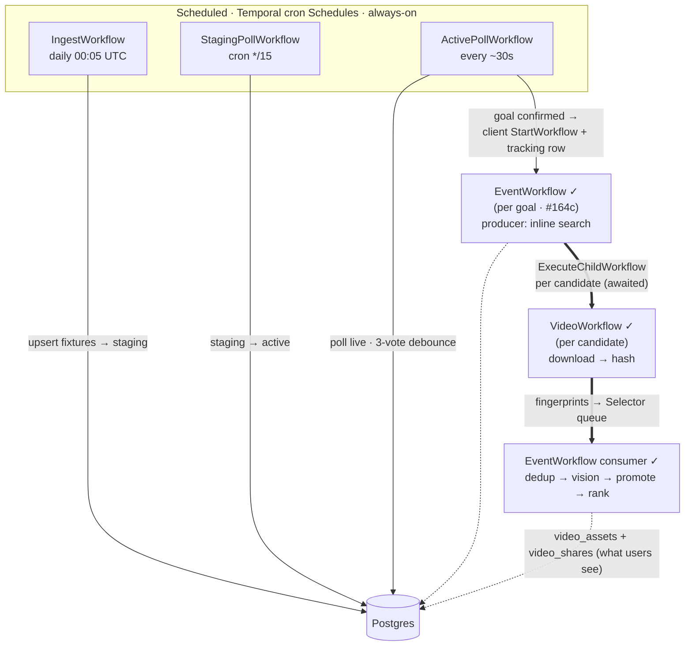

# orchestration.md — Go rebuild ledger

**Purpose.** This doc records what has actually shipped in the
`internal/workflow/` and `internal/activity/` packages — the workflow
inventory, the activities each workflow orchestrates, the state
transitions each triggers, and any divergences from
[`../rebuild-plan.md`](design/rebuild-plan.md) §5.

If code and plan diverge, the divergence is logged in
[`../decisions.md`](decisions.md). This doc is the ledger; the plan
is the intent.

**Update rule.** Every workflow/activity commit updates this doc in
the same commit. Per the [2026-07-07 working rule](decisions.md).

## Workflow inventory

| Workflow | Status | Trigger | Location |
|---|---|---|---|
| IngestWorkflow | ✓ scheduled | Temporal Schedule `ingest-scheduled-daily` (`5 0 * * *`) | `internal/workflow/ingest.go` |
| ActivePollWorkflow | ✓ scheduled | Temporal Schedule `active-poll-scheduled` (IntervalSpec 30s default) | `internal/workflow/active_poll.go` |
| StagingPollWorkflow | ✓ scheduled | Temporal Schedule `staging-poll-scheduled` (cron `*/15 * * * *` default) | `internal/workflow/staging_poll.go` |
| EventWorkflow | ✓ spawned | `ReconcileFixture` starts `event-{id}` when `downstream_triggered` flips. | `internal/workflow/event.go` + `event_pipeline.go` |
| VideoWorkflow | ✓ child | EventWorkflow starts one awaited child per candidate. | `internal/workflow/video.go` |
| ~~VideoValidationWorkflow~~ / ~~AssetPersistenceWorkflow~~ | ⊘ superseded | Validation and persistence run as activities inside EventWorkflow's serialized queue. | — |

**Note on the ActivePoll + StagingPoll split** (2026-07-11): plan §5 W2
speced a single `MonitorWorkflow` combining active + staging polling
via bucket-suppression. During implementation the bucket math emerged
as a workaround for cramming two cadences into one workflow. Split
into two workflows on independent Temporal Schedules — see
the [2026-07-11 workflow-split decision](decisions.md#2026-07-11--split-monitorworkflow-into-activepollworkflow--stagingpollworkflow)
for the full reasoning (failure isolation, runtime tunability, config
honesty). `PreActivateUpcoming` renamed to `ActivateUpcoming` at the
same time — the "Pre" prefix was misleading.

### Spawn + tracking map

Two distinct spawn mechanisms:

- **Monitor → EventWorkflow — Temporal client `StartWorkflow`, pg-tracked.**
  The three scheduled workflows are independent Temporal cron Schedules;
  none is a Temporal parent of the others. When a goal's
  `downstream_triggered` flips, `ReconcileFixture` spawns the EventWorkflow
  via the Temporal **client** (`StartWorkflow`, deterministic ID
  `event-{id}`, failed-only reuse) — **not** a Temporal ChildWorkflow of the
  poll. Its lifecycle is tracked in Postgres via `event_downstream_workflows`
  (one row per spawned workflow; a fixture completes when it has no pending
  rows — the "completion contract"). Running and successful executions reject
  duplicate starts; a closed unsuccessful execution may reuse the ID and
  restore its durable progress. See the
  [failed-run recovery decision](./decisions/2026-08-17-failed-event-workflows-resume-durable-progress.md).
- **EventWorkflow → VideoWorkflow — a real Temporal `ExecuteChildWorkflow`.**
  Each candidate spawns an *awaited* child (with `ParentClosePolicy`), so
  cancelling the EventWorkflow tears its Video children down with it. This
  is the one genuine Temporal parent/child link in the system.



## IngestWorkflow — as shipped

Daily fixture ingest. Refreshes the tracked-teams filter, fetches the
relevant day(s) from api-sports.io with a smart timezone-lookahead,
categorizes each fixture by API state, upserts to Postgres, ensures a
canonical-name row for every team seen, then runs two-part retention
(hard-delete clipless completed fixtures + reclaim Garage bytes for
clip-bearing ones) beyond the retention window.

### Signature

```go
package workflow

type IngestWorkflowInput struct {
    ManualDate       *time.Time     // nil = today's anchor (scheduled path); set = re-ingest a specific day
    ManualFixtureIDs []int64        // non-empty = fetch by IDs (bypasses the tracked-teams filter + date scan)
    FetchFuture      bool           // daily schedule sets true → today + smart-lookahead future days
    ActivationWindow time.Duration  // kickoff-lookahead auto-activation; zero → config (WORKFLOWS_ACTIVATION_WINDOW, default 5m)
    RetentionDays    int            // prune completed older than this; zero → config, then skip
}

type IngestWorkflowOutput struct {
    TrackedTeamsRefreshed bool // did RefreshTrackedTeamsIfStale re-fetch this run
    TrackedTeamsCount     int  // cache size after a refresh; 0 on cache-hit runs
    Fetched               int
    FilteredOut           int  // fixtures the tracked-teams filter dropped
    Staging               int
    Active                int
    Completed             int
    ExistingAliases       int
    InsertedAliases       int
    PrunedFixtures        int  // clipless completed fixtures hard-deleted (Step 4a)
    ReclaimedEvents       int  // clip-bearing events byte-reclaimed via DestroyEvent (Step 4b)
    Errors                []string // aggregated per-fixture/per-team failure context
}
```

**Divergences from plan §5 W1 signature — see
[decisions.md 2026-07-07 IngestWorkflow](decisions.md).**

### Activity sequence

Sequential — each step feeds the next; no parallel branches (daily
ingest isn't throughput-bound, and sequencing keeps failure attribution
simple).

```
0.  GetIngestConfig() → {ActivationWindow, RetentionDays, MaxLookaheadDays}
      Read once at start (workflows can't touch env). Input overrides
      (ActivationWindow, RetentionDays) win; zero falls back to config.
0.5 IF NOT manual-IDs path:
      RefreshTrackedTeamsIfStale()                         [120s timeout]
        → {Refreshed, TotalTeams, PerLeagueCounts, PreservedLeagues}
      Re-fetches each tracked league's current-season roster into
      tracked_teams_cache when stale. Non-fatal: on failure fetch proceeds
      with the preserved cache; an empty cache makes date fetches fail closed.
      Partial-refresh-safe (audit P1-1): a league that errors OR returns an
      empty roster (season rollover) keeps its PRIOR rows + original
      refreshed_at (so it's retried next run) instead of being wiped; only an
      all-league failure aborts without touching the cache. Preserved leagues
      surface in PreservedLeagues + a WARN log.
1.  Fetch (branches on ManualFixtureIDs):
      IF len(ManualFixtureIDs) > 0:
        FetchFixturesByIDs(IDs) → {Fixtures, FailedIDs}
          Targeted-retry loop: re-request only FailedIDs, up to 3 attempts,
          linear backoff (in-cycle recovery beats waiting 24h). By-ID
          bypasses the tracked-teams filter.
      ELSE (by-date, smart timezone-lookahead):
        FetchFixturesForDay(anchor)                          [always]
        IF FetchFuture:
          FetchFixturesForDay(anchor+1)                      [tomorrow]
          IF tomorrow non-empty: FetchFixturesForDay(anchor+2)
          ELSE: scan anchor+2 .. anchor+MaxLookaheadDays for the next
                non-empty day, then also fetch that day + 1
        Dedupe by fixture ID across days; each day's FilteredOut (dropped
        by the tracked-teams filter) accumulates into the output.
2.  CategorizeAndUpsertFixtures(fixtures, ActivationWindow) [120s timeout]
      → {Staging, Active, Completed, TeamRefs, Errors}
3.  IF len(TeamRefs) > 0:
      EnsureAliasPlaceholders(TeamRefs) → {Existing, Inserted, Errors}
4.  IF RetentionDays > 0 — two-part retention (#176, decisions.md 2026-08-11):
    4a. PruneOldFixtures(anchor - RetentionDays days)
          → {Deleted, ReclaimEventIDs}
        PG-only. Hard-deletes completed fixtures older than the threshold
        (keyed on completed_at) that have NO surviving video_shares — the
        clipless half (deleting share-less rows 404s nothing). ALSO returns
        the events of clip-BEARING aged fixtures that still have a live share
        (ListReclaimableEventIDs), for 4b.
    4b. FOR each ReclaimEventID: DestroyEvent(id, reason='policy') [2m timeout]
        Revoke the event's shares → 410 + delete its Garage bytes (the #172
        primitive), KEEPING all rows as tombstones so no shared URL ever
        404s. Best-effort per event (failures → out.Errors), never aborts
        ingest; idempotent (reclaimed events drop off tomorrow's list). This
        is where Garage bytes finally get reclaimed — closes audit G4.
```

Anchor: `ManualDate` if set, else `workflow.Now(ctx)` — deterministic
across replays. Manual-date override propagates through the whole
workflow (fetch window AND retention cutoff both computed from the
anchor) so re-ingesting a past date behaves consistently.

The ingest activity methods — `GetIngestConfig`,
`RefreshTrackedTeamsIfStale`, `FetchFixturesForDay`, `FetchFixturesByIDs`,
`CategorizeAndUpsertFixtures`, `EnsureAliasPlaceholders`,
and `PruneOldFixtures` — live in
`internal/activity/ingest/activities.go`, registered on the worker as
methods of `*ingest.Activities`. Step 4b's `DestroyEvent` is the
video-package `PersistActivities` activity (shared with #172's VAR
teardown), not an ingest activity — the workflow calls it by string name.

### Reconcile logic — the load-bearing merge

`CategorizeAndUpsertFixtures` calls `reconcileFixture` per API fixture:

**Existing row present:** refresh only API-mutable fields (Status,
Elapsed, Extra, Kickoff, Home, Away, League, Scores) + LastPolledAt
+ UpdatedAt. Preserve domain-managed fields (State, ActivatedAt,
CompletedAt, LastActivityAt, CreatedAt). Rationale: a fixture already
active in our DB (activated_at set) MUST NOT have its activated_at
cleared by the daily 00:05 re-ingest. LastPolledAt DOES get updated
because ingest is itself a poll. (The planned bucket-suppression that
would have consulted it was abandoned in the ActivePoll/StagingPoll
split — see the note above.)

**Live-feed emit (N6, decisions.md 2026-08-14).** `reconcileFixture` also reports
a `changed` bool — true for a fresh row, or for an existing row whose
frontend-meaningful fields moved (status / kickoff / score / penalty / winner; a
bare LastPolledAt/UpdatedAt bump does NOT count). `CategorizeAndUpsertFixtures`
collects the changed ids into `ChangedIDs`, and IngestWorkflow fires one
`PublishFixtureBatch` (update-only) for them → `fixture.update`. Best-effort; a
lost batch heals on the consumer's next window refetch.

**Fresh row (Get returns ErrNotFound):** construct via `fixture.New`,
set `LastPolledAt = now` (before state transitions — Activate/Complete
don't touch LastPolledAt so it survives), then apply initial state by
API status:

- **Terminal** (`FT`, `AET`, `PEN`, `CANC`, `ABD`, `AWD`, `WO`) →
  `Activate(kickoff)` + `Complete(now)`. Missed-the-match case;
  ended before we noticed. Two-step transition maintains the
  invariant that completed rows have both activated_at and
  completed_at set.
- **Live** (`1H`, `HT`, `2H`, `ET`, `BT`, `P`, `LIVE`, `SUSP`, `INT`,
  `PST`) → `Activate(now)`. Emergency case: API says the match is
  already playing (or paused mid-play, or postponed with maybe-same-
  day resume) but our DB doesn't have it. Land as active so
  ActivePollWorkflow starts polling next cycle. See
  [decisions.md 2026-07-07 status bucketing](decisions.md) for
  why SUSP/INT/PST count as Live — matches Python.
- **Not started** (`NS`, `TBD`, etc.) → check
  `ShouldActivateNow(now, ActivationWindow)`. If true (kickoff within
  the activation window), Activate before first Upsert (avoids the "manual ingest at
  14:55 for 15:00 kickoff sits in staging" Python bug — see
  [decisions.md 2026-07-07 Fixture activation triggers](decisions.md#2026-07-07--fixture-activation-triggers--staging-poll-design)).
  Otherwise stays staging.

### Canonical team-name record

`EnsureAliasPlaceholders` creates a `team_aliases` row for each observed team
when one does not exist. The row supplies a stable canonical API-Football name
to EventWorkflow. The Wikipedia→Wikidata resolver was removed on 2026-08-16;
no resolution activity follows this step, and the stored `aliases` array is not
passed to the query builder. Discovery derives player tokens and a team
abbreviation with deterministic text operations.

### Timeouts + retry

Default activity options:
- StartToCloseTimeout: 60s
- Retry: exponential backoff 2s → cap 30s (coefficient 2), max 3 attempts

Per-activity timeout overrides (same retry policy):
- `RefreshTrackedTeamsIfStale`: 120s (~6 leagues × 2 API calls each)
- `CategorizeAndUpsertFixtures`: 120s (DB-bound over 100s of fixtures)

No workflow-level retry policy — an ingest failure surfaces to the
Temporal UI; operator can manually re-run. Rationale: the workflow
is idempotent (UPSERT semantics + reconcile-merge preserve state)
so an aggressive retry adds no value, and hiding failures behind
auto-retry masks real problems.

### Wire-up (O1d)

`cmd/worker/main.go` constructs `*ingest.Activities` with real
dependencies:

```go
ingestActs := &ingestactivity.Activities{
    APIFootball:           afClient,      // *apifootball.Client
    FixtureRepo:           fixtureRepo,   // domain/fixture.Repo
    AliasRepo:             aliasRepo,     // domain/alias.Repo
    TeamRepo:              teamRepo,      // domain/team.Repo (tracked-teams cache)
    TrackedLeagueIDs:      cfg.APIFootball.TrackedLeagueIDs,
    TopFlightCacheHours:   cfg.APIFootball.TopFlightCacheHours,
    FetchWindowFutureDays: cfg.APIFootball.FetchWindowFutureDays,
    ActivationWindow:      cfg.Workflows.ActivationWindow,
    RetentionDays:         cfg.Workflows.RetentionDays,
}
w.RegisterWorkflow(ffwf.IngestWorkflow)
w.RegisterActivity(ingestActs)
```

Registration happens BEFORE `w.Start(ctx)` — Temporal's reflection
walk runs on Start; anything registered after is silently ignored.

**Wired (O1e):** the daily Temporal Schedule `ingest-scheduled-daily`
(`5 0 * * *`) is registered by `ensureIngestSchedule` in
`cmd/worker/main.go`; Create is idempotent (swallows AlreadyRunning).
Manual trigger via `scripts/trigger_ingest/main.go` remains for ad-hoc
re-ingests.

## ActivePollWorkflow — as shipped

30s poll of ACTIVE fixtures. Schedule `active-poll-scheduled` (IntervalSpec 30s).
Per cycle: `GetMonitorConfig` → `ActivateUpcoming` (DB-only staging→active
promotion) → `ListActiveFixtureIDs` → `FetchLiveFixtures` (batched
/fixtures?ids=) → `ReconcileFixture` per fixture (the event set-diff +
3-poll debounce + downstream spawn + completion check). Location:
`internal/workflow/active_poll.go` + `internal/activity/monitor/`.

**Live-feed classification (N4, decisions.md 2026-08-14).** `ReconcileFixture`
snapshots the fixture's API-mutable fields before the `Update*` calls and diffs
after, so `ReconcileFixtureOutput` carries `Minute`/`Extra` + two disjoint
signals per cycle: **`ClockChanged`** (the minute/extra advanced and nothing
else) and **`Structural`** (a new/removed/stabilised event, an unknown-scorer
drop, a score/penalty/winner/status change, or completion — set incrementally so
it holds at every return path). **Step 5 (N5, shipped)** partitions the cycle's
reconciles — structural wins, so a fixture is never in both — and fires one
`PublishFixtureBatch` activity → `fixture.clock` (inline ticks) + `fixture.update`
(ids to bulk-refetch). Best-effort (a lost batch heals on the consumer's next
window refetch). Activation (staging→active) is not emitted; the kickoff
status-flip is captured as Structural on the fixture's first live reconcile.

**Event mutable-field refresh (#199, decisions.md 2026-08-15).** For an existing
known-scorer event, `ReconcileFixture` also diffs the provider's mutable
NON-identity fields (`Event.MutableFieldsChanged` — assist, minute, extra, detail)
against the stored row and, on a real delta, calls `UpdateMutableFields` + sets
`Structural` so the late value rides `fixture.update`. Assists arrive after the goal
(API-Football fills the assister post-match); minute/extra get VAR-corrected.
Identity (the `natural_key`) is never touched. Active-fixture only — the
completed-fixture backfill is tracked as [`FF-010`](./todo.md#confirmed-lower-priority-backlog).

**Event debounce — scorer-aware 3-state (2026-08-05).** `natural_key` embeds
`player_id`, so an unknown scorer (`player_id` null) and its later-attributed
known scorer are *different* keys. A goal without a scorer is "not a full event
yet": it lands as a **placeholder at `debounce_count=0`**, casts no presence
vote, and never spawns a search (no player → no Twitter query). It's pinned at
0 while present and **hard-deleted the cycle it disappears** (`DeleteUnknownEvent`)
— normally because the vendor attributed the scorer and a fresh player-keyed
event superseded it. Only known-scorer events vote, debounce 1→3, flip
`downstream_triggered`, and (on absence to 0) soft-delete as `var` — which fires
the **VAR destroy** (#172, decisions.md 2026-08-10): `ActivePollWorkflow` Step 4.5
cancels the event's discovery, revokes its shares (→ the #167 redirect 410s the
clips), and reclaims its Garage objects. Mirrors Python (`monitor.py`
`initial_count` + `unknown_scorer_disappeared` + `mark_event_removed`); see
[decisions.md](decisions.md) 2026-08-05. Surfaced per cycle as `unknown_dropped`.

**Stable event sequence identity (FF-027).** Sequence is no longer recomputed
from each provider array's position. Reconcile reads active and removed rows,
matches each scorer/type group to active stored events by ordered nearest match
clock, and allocates unmatched events above the complete historical maximum.
An incomplete score-backed goal inventory requires exact clock matching so a
nearby new goal cannot consume an omitted goal's identity. Exact removed-row
reappearances map to their terminal tombstone. Existing natural keys remain
unchanged; a late insertion may receive a higher sequence than a chronologically
later stored event because sequence is durable allocation identity, not display
order.

**Score-backed goal removal and coherent fixture completion (FF-014).** A
missing goal no longer receives an absence vote when the aggregate score in
that same provider response exceeds the current API goal count for its
beneficiary team. `ReconcileFixture` returns the protected natural keys as
`GoalAbsencesHeld`, and `ActivePollWorkflow` records them without running VAR
destroy. A true VAR drops the score and resumes normal absence debounce; a
replacement scorer/own-goal identity accounts for the unchanged score and lets
the old identity decay. Missing red cards and missed penalties retain ordinary
absence behavior because they do not affect the score.

The fixture completion counter now measures coherent terminal snapshots, not
terminal status alone. For `FT`, `AET`, and `PEN`, a poll advances the counter
only when the current response contains exact per-team scoring-event parity
with its reported score; any non-terminal, nil-score, or inconsistent played
response resets it to zero. `CANC`, `ABD`, `WO`, and `AWD` advance on terminal
status alone because they do not promise a played-match event inventory.
Winner flags remain stored result/display facts and cannot bypass the three
votes.

After the counter reaches three, `FixtureReadyToComplete` independently
requires exact parity with surviving stored goals, no known event still below
its trigger, and no incomplete `event_downstream_workflows` row. Unknown-scorer
goal placeholders count for score parity but do not block the event-settled
predicate; red cards, missed penalties, and shootout events do not count toward
the match score. See the
[decision record](./decisions/2026-08-16-score-backed-goal-removal.md).

**Per-event Firefox fleet lifecycle (#160, gated on `FleetEnabled`; live in prod).**
Two hooks straddle the debounce, both gated on the monitor config's
`FleetEnabled` (default false → both inert):
- **Step 4.4 provision.** `ReconcileFixture` returns `NewNamedEventIDs` — the
  events that *this cycle* first acquired a known scorer (debounce_count went to
  1, so all data needed for a Twitter query now exists). ActivePoll fires
  `ProvisionFirefox` per ID: create+start a dedicated
  `<compose-network>-firefox-ev-<full-event-uuid>` container with the
  history-compatible `ff-firefox-ev-<8hex>` network alias (no blocking health
  wait — the ~30s warm-up hides behind the debounce window). Warming at count=1
  means the instance is ready when the event *triggers* at count=3.
- **Step 4.5 release.** The same step that runs the VAR destroy also calls
  `ReleaseFirefox` for every `EventsRemovedIDs` member — covering both a
  triggered event decaying to 0 (VAR) and a pre-trigger event that provisioned
  at count=1 but decayed before reaching 3. Release is idempotent, so the
  overlap with EventWorkflow's own finalize-release (the happy path) is harmless.
- **Reaper backstop** (StagingPoll, audit P0-5). The provision/release hooks only
  fire while the worker is alive; a crash between provision and release, or a
  failed release, strands a container. `ReapOrphanedFirefox` (below) reconciles
  the labeled container set against the DB every 15 min. See
  [decisions.md](decisions.md) 2026-08-13 (audit P0-5) for the KEEP predicate and
  why the reaper lives in StagingPoll rather than at worker startup.

## StagingPollWorkflow — as shipped

15-min poll of STAGING fixtures. Schedule `staging-poll-scheduled` (cron
`*/15 * * * *`, runtime-tunable). Fires `PollStagingFixtures`: polls all
staging fixtures + handles vendor edge cases (kickoff-corrected activation,
Live()-emergency activation). Location: `internal/workflow/staging_poll.go`.

Also the home of the **fleet orphan reaper** (audit P0-5): each cycle ends with a
best-effort `ReapOrphanedFirefox` — it diffs the labeled Firefox containers
against `EventRepo.ListLiveFleetEventIDs` (the KEEP set: not-removed events whose
fixture is still active OR whose downstream is still in flight) and releases the
strays past a 120s min-age grace. No-op when the fleet is disabled, so the call
is unconditional. A sweep failure is recorded, never fatal — the next tick
retries. This is the only thing that cleans up a container the live-path
provision/release hooks stranded (worker crash, failed release).

## EventWorkflow

The per-goal orchestrator (renamed from DiscoveryWorkflow, decisions.md
2026-08-03 — the workflow became the event orchestrator, so "Discovery"
undersold it; the discovery *phase* keeps its name). Spawned
Temporal-direct by Monitor's `ReconcileFixture` via `DownstreamSpawner`
when an event's `downstream_triggered` flips (workflow ID `event-{id}`,
failed-only reuse; NOT scheduled — 2026-07-16, revised by FF-007). Location:
`internal/workflow/event.go` (orchestration) + `event_pipeline.go`
(consumer) + `internal/activity/discovery/`.

Runs a **producer + consumer concurrently** (`workflow.Go` + a
`workflow.Selector` queue), with Temporal owning completion — the
consumer returns when search is done AND nothing is in flight (no idle
timeout):

**Producer** (the discovery search loop). `GetDiscoveryConfig` →
`FetchTeamAliases` (canonical name only; resolved aliases are disconnected) →
`querybuilder.Build(player, canonical, nil)` → N attempts × M spacing
(`config.DiscoveryConfig`, default 15 × 60s) of
`SearchTweets` with per-event `exclude_urls` accumulating across attempts
(so attempts 2+ stop early on consecutive-already-seen). Each new
candidate is persisted via `StoreCandidate` (post-hoc query-quality
learning) AND spawns a `VideoWorkflow` child (`ExecuteChildWorkflow`,
awaited) that runs `DownloadAndStage → HashVideo` and returns
md5 + frame-hash fingerprints. If either activity exhausts retries, the child
returns a typed terminal failure with the tweet URL, stage reason, and any
staging key instead of failing without correlation data. Wall-clock
`max_age_minutes` filter
(decisions.md 2026-07-23).

Each `SearchTweets` activity has four transient-infrastructure attempts at
roughly 0/10/30/60 seconds. This spans FF-017's measured Firefox cold restart,
including on the final outer discovery attempt; the minute between successful
outer attempts remains unchanged. A Temporal version marker preserves the old
three-try policy for histories started before FF-017.

**Candidate failure contract (FF-002).** `download_error` stamps the persisted
candidate `failed`; no staging object exists. `hash_error` stamps `failed` and
calls `DeleteStaging` with the key returned by download. An unexpected failed
child future uses the tweet URL captured when the parent registered the future
and stamps `video_workflow_error`. Invalid output uses
`video_workflow_invalid_outcome` and also reclaims any returned staging key.
Cancellation bypasses all of these commands under the FF-015 contract. Both
workflow sides use Temporal change ID `ff-002-terminal-video-failures`, version
1; histories without the marker replay the old command sequence.

**Cancellation contract (FF-015).** Producer cancellation from an activity or
the between-attempt `workflow.Sleep` terminates the producer and records its
error while a deferred close always marks the search side done. The consumer
returns any `workflow.Await` error instead of awaiting the canceled context
again. Cancellation therefore closes the workflow without another search,
another child spawn, or `finalizeEvent`. The monitor's event-removal
transaction owns downstream-checklist closure, and its destroy/release path
owns cleanup for this case.

**Failed-execution recovery contract (FF-007).** The monitor may start a new
run under the same deterministic Workflow ID only when the prior run closed
unsuccessfully. EventWorkflow has no outer execution timeout: its attempt loop
is finite, while each activity and Video child retains its own timeout. Before
new work starts, the replacement run loads active persisted assets, the
monotonic `attempts_completed` checkpoint from downstream metadata, and every
persisted candidate. Terminal candidates seed exclusions; candidates still
marked `pending` are re-driven. Search resumes at the first uncompleted
attempt, and each fully scheduled attempt advances the checkpoint. The
checklist remains open until the replacement run reaches normal finalization.
A Temporal change marker keeps executions started before FF-007 on their old
command sequence; every new or replacement execution records version 1 and
uses recovery.
A genuinely stale `RUNNING` execution needs the separate FF-025 backstop; age
alone never authorizes fixture completion.

**Consumer** (`event_pipeline.go`, serialized). Two dedup stages straddle
vision (#171 shipped 2026-08-09 — the pre-vision, category-blind, keep-first
gate was replaced):

- **Gate** (`onVideoDone`): **md5-exact dedup only**, against kept + pending
  clips. An exact byte-dup is dropped, its vote credited to the winner — on the
  asset row if promoted, or **accumulated in memory** on the winner if it's still
  pending vision (#180); otherwise the clip fires **vision** (`ValidateClip` on
  joi — screen-gate + period-aware clock).
  Perceptual dedup is deliberately NOT here: a clip's verified/unverified
  category is unknown until vision, and md5-identical bytes are trivially the
  same category.
- **Post-vision** (`onVisionDone`, `dedupAndPromote`): a rejected clip is
  dropped; a verified/unverified clip runs **category-scoped perceptual dedup**
  (`matchAssets` — same pool only, ALL matches, dHash isn't transitive) then
  which-to-keep. Unique or cluster quality-winner (`IsUpgrade`) → **promote**
  (`PromoteAndPersist` derives a deterministic UUID, reuses a matching durable
  asset or copies staging→asset before inserting it, ensures one
  `video_shares` row, always rebalances ranks, then deletes staging). A durable
  asset row proves the destination copy preceded it, so a retry after an
  uncertain staging-delete response skips the now-impossible source copy. A
  loser clip collapses (popularity bump); any bridged assets **consolidate**
  onto the winner (`SupersedeAssets` — `superseded_by` chain + atomic
  popularity merge + retire loser shares to `'superseded'` + reclaim Garage
  bytes). **Rank** = `RebalanceRanks` by `CompareShares` (verified → popularity
  → file_size → oldest); verified always outranks unverified, and pools never
  cross-compare for dedup.
- **Emit** (N3): after a successful promotion completion with a durable share
  (`Minted=true`) or a supersede that collapsed losers, the pipeline fires the
  `event.video` dirty-signal via the `livefeed.PublishEventVideo` activity —
  best-effort, and only after the persistence tail has completed. A retry that
  finds the share created by its failed prior attempt still returns
  `Minted=true`: Temporal never delivered that failed attempt's result, so the
  workflow still owes one signal. Consumers refetch current state, making an
  extra signal from an external workflow re-drive harmless. A popularity-only
  bump and a VAR `DestroyEvent` do **not** emit (the latter surfaces as the
  event's absence in the parent's `fixture.update` refetch).

On completion `finalizeEvent` marks the `event_downstream_workflows` row
complete with an `outcome_class` (the pg `workflow_type` stays `'discovery'` —
the internal downstream label). `AssetsKept` is the LIVE count (`len(p.assets)`
— supersede removes losers), not cumulative promotes. Methodology + rationale:
[decisions.md 2026-08-09](decisions.md) + [`video-dedup.md`](design/proposals/video-dedup.md);
promotion retry and cleanup contract in
[`2026-08-16-promotion-retries-complete-durable-tail.md`](decisions/2026-08-16-promotion-retries-complete-durable-tail.md);
history in [audit-2026-08-05](design/audits/audit-2026-08-05.md) Tier-1 #1.

**Per-event Firefox fleet binding (#160, gated on `FleetEnabled`; live in prod).**
When `GetDiscoveryConfig` returns `FleetEnabled=true`, the producer derives
`instanceAddr := fleetactivity.InstanceAddr(EventID)` — a pure function of the
event ID, no registry lookup — and threads it through every
`SearchTweetsInput.InstanceAddr`, so this event's searches hit its own dedicated
Firefox (provisioned back at debounce count=1). Empty when disabled → searches
fall back to the shared twitter service. `finalizeEvent` calls
`ReleaseFirefox(EventID)` on normal completion when `FleetEnabled`, the
happy-path teardown; the monitor's Step 4.5 release covers an event that never
reaches finalize (decay/VAR cancellation). Both are idempotent.

## Testing shape

Two-layer testing pattern matches plan §12:

**Unit tests for activities** —
`internal/activity/ingest/activities_test.go`. In-memory fake
`fixture.Repo` + `alias.Repo` + `fixtureFetcher`. Tests state-transition
edge cases (fresh terminal,
existing preserves domain fields, empty input, mixed existing/new
aliases, prune threshold).

**Workflow-level tests** — `internal/workflow/ingest_test.go` using
`testsuite.WorkflowTestSuite`. Mocks activities by name via testify
`OnActivity`. Tests the workflow's control flow: activity call
order, conditional-skip branches (empty TeamRefs skips alias step,
zero RetentionThreshold skips prune step), error propagation +
retry policy behavior.

**Live end-to-end via scripts/trigger_ingest** — dev-only script
that dials Temporal, fires a real IngestWorkflow with a tight
window, waits for completion. Exercises the whole chain against
real api-sports.io + dev pg. Used for O1d verification.

## Cross-refs

- Plan §5 (orchestration + workflow inventory) —
  [rebuild-plan.md §5](design/rebuild-plan.md#5-orchestration-layer--temporal-workflows-and-activities)
- Plan §5 W1 (IngestWorkflow spec — the intent) —
  [rebuild-plan.md §5 W1](design/rebuild-plan.md#workflow-1-ingestworkflow)
- Divergences from plan for IngestWorkflow —
  [decisions.md](decisions.md)
- Activity inventory (plan) —
  [rebuild-plan.md activity inventory](design/rebuild-plan.md#activity-inventory-by-domain-package)
- Architecture ledger (what packages exist) —
  [architecture.md](./architecture.md)
- Temporal specifics (client + worker shape) — [temporal.md](./temporal.md)
