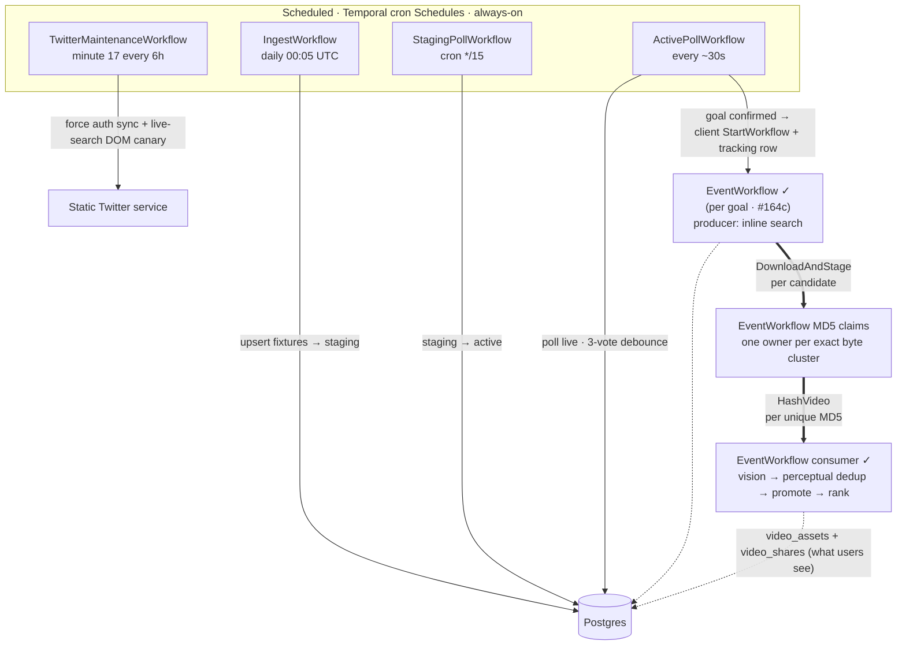

# Workflow orchestration

**Purpose.** This doc records what has actually shipped in the
`internal/workflow/` and `internal/activity/` packages — the workflow
inventory, the activities each workflow orchestrates, the state
transitions each triggers, and any divergences from
[`rebuild-plan.md`](../design/rebuild-plan.md) §5.

If code and plan diverge, the divergence is logged in
[`decisions.md`](../decisions.md). This doc set is the current ledger; the plan
preserves original intent and is not current implementation authority.

**Update rule.** Every workflow/activity commit updates this doc in
the same commit. Per the [2026-07-07 working rule](../decisions.md).

## Topic map

- [`ingest.md`](./ingest.md) — daily fixture ingest, categorization, and retention.
- [`monitor.md`](./monitor.md) — active and staging polling, debounce, removal,
  and fixture completion.
- [`event.md`](./event.md) — per-event search, candidate processing, validation,
  deduplication, persistence, and completion.
- [`twitter-maintenance.md`](./twitter-maintenance.md) — fixture-independent
  authentication persistence and live-search DOM canary.
- [`testing.md`](./testing.md) — workflow test shape and related references.

## Workflow inventory

| Workflow | Status | Trigger | Location |
|---|---|---|---|
| IngestWorkflow | ✓ scheduled | Temporal Schedule `ingest-scheduled-daily` (`5 0 * * *`) | `internal/workflow/ingest.go` |
| ActivePollWorkflow | ✓ scheduled | Temporal Schedule `active-poll-scheduled` (IntervalSpec 30s default) | `internal/workflow/active_poll.go` |
| StagingPollWorkflow | ✓ scheduled | Temporal Schedule `staging-poll-scheduled` (cron `*/15 * * * *` default) | `internal/workflow/staging_poll.go` |
| TwitterMaintenanceWorkflow | ✓ scheduled | Temporal Schedule `twitter-maintenance-scheduled` (cron `17 */6 * * *` default) | `internal/workflow/twitter_maintenance.go` |
| EventWorkflow | ✓ spawned | `ReconcileFixture` starts `event-{id}` when `downstream_triggered` flips. | `internal/workflow/event.go` + `event_pipeline*.go` |
| VideoWorkflow | ✓ replay compatibility | EventWorkflow histories started before FF-022 retain their awaited child per candidate; new executions schedule the two activities directly around an exact-MD5 claim. | `internal/workflow/video.go` |
| ~~VideoValidationWorkflow~~ / ~~AssetPersistenceWorkflow~~ | ⊘ superseded | Validation and persistence run as activities inside EventWorkflow's serialized queue. | — |

**Note on the ActivePoll + StagingPoll split** (2026-07-11): plan §5 W2
speced a single `MonitorWorkflow` combining active + staging polling
via bucket-suppression. During implementation the bucket math emerged
as a workaround for cramming two cadences into one workflow. Split
into two workflows on independent Temporal Schedules — see
the [2026-07-11 workflow-split decision](../decisions.md#2026-07-11--split-monitorworkflow-into-activepollworkflow--stagingpollworkflow)
for the full reasoning (failure isolation, runtime tunability, config
honesty). `PreActivateUpcoming` renamed to `ActivateUpcoming` at the
same time — the "Pre" prefix was misleading.

### Spawn + tracking map

The current spawn mechanism and retained compatibility boundary are:

- **Monitor → EventWorkflow — Temporal client `StartWorkflow`, pg-tracked.**
  The four scheduled workflows are independent Temporal Schedules;
  none is a Temporal parent of the others. When a goal's
  `downstream_triggered` flips, `ReconcileFixture` spawns the EventWorkflow
  via the Temporal **client** (`StartWorkflow`, deterministic ID
  `event-{id}`, failed-only reuse) — **not** a Temporal ChildWorkflow of the
  poll. Its lifecycle is tracked in Postgres via `event_downstream_workflows`
  (one row per spawned workflow; a fixture completes when it has no pending
  rows — the "completion contract"). Running and successful executions reject
  duplicate starts; a closed unsuccessful execution may reuse the ID and
  restore its durable progress. See the
  [failed-run recovery decision](../decisions/2026-08-17-failed-event-workflows-resume-durable-progress.md).
- **EventWorkflow → candidate activities — direct, awaited futures.** New
  executions schedule `DownloadAndStage`, claim the returned exact MD5 in the
  serialized consumer, then schedule one `HashVideo` per distinct byte cluster.
  The producer dispatches candidate processing before awaiting observation
  inserts, while the consumer requires an evidence-carrying terminal UPSERT
  before the candidate becomes complete. Both activity contexts inherit
  EventWorkflow cancellation. Histories that
  began before FF-022 retain the old awaited `VideoWorkflow` child command
  sequence; histories begun before FF-034 retain their best-effort outcome
  update. Both compatibility paths stay registered for replay. See the
  [exact-byte ownership decision](../decisions/2026-08-17-exact-md5-ownership-precedes-dense-hashing.md)
  and [candidate durability decision](../decisions/2026-08-17-candidate-terminal-state-is-a-workflow-invariant.md).

